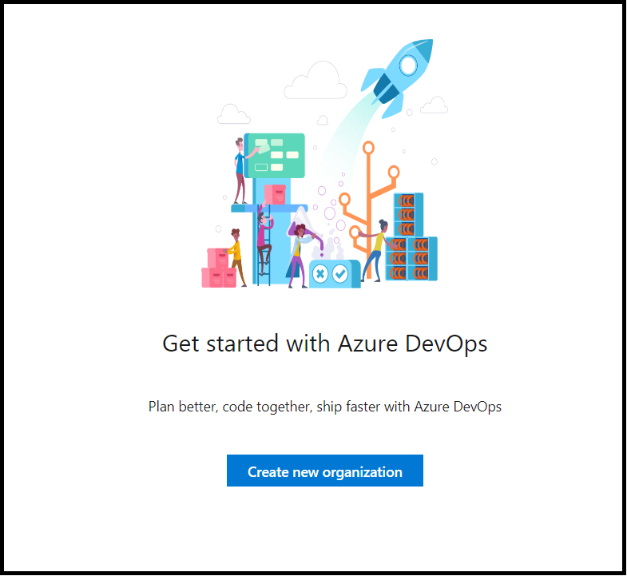
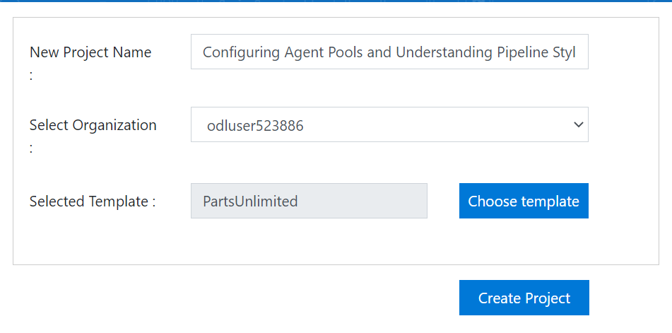
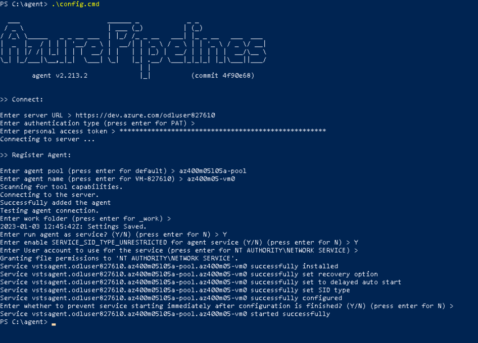

# Lab 04: Configuring Agent Pools and Understanding Pipeline Styles
# Student lab manual

## Lab overview

YAML-based pipelines allow you to fully implement CI/CD as code, in which pipeline definitions reside in the same repository as the code that is part of your Azure DevOps project. YAML-based pipelines support a wide range of features that are part of the classic pipelines, such as pull requests, code reviews, history, branching, and templates. 

Regardless of the choice of the pipeline style, to build your code or deploy your solution by using Azure Pipelines, you need an agent. An agent hosts compute resources that runs one job at a time. Jobs can be run directly on the host machine of the agent or in a container. You have an option to run your jobs using Microsoft-hosted agents, which are managed for you, or implementing a self-hosted agent that you set up and manage on your own. 

In this lab, you will step through the process of converting a classic pipeline into a YAML-based one and running it first by using a Microsoft-hosted agent and then performing the equivalent task by using a self-hosted agent.

## Objectives

After you complete this lab, you will be able to:

- implement YAML-based pipelines
- implement self-hosted agents

## Instructions

#### Set up an Azure DevOps organization

1. On your lab VM open **Edge Browser** on desktop and navigate to https://aex.dev.azure.com. Then login with the credentials provided in environment details tab.

    
    
1. On the next page if asked, click on **Create new organization** else, skip this step.

    

2. On the next page accept defaults and click on continue.

    

3. On the **Get started with Azure DevOps** page click on **Continue**.

4. On the **Almost Done...** page fill the captcha and click on continue. 

    
    
5. On the Azure Devops page click on **Azure DevOps** located at top left corner and then click on **Organization Setting** at the left down corner

    

6. In the **Organization Setting** window on the left menu click on **Billing** and select **Setup Billing** then click on save.

    
        

7. On the **MS Hosted CI/CD** section under **Paid parallel jobs** enter value **1** and at the end of the page click on **Save**.

    

### Exercise 0: Configure the lab prerequisites

In this exercise, you will set up the prerequisite for the lab, which consists of the preconfigured Parts Unlimited team project based on an Azure DevOps Demo Generator template.

#### Task 1: Configure the team project

In this task, you will use Azure DevOps Demo Generator to generate a new project based on the **PartsUnlimited** template.

1.  In a new tab of Edge browser navigate to https://azuredevopsdemogenerator.azurewebsites.net. This utility site will automate the process of creating a new Azure DevOps project within your account that is prepopulated with content (work items, repos, etc.) required for the lab. 

    > **Note**: For more information on the site, see https://docs.microsoft.com/en-us/azure/devops/demo-gen.

2.  Click **Sign in** and if prompted sign with the credentials provided in environment details tab.
3.  If required, on the **Azure DevOps Demo Generator** page, click **Accept** to accept the permission requests for accessing your Azure DevOps subscription.
4.  On the **Create New Project** page, in the **New Project Name** textbox, type **Configuring Agent Pools and Understanding Pipeline Styles**, in the **Select organization** dropdown list, select your Azure DevOps organization, and then click **Choose template**.
    
    

5.  On the **Choose a template** page, click the **PartsUnlimited** template, and then click **Select Template**.
6.  Click **Create Project**

    > **Note**: Wait for the process to complete. This should take about 2 minutes. In case the process fails, navigate to your DevOps organization, delete the project, and try again.

1.  On the **Create New Project** page, click **Navigate to project**.

### Exercise 1: Author YAML-based Azure DevOps pipelines

In this exercise, you will convert a classic Azure DevOps pipeline into a YAML-based one. 

#### Task 1: Create an Azure DevOps YAML pipeline

In this task, you will create a template-based Azure DevOps YAML pipeline.

1.  From the web browser displaying the Azure DevOps portal with the **Configuring Agent Pools and Understanding Pipeline Styles** project open, in the vertical navigational pane on the left side, click **Pipelines**. 
1.  On the **Recent** tab of the **Pipelines** pane, click **New pipeline**.
1.  On the **Where is your code?** pane, click **Azure Repos Git**. 
1.  On the **Select a repository** pane, click **PartsUnlimited**.
1.  On the **Review your pipeline YAML** pane, review the sample pipeline, click the down-facing caret symbol next to the **Run** button, click **Save**.

### Exercise 2: Manage Azure DevOps agent pools

In this exercise, you will implement self-hosted Azure DevOps agent.

#### Task 1: Configure an Azure DevOps self-hosting agent

In this task, you will configure the LOD VM as an Azure DevOps self-hosting agent and use it to run a build pipeline.

1.  In the Azure DevOps portal, in the upper right corner of the Azure DevOps page, click the **User settings** icon, in the dropdown menu, click **Personal access tokens**, on the **Personal Access Tokens** pane, and click **+ New Token**.
1.  On the **Create a new personal access token** pane, click the **Show all scopes** link and, specify the following settings and click **Create** (leave all others with their default values):

    | Setting | Value |
    | --- | --- |
    | Name | **Configuring Agent Pools and Understanding Pipeline Styles lab** |
    | Scope (custom defined) | **Agent Pools** (show more scopes option below if needed)|
    | Permissions | **Read and manage** |

1.  On the **Success** pane, copy the value of the personal access token to Clipboard.

    > **Note**: Make sure you copy the token. You will not be able to retrieve it once you close this pane. 

1.  On the **Success** pane, click **Close**.
1.  On the **Personal Access Token** pane of the Azure DevOps portal, click **Azure DevOps** symbol in the upper left corner and then click **Organization settings** label in the lower left corner.
1.  To the left side of the **Overview** pane, in the vertical menu, in the **Pipelines** section, click **Agent pools**.
1.  On the **Agent pools** pane, in the upper right corner, click **Add pool**. 
1.  On the **Add agent pool** pane, in the **Pool type** dropdown list, select **Self-hosted**, in the **Name** text box, type **az400m05l05a-pool** and then click **Create**.
1.  Back on the **Agent pools** pane, click the entry representing the newly created **az400m05l05a-pool**. 
1.  On the **Jobs** tab of the **az400m05l05a-pool** pane, click the **Agents** header.
1.  On the **Agents** tab of the **az400m05l05a-pool** pane, click the **New agent** button.
1.  On the **Get the agent** pane, ensure that the **Windows** and **x64** tabs are selected, and click **Download** to download the zip archive containing the agent binaries to download it into the local **Downloads** folder within your user profile.

    > **Note**: If you receive an error message at this point indicating that the current system settings prevent you from downloading the file, in the Internet Explorer window, in the upper right corner, click the gearwheel symbol designating the **Settings** menu header, in the dropdown menu, select **Internet Options**, in the **Internet Options** dialog box, click **Advanced**, on the **Advanced** tab, click **Reset**, in the **Reset Internet Explorer Settings** dialog box, click **Reset** again, click **Close**, and try the download again. 

1.  Start Windows PowerShell as administrator and in the **Administrator: Windows PowerShell** console run the following lines to create the **C:\\agent** directory and extract the content of the downloaded archive into it. 

    ```powershell
    cd \
    mkdir agent ; cd agent
    $TARGET = Get-ChildItem "$Home\Downloads\vsts-agent-win-x64-*.zip"
    Add-Type -AssemblyName System.IO.Compression.FileSystem
    [System.IO.Compression.ZipFile]::ExtractToDirectory($TARGET, "$PWD")
    
    ```

1.  In the same **Administrator: Windows PowerShell** console, run the following to configure the agent:

    ```powershell
    .\config.cmd
    ```

1.  When prompted, specify the values of the following settings:

    | Setting | Value |
    | ------- | ----- |
    | Enter server URL | the URL of your Azure DevOps organization, in the format **https://dev.azure.com/<organization_name>**, where `<organization_name>` represents the name of your Azure DevOps organization |
    | Enter authentication type (press enter for PAT) | **Enter** |
    | Enter personal access token | The access token you recorded earlier in this task |
    | Enter agent pool (press enter for default) | **az400m05l05a-pool** |
    | Enter agent name | **az400m05-vm0** |
    | Enter work folder (press enter for _work) | **Enter** |
    | Enter Perform an unzip for tasks for each step. (press enter for N) | **Enter** |
    | Enter run agent as service? (Y/N) (press enter for N) | **Y** |
    | enter enable SERVICE_SID_TYPE_UNRESTRICTED (Y/N) (press enter for N) | **Y** |
    | Enter User account to use for the service (press enter for NT AUTHORITY\NETWORK SERVICE) | **Enter** |
    | Enter whether to prevent service starting immediately after configuration is finished? (Y/N) (press enter for N) | **Enter** |

    > **Note**: You can run self-hosted agent as either a service or an interactive process. You might want to start with the interactive mode, since this simplifies verifying agent functionality. For production use, you should consider either running the agent as a service or as an interactive process with auto-logon enabled, since both persist their running state and ensure that the agent starts automatically if the operating system is restarted.

    > **Note**: Verify that the agent is reporting the **Listening for Jobs** status.

      

1.  Switch to the browser window displaying the Azure DevOps portal and close the **Get the agent** pane.
1.  Back on the **Agents** tab of the **az400m05l05a-pool** pane, note that the newly configured agent is listed with the **Online** status.
1.  In the web browser window displaying the Azure DevOps portal, in the upper left corner, click the **Azure DevOps** label.
1.  In the browser window displaying the list of projects, click the tile representing your **Configuring Agent Pools and Understanding Pipeline Styles** project. 
1.  On the **Configuring Agent Pools and Understanding Pipeline Styles** pane, in the vertical navigational pane on the left side, in the **Pipelines** section, click **Pipelines**. 
1.  On the **Recent** tab of the **Pipelines** pane, select **PartsUnlimited** and, on the **PartsUnlimited** pane, select **Edit**.
1.  On the **PartsUnlimited** edit pane, in the existing YAML-based pipeline, replace line  `vmImage: windows-2019` designating the target agent pool the following content, designating the newly created self-hosted agent pool:

    ```yaml
    name: az400m05l05a-pool
    demands:
    - agent.name -equals az400m05-vm0
    ```
1. For `Task: NugetInstaller@0`, click on **Settings (link that is displaying above the task in grey colour)**, modify **Version of NuGet.exe to install** > **4.0.0**  and click on **Add**. 
1.  On the **PartsUnlimited** edit pane, in the upper right corner of the pane, click **Save** and, on the **Save** pane, click **Save** again. This will automatically trigger the build based on this pipeline. 
1.  In the Azure DevOps portal, in the vertical navigational pane on the left side, in the **Pipelines** section, click **Pipelines**.
1.  On the **Recent** tab of the **Pipelines** pane, click the **PartsUnlimited** entry, on the **Runs** tab of the **PartsUnlimited** pane, select the most recent run, on the **Summary** pane of the run, scroll down to the bottom, in the **Jobs** section, click **Phase 1** and monitor the job until its successful completion. 

### Exercise 3: Remove the Azure DevOps billing

In this exercise, you will remove the Azure DevOps billing enabled in this lab to eliminate unexpected charges.

#### Task 1: Remove the Azure DevOps billing

In this task, you will remove pipeline billing to eliminate unnecessary charges.

1. On the lab computer, switch to the browser window displaying Azure DevOps organization homepage and select **Organization Settings** at bottom left corner.

1. Under **Organization Settings** select **Billing** and click on **Change billing** button to open Change billing pane.

1. In the **Change billing** pane, select **Remove billing** setting and click on Save.

#### Review

In this lab, you learned how to convert classic pipelines into YAML-based ones and how to implement and use self-hosted agents.
