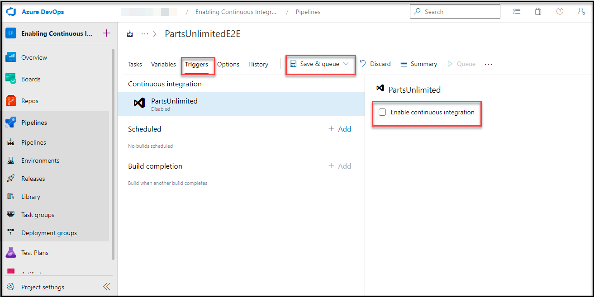
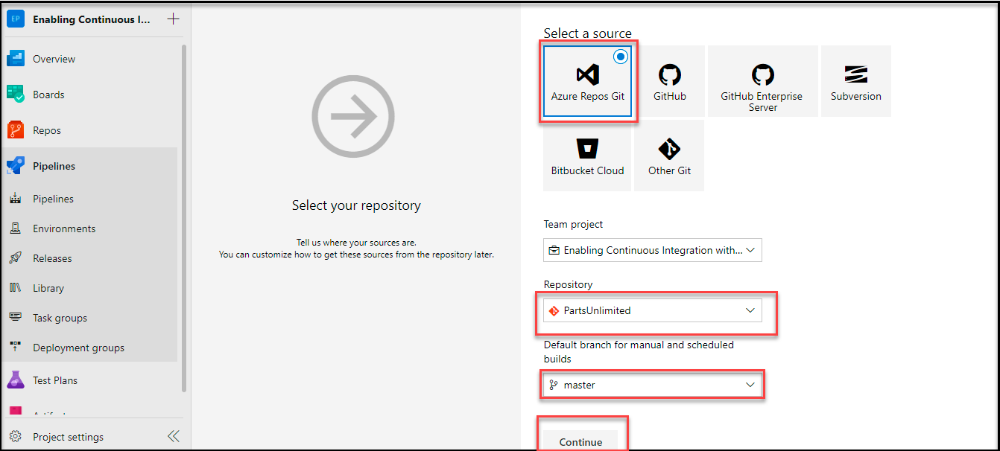
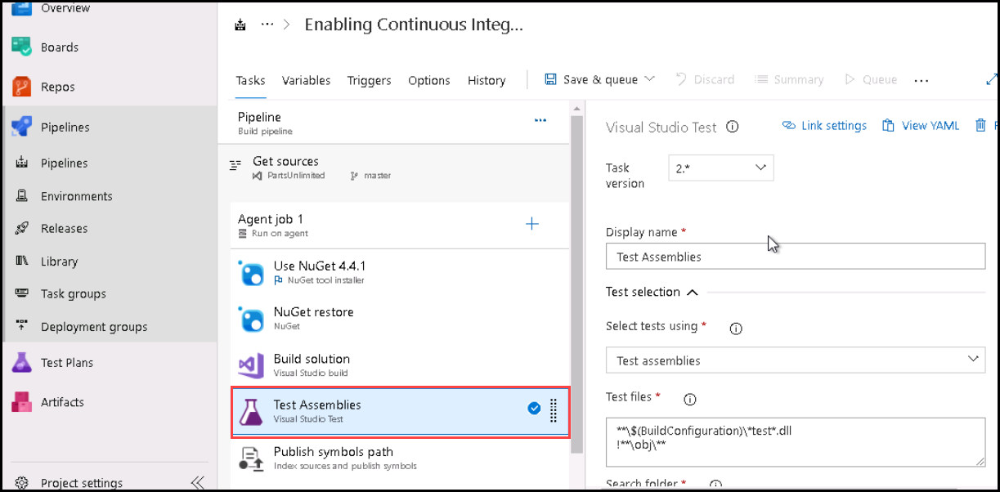
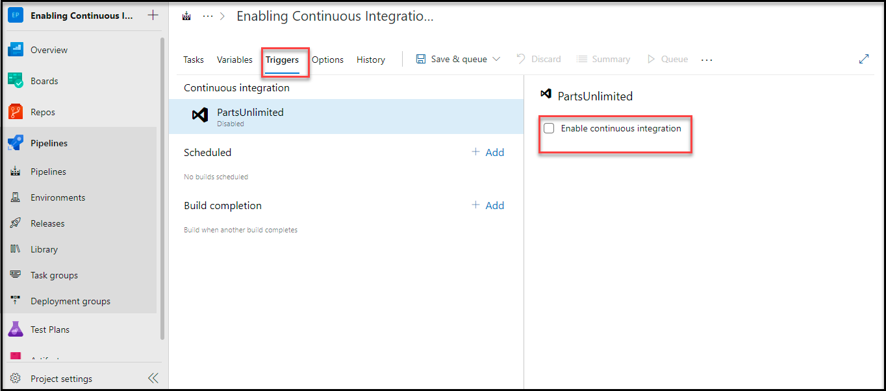
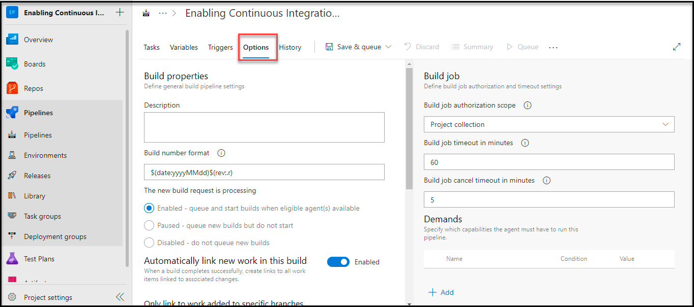

# Lab 05: Enabling Continuous Integration with Azure Pipelines
# Student lab manual

## Lab overview

In this lab, you will learn how to configure continuous integration (CI) and continuous deployment (CD) for your applications using Build and Release in Azure Pipelines. This scriptable CI/CD system is both web-based and cross-platform, while also providing a modern interface for visualizing sophisticated workflows. Although we won’t demonstrate all of the cross-platform possibilities in this lab, it is important to point out that you can also build for iOS, Android, Java (using Ant, Maven, or Gradle) and Linux.

## Objectives

After you complete this lab, you will be able to:

-   Create a basic build pipeline from a template
-   Track and review a build
-   Invoke a continuous integration build

## Instructions

#### Set up an Azure DevOps organization. 

1. On your lab VM open **Edge Browser** on desktop and navigate to https://go.microsoft.com/fwlink/?LinkId=307137. 

2. In the pop-up for *Help us protect your account*, select **Skip for now (14 days until this is required)**.

3. On the next page accept defaults and click on continue.

    

4. On the **Almost Done...** page fill the captcha and click on continue. 

    

### Exercise 0: Configure the lab prerequisites

In this exercise, you will set up the prerequisite for the lab, which consists of the preconfigured Parts Unlimited team project based on an Azure DevOps Demo Generator template.

#### Task 1: Configure the team project

In this task, you will use Azure DevOps Demo Generator to generate a new project based on the **Parts Unlimited** template.

1.  In a new tab of Edge browser navigate to https://azuredevopsdemogenerator.azurewebsites.net. This utility site will automate the process of creating a new Azure DevOps project within your account that is prepopulated with content (work items, repos, etc.) required for the lab. 

    > **Note**: For more information on the site, see https://docs.microsoft.com/en-us/azure/devops/demo-gen.

2.  Click **Sign in** and if prompted sign with the credentials provided in environment details tab.

     
3.  If required, on the **Azure DevOps Demo Generator** page, click **Accept** to accept the permission requests for accessing your Azure DevOps subscription.
4.  On the **Create New Project** page, in the **New Project Name** textbox, type **Enabling Continuous Integration with Azure Pipelines**, in the **Select organization** dropdown list, select your Azure DevOps organization, and then click **Choose template**.

     
     
5.  In the list of templates, locate the **PartsUnlimited** template and click **Select Template**.

    
6.  Back on the **Create New Project** page, click **Create Project**

    > **Note**: Wait for the process to complete. This should take about 2 minutes. In case the process fails, navigate to your DevOps organization, delete the project, and try again.

7.  On the **Create New Project** page, click **Navigate to project**.

    

### Exercise 1: Introduction to Azure DevOps Build 

In this exercise, you will create a basic build pipeline from a template, track and review the new build job, and trigger a continuous integration build.

#### Task 1: Creating a basic build pipeline from a template

In this task, you will create and configure a build pipeline by using a predefined template.

1.  In the web browser displaying your Azure DevOps organization with the **Enabling Continuous Integration with Azure Pipelines** project you generated in the previous exercise, in the vertical navigational pane, select the **Pipelines** section and ensure that the **Pipelines** view is displayed.

      

    > **Note**: Alternatively, you can access the project page directly by navigating to the [https://dev.azure.com/`<your-Azure-DevOps-account-name>`/Enabling%20Continuous%20Integration%20with%20Azure%20Pipelines) URL, where the `<your-Azure-DevOps-account-name>` placeholder, represents your account name. 

2.  On the **Pipelines** pane, hover the mouse pointer over the entry representing the existing **PartsUnlimitedE2E** pipeline to reveal the ellipsis symbol on the right side.
3.  Click the ellipsis and, in the dropdown menu, click **Edit**.

    

   > **Note**: In order to avoid two pipelines being triggered later in the lab, start by disabling the CI trigger for the pipeline created by the template.

4.  On the **Tasks** tab of the **PartsUnlimitedE2E** pane, click the **Triggers** tab, clear the checkbox **Enable continuous integration**, click **Save & queue** and then click **Save**.
  
    

5.  To create a new pipeline, navigate back to the **Pipelines** view by selecting **Pipelines** in the vertical navigational pane in the Azure DevOps portal.
6.  Back on the **Pipelines** pane, click **New pipeline** to create a new build pipeline.

   

> **Note**: The default option for build pipelines involves the use of YAML. For this lab, you will use the classic editor. 

7.  On the **Where is your code ?** pane, click the **Use the classic editor** link at the bottom of the page.

   

 > **Note**: You need to start by configuring the source repository. Every major platform is available, but the default options are all we need here. This build will use the **master** branch of the **PartsUnlimited** repo. 

8.  Ensure that the **Azure Repos Git** option with the **PartsUnlimited** repository and **master** branch entries are selected, and click **Continue**.

  
9.  On the **Choose a template** pane, in the **Search** text box, type **ASP.NET**, in the list of results, select the **ASP.NET** template and click **Apply** to apply this template to the build definition. 

  

  > **Note**: Note that there are many options that should cover all of our mainstream scenarios. For our purposes here, we'll just build the project using the baseline ASP.NET template. The process for this build pipeline is easy to follow. After getting the source, Azure DevOps will use NuGet to restore any dependent packages. Then, the project will be built and tested. The results will then be published to the configured target.

10. On the **Tasks** tab, look for **test Assemblies** task , right-click and **disable selected task(s)**.

   
  
   

11.  Select the **Variables** tab and review its content.

   

   > **Note**: Here you can configure special parameters to be used during the build, such as the configuration or platform.

12.  Select the **Triggers** tab and check the **Enable continuous integration** checkbox. 

   

  > **Note**: This automatically invokes the build whenever source changes are committed. Triggers allow you to automatically invoke builds on a schedule, when another build completes, or when changes are made to the source.

13.  Select the **Options** tab and review its content.

  

 > **Note**: This section includes a wide variety of options related to the build workflow. Note that you'll generally configure options for specific build tasks on the configuration views of the tasks themselves.

14.  Select the **History** tab. 

   > **Note**: At this point, the tab does not contain any entries, but it will show a history of changes you make to the build definition.

15.  Select the **Save & Queue** tab header and, in the dropdown menu, select **Save & Queue** entry to save and queue a new build.

  > **Note**: You can define the retention time for pipeline artifacts from **Project Settings** > **Settings** > **Retention policy**. These settings enable you to configure which pipeline runs are retained and for how long. 

16.  In the **Run pipeline** pane, accept the default options and click **Save and run**. This will automatically display the **Summary** tab of the pipeline run job, with the **Queued** status.

#### Task 2: Tracking and reviewing a build

In this task, you will track and review the new build job.

> **Note**: Once the build begins, you'll be able to track the console output per task. 

1.  On the **Summary** tab of the pipeline run job, in the **Jobs** section, click **Agent job 1**. This will display the details pane of the job.

    > **Note**: If you want to review an earlier task, you can scroll the right pane to review its logs.

2.  Once the build completes successfully, on the job details pane, click the left-facing arrow to return to the summary view. 

    > **Note**: The summary view provides overview details about the build, including details about commits, tests, and artifacts.

#### Task 3: Invoking a continuous integration build

In this task, you will trigger a continuous integration build.

   > **Note**: In the first task of this exercise, you configured the build to support continuous integration. In this task, you will test its functionality.

1.  In the web browser window displaying your project settings in the Azure DevOps portal, in the vertical navigational pane, select the **Repos** section and ensure that the **Files** view is displayed.
2.  In the middle pane, navigate to the file **PartsUnlimited-aspnet45/src/PartsUnlimitedWebsite/Views/Home/Index.cshtml** and select it. 
3.  On the **Index.cshtml** pane, click **Edit**.
4.  On the **Index.cshtml** pane, make a minor update by changing the line `ViewBag.Title = "Home Page";` to `ViewBag.Title = "Lab Project Home Page";` and click **Commit**.
5.  On the **Commit** pane, accept the default commit details and click **Commit**.

    > **Note**: This will automatically trigger a build. 

6.  In the vertical navigational pane, select the **Pipelines** section and ensure that the **Pipelines** view is displayed.
7.  On the **Pipelines** pane, verify that it contains the entry representing a new build (note that its number contains the trailing **.2**) which was triggered by your change. 
8.  Click the build entry to display its details and verify that it completed successfully. 

    > **Note**: **Congratulations!** You have successfully completed the exercise. Please validate your progress by clicking on **(...) icon** and switch to **Lab Validation** tab and then click on **Validate** button for the respective task.

#### Review

In this lab, you used the Azure DevOps portal to create a basic build pipeline from a template, to track and review a build, and to invoke a continuous integration build.
