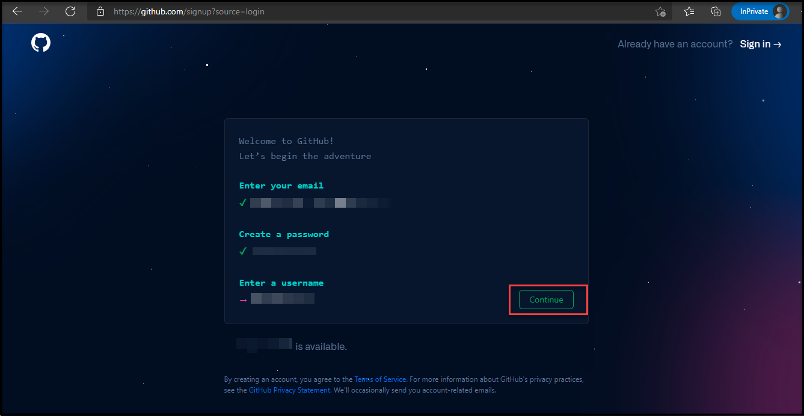
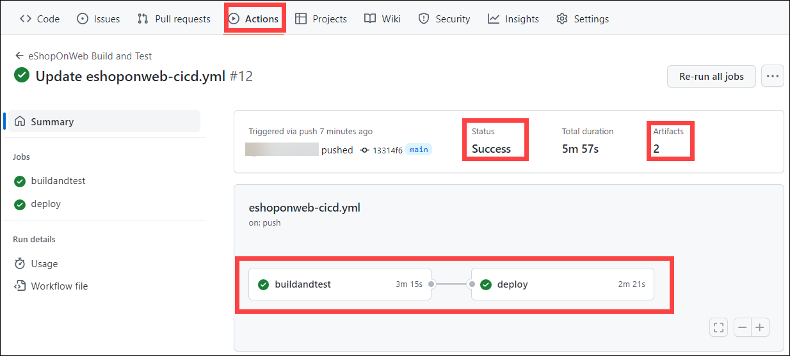

# Lab 05: Implementing GitHub Actions for CI/CD

## Lab overview

In this lab, you will learn how to implement a GitHub Action workflow that deploys an Azure web app by using DevOps Starter.

## Objectives

After you complete this lab, you will be able to:

- Implement a GitHub Action workflow by using DevOps Starter
- Explain the basic characteristics of GitHub Action workflows

## Estimated timing: 60 minutes

## Architecture Diagram

   

## Lab requirements

- If you don't already have a GitHub account that you can use for this lab, follow instructions available at [Signing up for a new GitHub account](https://docs.github.com/get-started/signing-up-for-github/signing-up-for-a-new-github-account).


## Prepare a GitHub account

1. If you already have a GitHub account that you can use for this lab proceed with Exercise 1, else follow the instructions to create an account.

1. Navigate to the https://github.com/ Click on Signup.
   
1. Provide the email address and click on continue.

   
 
1. Provide the password and enter the valid username and click on continue.

   

1. Provide the confirmation and verify your account and click on create account. This would take 2 minutes to create.

   

# Exercise 0: Import eShopOnWeb to your GitHub Repository

In this exercise, you will import the existing [eShopOnWeb](https://github.com/MicrosoftLearning/eShopOnWeb) repository code to your own GitHub private repo.

The repository is organized the following way:
    - **.ado** folder contains Azure DevOps YAML pipelines
    - **.devcontainer** folder container setup to develop using containers (either locally in VS Code or GitHub Codespaces)
    - **.azure** folder contains Bicep&ARM infrastructure as code templates used in some lab scenarios.
    - **.github** folder container YAML GitHub workflow definitions.
    - **src** folder contains the .NET 6 website used on the lab scenarios.

## Task 1: Create a public repository in GitHub and import eShopOnWeb

In this task, you will create an empty public GitHub repository and import the existing [eShopOnWeb](https://github.com/MicrosoftLearning/eShopOnWeb) repository.

1. From the lab computer, start a web browser, navigate to the [GitHub website](https://github.com/), sign in using your account and click on **New** to create new repository.

    
 
1. On the **Create a new repository** page, click on **Import a repository** link (below the page title).

    > NOTE: you can also open the import website directly at https://github.com/new/import

1. On the **Import your project to GitHub** page:
    
    | Field | Value |
    | --- | --- |
    | Your old repository’s clone URL| https://github.com/MicrosoftLearning/eShopOnWeb |
    | Owner | Your account alias |
    | Repository Name | eShopOnWeb |
    | Privacy | **Public** | 

1. Click on **Begin Import** and wait for your repository to be ready.

1. On the repository page, go to **Settings**, click on **Actions > General** and choose the option **Allow all actions and reusable workflows**. Click on **Save**.

    


# Exercise 1: Setup your GitHub Repository and Azure access

In this exercise, you will create an Azure Service Principal to authorize GitHub accessing your Azure subscription from GitHub Actions. You will also setup the GitHub workflow that will build, test and deploy your website to Azure. 

## Task 1: Create an Azure Service Principal and save it as GitHub secret

In this task, you will create the Azure Service Principal used by GitHub to deploy the desired resources. As an alternative, you could also use [OpenID connect in Azure](https://docs.github.com/actions/deployment/security-hardening-your-deployments/configuring-openid-connect-in-azure), as a secretless authentication mechanism.

1. On your lab computer, in a browser window, open the  [Azure Portal](https://portal.azure.com).
1. In the portal, look for **Resource Groups** and click on it.
1. Click on **+ Create** to create a new Resource Group for the exercise.
1. On the **Create a resource group** tab, give the following name to your Resource Group: **rg-az400-eshopeonweb-NAME** (replace NAME for some unique alias). Click on **Review+Create > Create**.
1. In the Azure Portal, open the **Cloud Shell** (next to the search bar).

    > NOTE: If this is the first time you are starting **Cloud Shell** and you are presented with the **You have no storage mounted** message, select the subscription you are using in this lab, and select **Create storage**

1. Make sure the terminal is running in **Bash** mode and execute the following command, replacing **SUBSCRIPTION-ID** and **RESOURCE-GROUP** with your own identifiers (both can be found on the **Overview** page of the Resorce Group):

    `az ad sp create-for-rbac --name GH-Action-eshoponweb --role contributor --scopes /subscriptions/SUBSCRIPTION-ID/resourceGroups/RESOURCE-GROUP --sdk-auth`

    > NOTE: this command will create a Service Principal with Contributor access to the Resource Group created before. This way we make sure GitHub Actions will only have the permissions needed to interact only with this Resource Group (not the rest of the subscription)

1. The command will output a JSON object, you will later keep it as a GitHub secret for the workflow, copy it. The JSON contains the identifiers used to authenticate against Azure in the name of an Azure AD application identity (service principal).

    ```JSON
        {
            "clientId": "<GUID>",
            "clientSecret": "<GUID>",
            "subscriptionId": "<GUID>",
            "tenantId": "<GUID>",
            (...)
        }
    ```

1. In a browser window, go back to your **eShopOnWeb** GitHub repository.
1. On the repository page, go to **Settings**, click on **Secrets and variables > Actions**. Click on **New repository secret**
    - Name : **AZURE_CREDENTIALS**
    - Secret: **paste the previously copied  JSON object** (GitHub is able to keep multiple secrets under same name, used by  [azure/login](https://github.com/Azure/login) action )

1. Click on **Add secret**. Now GitHub Actions will be able to reference the service principal, using the repository secret.

## Task 2: Modify and execute the GitHub workflow

In this task, you will modify the given GitHub workflow and execute it to deploy the solution in your own subscription.

1. In a browser window, go back to your **eShopOnWeb** GitHub repository.
1. On the repository page, go to **Code** and open the following file: **eShopOnWeb/.github/workflows/eshoponweb-cicd.yml**. This workflow defines the CI/CD process for the given .NET 6 website code.

1. Uncomment the **on** section (delete "#"). The workflow triggers with every push to the main branch and also offers manual triggering ("workflow_dispatch").

1. In the **env** section, make the following changes:
    - Replace **NAME** in **RESOURCE-GROUP** variable. It should be the same resource group created in previous steps.
    - (Optional) You can choose your closest [azure region](https://azure.microsoft.com/en-gb/explore/global-infrastructure/geographies/#geographies) for **LOCATION**. For example, "eastus", "eastasia", "westus", etc.
    - Replace **YOUR-SUBS-ID** in **SUBSCRIPTION-ID**.
    - Replace **NAME** in **WEBAPP-NAME** with some unique alias. It will be used to create a globally unique website using Azure App Service.

1. Read the workflow carefully, comments are provided to help understand.

1. Click on **Start Commit** and **Commit Changes** leaving defaults (changing the main branch). The workflow will get automatically executed.

## Task 3: Review GitHub Workflow execution
 
In this task, you will review the GitHub workflow execution:

1. In a browser window, go back to your **eShopOnWeb** GitHub repository.
1. On the repository page, go to **Actions**, you will see the workflow setup before executing. Click on it.

    

1. Wait for the workflow to finish. From the **Summary** you can see the two workflow jobs, the status and Artifacts retained from the execution. You can click in each job to review logs.

    

1. In a browser window, go back to the Azure Portal (https://portal.azure.com/). Open the resource group created before. You will see that the GitHub Action, using a bicep template, has created an Azure App Service Plan + App Service. You can see the published website opening the App Service and clicking **Browse**.

    

## (OPTIONAL) Task 4: Add manual approval pre-deploy using GitHub Environments

In this task, you will use GitHub environments to ask for manual approval before executing the actions defined on the deploy job of your workflow.

1. On the repository page, go to **Code** and open the following file: **eShopOnWeb/.github/workflows/eshoponweb-cicd.yml**.
1. In the **deploy** job section, you can find a reference to an **enviroment** called **Development**. GitHub used [environments](https://docs.github.com/en/actions/deployment/targeting-different-environments/using-environments-for-deployment) add protection rules (and secrets) for your targets.

1. On the repository page, go to **Settings**, open **Environments** and click **New environment**.

1. Give it **Development** name and click on **Configure Environment**.

1. In the **Configure Development** tab, check the option **Required Reviewers** and your GitHub account as a reviewer. Click on **Save protection rules**.

1. Now lets test the protection rule. On the repository page, go to **Actions**, click on **eShopOnWeb Build and Test** workflow and click on **Run workflow>Run workflow** to execute manually.

    

1. Click on the started execution of the workflow and wait for **buildandtest** job to finish. You will see a review request when **deploy** job is reached.

1. Click on **Review deployments**, check **Development** and click on **Approve and deploy**.

    

1. Workflow will follow the **deploy** job execution and finish.

  **Congratulations** on completing the lab! Now, it's time to validate it. Here are the steps:

  > - Navigate to the Lab Validation tab, from the upper right corner in the lab guide section.
  > - Hit the Validate button for the corresponding task. If you receive a success message, you have successully validated the lab. 
  > - If not, carefully read the error message and retry the step, following the instructions in the lab guide.
  > - If you need any assistance, please contact us at labs-support@spektrasystems.com.

## Review

In this lab, you implemented a GitHub Action workflow that deploys an Azure web app by using DevOps Starter.
