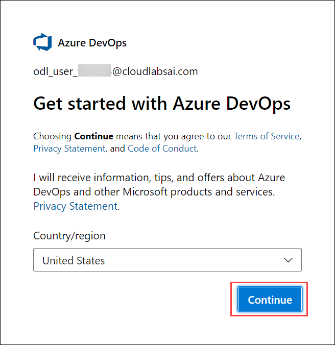
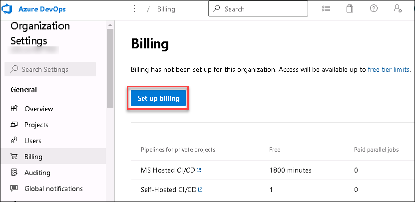
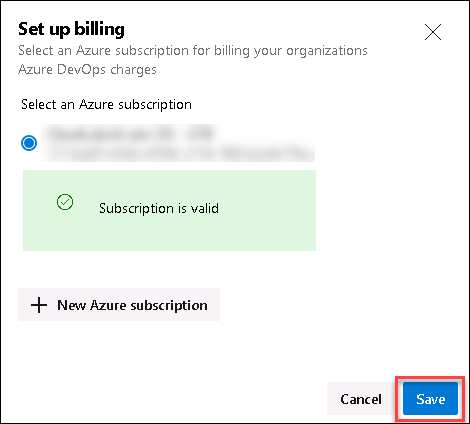
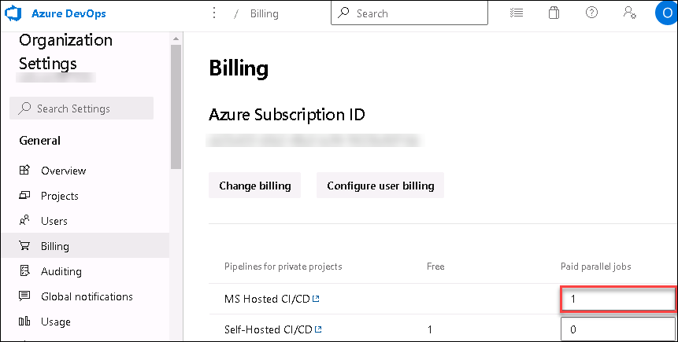
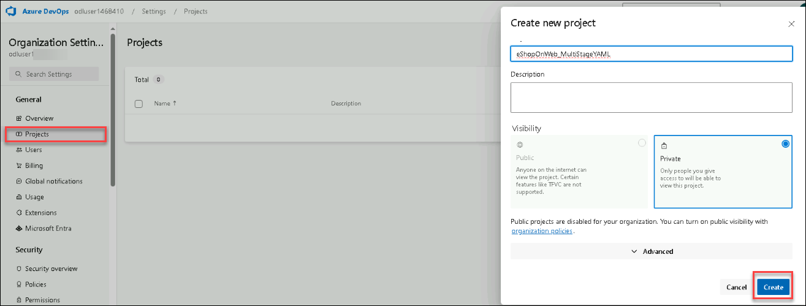
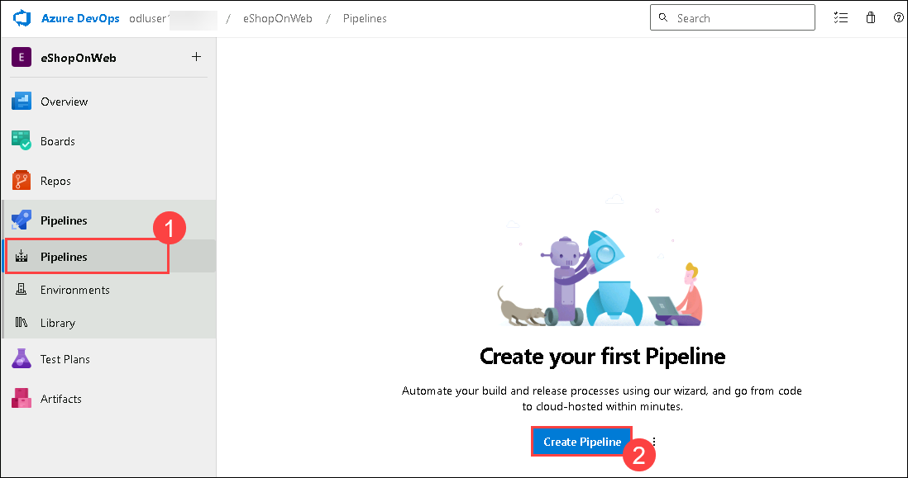

# Lab 01: Configuring Pipelines as Code with YAML

## Lab overview

Azure DevOps supports two types of version control, Git and Team Foundation Version Control (TFVC). Here is a quick overview of the two version control systems:

- **Team Foundation Version Control (TFVC)**: TFVC is a centralized version control system. Typically, team members have only one version of each file on their dev machines. Historical data is maintained only on the server. Branches are path-based and created on the server.

- **Git**: Git is a distributed version control system. Git repositories can live locally (such as on a developer's machine). Each developer has a copy of the source repository on their dev machine. Developers can commit each set of changes on their dev machine and perform version control operations such as history and compare without a network connection.

Git is the default version control provider for new projects. You should use Git for version control in your projects unless you have a specific need for centralized version control features in TFVC.

In this lab, you will learn how to establish a local Git repository, which can easily be synchronized with a centralized Git repository in Azure DevOps. In addition, you will learn about Git branching and merging support. You will use Visual Studio Code, but the same processes apply for using any Git-compatible client.

## Objectives

After you complete this lab, you will be able to:

-   configure CI/CD pipelines as code with YAML in Azure DevOps

## Estimated timing: 60 minutes

## Architecture Diagram

   

# Set up an Azure DevOps organization

1. On your lab VM open **Edge Browser** on desktop and navigate to https://go.microsoft.com/fwlink/?LinkId=307137. 

2. In the pop-up for *Help us protect your account*, select **Skip for now (14 days until this is required)**.

3. On the next page accept defaults and click on continue.

    

4. On the **Almost Done...** page fill the captcha and click on continue. 

    

5. On the Azure Devops page click on **Azure DevOps** located at top left corner and then click on **Organization Setting** at the left down corner

    

6. In the **Organization Setting** window on the left menu click on **Billing** and select **Setup Billing** then click on save.

    
    
        

7. On the **MS Hosted CI/CD** section under **Paid parallel jobs** enter value **1** and at the end of the page click on **Save**.

    

# Exercise 0: Configure the lab prerequisites

In this exercise, you will set up the prerequisites for the lab, which consist of a new Azure DevOps project with a repository based on the [eShopOnWeb](https://dev.azure.com/unhueteb/_git/eshopweb-az400).

## Task 1: Create and configure the team project

In this task, you will create an **eShopOnWeb** Azure DevOps project to be used by several labs.

1. On your lab computer, in a browser window where Azure DevOps organization. navigate to **projects**, click on **New Project**. give your project the name **eShopOnWeb_MultiStageYAML** and leave the other fields with defaults. Click on **Create**..

    

## Task 2: Import eShopOnWeb Git Repository

In this task you will import the eShopOnWeb Git repository that will be used by several labs.

1.  On your lab computer, in a browser window open your Azure DevOps organization and the previously created **eShopOnWeb** project. Navigate to **Repos (1)>Files (2)** and then click on **Import (3)** within the **Import a repository** card. On the **Import a Git Repository** window, paste the following URL https://github.com/MicrosoftLearning/eShopOnWeb.git **(4)** and click on **Import (5)**:

    


1.  The repository is organized the following way:
    - **.ado** folder contains Azure DevOps YAML pipelines
    - **.devcontainer** folder container setup to develop using containers (either locally in VS Code or GitHub Codespaces)
    - **infra** folder contains Bicep&ARM infrastructure as code templates used in some lab scenarios.
    - **.github** folder container YAML GitHub workflow definitions.
    - **src** folder contains the .NET 6 website used on the lab scenarios.
  

1. Go to **Repos>Branches (1)**.
1. Hover on the **main** branch then click the ellipsis on the right of the column **(2)**.
1. Click on **Set as default branch (3)**.
   
    
   

## Task 2: Create Azure resources

In this task, you will create an Azure web app by using the Azure portal.

1. From the lab computer, start a web browser, navigate to the [**Azure Portal**](https://portal.azure.com), and sign in with the user account that has the Owner role in the Azure subscription you will be using in this lab and has the role of the Global Administrator in the Azure AD tenant associated with this subscription.
1. In the Azure portal, in the toolbar, click the **Cloud Shell** icon located directly to the right of the search text box.
   
    
   
1. If prompted to select either **Bash** or **PowerShell**, select **Bash**.
   
   
1. On the **Getting started**, select **Mount storage account** and select your subscription under storage account subscription. Click on **Apply**.
   
     
   
   
1. On the **Mount storage account** tab, select **I want to create a storage account**. Click on **Next**.
   
     


1. Use the existing **Subscription (1)** and **Resource group** as **AZ400-JumpVM (2)** and **Region** as **westus(3)** and specify new names for **Storage account** as **az400storage<inject key="DeploymentID" enableCopy="false" /> (4)** and **File share** as **az400fileshare<inject key="DeploymentID" enableCopy="false" /> (5)**, as shown in the dialog below. Then select **Create**.
   
     

    > **Note:** for a list of regions and their alias, run the following command from the Azure Cloud Shell - Bash:

    ```bash
    az account list-locations -o table
    ```

1. From the **Bash** prompt, in the **Cloud Shell** pane, run the following command to create a resource group (replace the `<region>` placeholder with the name of the Azure region closest to you such as 'centralus', 'westeurope' or other region of choice).

    ```bash
    LOCATION='<region>'
    ```

    ```bash
    RESOURCEGROUPNAME='az400m05l11-RG'
    az group create --name $RESOURCEGROUPNAME --location $LOCATION
    ```

1. To create a Windows App service plan by running the following command:

    ```bash
    SERVICEPLANNAME='az400m05l11-sp1'
    az appservice plan create --resource-group $RESOURCEGROUPNAME --name $SERVICEPLANNAME --sku B3
    ```

1. Create a web app with a unique name.

    ```bash
    WEBAPPNAME=eshoponWebYAML$RANDOM$RANDOM
    az webapp create --resource-group $RESOURCEGROUPNAME --plan $SERVICEPLANNAME --name $WEBAPPNAME
    ```

    > **Note**: Record the name of the web app. You will need it later in this lab.

1. Close the Azure Cloud Shell, but leave the Azure Portal open in the browser.


# Exercise 1: Configure CI/CD Pipelines as Code with YAML in Azure DevOps

In this exercise, you will configure CI/CD Pipelines as code with YAML in Azure DevOps.

## Task 1: Add a YAML build definition

In this task, you will add a YAML build definition to the existing project.


1. Navigate back to the **Pipelines (1)** pane in of the **Pipelines** hub.

1. Click **Create pipeline (2)** .

    

    > **Note**: We will use the wizard to create a new YAML Pipeline definition based on our project.

1. On the **Where is your code?** pane, click **Azure Repos Git (YAML)** option.
1. On the **Select a repository** pane, click **eShopOnWeb_MultiStageYAML**.
1. On the **Configure your pipeline** pane, scroll down and select **Existing Azure Pipelines YAML File**.
1. In the **Selecting an existing YAML File** blade, specify the following parameters:
    - Branch: **main**
    - Path: **.ado/eshoponweb-ci.yml**
1. Click **Continue** to save these settings.
1. From the **Review your Pipeline YAML** screen, click **Run** to start the Build Pipeline process.
1. Wait for the Build Pipeline to complete successfully. Ignore any warnings regarding the source code itself, as they are not relevant for this lab exercise.

    > **Note**: Each task from the YAML file is available for review, including any warnings and errors.

## Task 2: Add continuous delivery to the YAML definition

In this task, you will add continuous delivery to the YAML-based definition of the pipeline you created in the previous task.

> **Note**: Now that the build and test processes are successful, we can now add delivery to the YAML definition.

1. On the pipeline run pane, click the ellipsis symbol in the upper right corner and, in the dropdown menu, click **Edit pipeline**.
1. On the pane displaying the content of the **eShopOnWeb_MultiStageYAML/.ado/eshoponweb-ci.yml** file, navigate to the end of the file (line 56), and hit **Enter/Return** to add a new empty line.
1. Being on line **57**, add the following content to define the **Release** stage in the YAML pipeline.

    > **Note**: You can define whatever stages you need to better organize and track pipeline progress.

    ```yaml
    - stage: Deploy
      displayName: Deploy to an Azure Web App
      jobs:
      - job: Deploy
        pool:
          vmImage: 'windows-2019'
        steps:
    ```

1. Set the cursor on a new line at the end of the YAML definition.

    > **Note**: This will be the location where new tasks are added.

1. In the list of tasks on the right side of the code pane, search for and select the **Azure App Service Deploy** task.
1. In the **Azure App Service deploy** pane, specify the following settings and click **Add**:

    - In the **Azure subscription** drop-down list, select the Azure subscription into which you deployed the Azure resources earlier in the lab, click **Authorize**, and, when prompted, authenticate by using the same user account you used during the Azure resource deployment.
    - In the **App Service name** dropdown list, select the name of the web app you deployed earlier in the lab.
    - In the **Package or folder** text box, **update** the Default Value to `$(Build.ArtifactStagingDirectory)/**/Web.zip`
    - In the **Application and Configuration Settings** add `-UseOnlyInMemoryDatabase true -ASPNETCORE_ENVIRONMENT Development`
      
1. Confirm the settings from the Assistant pane by clicking the **Add** button.

    > **Note**: This will automatically add the deployment task to the YAML pipeline definition.

1. The snippet of code added to the editor should look similar to below, reflecting your name for the azureSubscription and WebappName parameters:

   ```yaml
   - task: AzureRmWebAppDeployment@4
     inputs:
       ConnectionType: "AzureRM"
       azureSubscription: "AZURE SUBSCRIPTION HERE (b999999abc-1234-987a-a1e0-27fb2ea7f9f4)"
       appType: "webApp"
       WebAppName: "eshoponWebYAML369825031"
       packageForLinux: "$(Build.ArtifactStagingDirectory)/**/Web.zip"
       AppSettings: "-UseOnlyInMemoryDatabase true -ASPNETCORE_ENVIRONMENT Development"
   ```


1. Validate the task is listed as a child of the **steps** task. If not, select all lines from the added task, press the **Tab** key twice to indent it four spaces, so that it listed as a child of the **steps** task.

    > **Note**: The **packageForLinux** parameter is misleading in the context of this lab, but it is valid for Windows or Linux.

    > **Note**: By default, these two stages run independently. As a result, the build output from the first stage might not be available to the second stage without additional changes. To implement these changes, we will add a new task to download the deployment artifact in the beginning of the deploy stage.

1. Place the cursor on the first line under the **steps** node of the **deploy** stage, and hit Enter/Return to add a new empty line (Line 64).
1. On the **Tasks** pane, search for and select the **Download build artifacts** task.
1. Specify the following parameters for this task:
    - Download Artifacts produced by: **Current Build**
    - Download Type: **Specific Artifact**
    - Artifact Name: **Enter "Website" in the text box**
    - Destination Directory: **$(Build.ArtifactStagingDirectory)**
1. Click **Add**.
1. The snippet of added code should look similar to below:

    ```yaml
        - task: DownloadBuildArtifacts@0
          inputs:
            buildType: 'current'
            downloadType: 'single'
            artifactName: 'Website'
            downloadPath: '$(Build.ArtifactStagingDirectory)'
    ```
1. If the YAML indentation is off, With the added task still selected in the editor, press the **Tab** key twice to indent it four spaces.

    > **Note**: Here as well you may also want to add an empty line before and after to make it easier to read.

1. Click **Save**, on the **Save** pane, click **Save** again to commit the change directly into the master branch.

    > **Note**: Since our original CI-YAML was not configured to automatically trigger a new build, we have to initiate this one manually.

1. From the Azure DevOps left menu, navigate to **Pipelines** and select **Pipelines** again. 
1. Open the **EShopOnWeb_MultiStageYAML** Pipeline and click **Run Pipeline**.
1. Confirm the **Run** from the appearing pane.
1. Notice the 2 different Stages, **Build .Net Core Solution** and **Deploy to Azure Web App** appearing.
1. Wait for the pipeline to kick off and wait until it completes the Build Stage successfully.
1. Once the Deploy Stage wants to start, you are prompted with **Permissions Needed**, as well as an orange bar saying 
    ```
    This pipeline needs permission to access a resource before this run can continue to Deploy to an Azure Web App
    ```
1. Click on **View**
1. From the **Waiting for Review** pane, click **Permit**.
1. Validate the message in the **Permit popup** window, and confirm by clicking **Permit**.
1. This sets off the Deploy Stage. Wait for this to complete successfully.

     > **Note**: If the deployment should fail, because of an issue with the YAML Pipeline syntax, use this as a reference:

     ```yaml
    #NAME THE PIPELINE SAME AS FILE (WITHOUT ".yml")
    # trigger:
    # - main

    resources:
      repositories:
        - repository: self
          trigger: none

    stages:
    - stage: Build
      displayName: Build .Net Core Solution
      jobs:
      - job: Build
        pool:
          vmImage: ubuntu-latest
        steps:
        - task: DotNetCoreCLI@2
          displayName: Restore
          inputs:
            command: 'restore'
            projects: '**/*.sln'
            feedsToUse: 'select'

        - task: DotNetCoreCLI@2
          displayName: Build
          inputs:
            command: 'build'
            projects: '**/*.sln'

        - task: DotNetCoreCLI@2
          displayName: Test
          inputs:
            command: 'test'
            projects: 'tests/UnitTests/*.csproj'

        - task: DotNetCoreCLI@2
          displayName: Publish
          inputs:
            command: 'publish'
            publishWebProjects: true
            arguments: '-o $(Build.ArtifactStagingDirectory)'

        - task: PublishBuildArtifacts@1
          displayName: Publish Artifacts ADO - Website
          inputs:
            pathToPublish: '$(Build.ArtifactStagingDirectory)'
            artifactName: Website

        - task: PublishBuildArtifacts@1
          displayName: Publish Artifacts ADO - Bicep
          inputs:
            PathtoPublish: '$(Build.SourcesDirectory)/.azure/bicep/webapp.bicep'
            ArtifactName: 'Bicep'
            publishLocation: 'Container'

    - stage: Deploy
      displayName: Deploy to an Azure Web App
      jobs:
      - job: Deploy
        pool:
          vmImage: 'windows-2019'
        steps:
        - task: DownloadBuildArtifacts@0
          inputs:
            buildType: 'current'
            downloadType: 'single'
            artifactName: 'Website'
            downloadPath: '$(Build.ArtifactStagingDirectory)'
        - task: AzureRmWebAppDeployment@4
          inputs:
            ConnectionType: 'AzureRM'
            azureSubscription: 'AZURE SUBSCRIPTION HERE (b999999abc-1234-987a-a1e0-27fb2ea7f9f4)'
            appType: 'webApp'
            WebAppName: 'eshoponWebYAML369825031'
            packageForLinux: '$(Build.ArtifactStagingDirectory)/**/Web.zip'

    ```

## Task 3: Review the deployed site

1. Switch back to web browser window displaying the Azure portal and navigate to the blade displaying the properties of the Azure web app.
1. On the Azure web app blade, click **Overview** and, on the overview blade, click **Browse** to open your site in a new web browser tab.
1. Verify that the deployed site loads as expected in the new browser tab, showing the EShopOnWeb E-commerce website.

# Exercise 2: Configure Environment settings for CI/CD Pipelines as Code with YAML in Azure DevOps

In this exercise, you will add approvals to a YAML-based Pipeline in Azure DevOps.

## Task 1: Set up Pipeline Environments

YAML Pipelines as Code don't have Release/Quality Gates as we have with Azure DevOps Classic Release Pipelines. However, some similarities can be configured for YAML Pipelines-as-Code using **Environments**. In this task, you will use this mechanism to configure approvals for the Build Stage.

1. From the Azure DevOps Project **EShopOnWeb_MultiStageYAML**, navigate to **Pipelines**.
1. Under the Pipelines Menu to the left, select **Environments**.
1. Click **Create Environment**.
1. In the **New Environment** pane, add a Name for the Environment, called **approvals**.
1. Under **Resources**, select **None**.
1. Confirm the settings by pressing the **Create** button.
1. Once the environment got created, click on the "ellipsis" (...) next to the button "Add Resource".
1. Select **Approvals and Checks**.
1. From the **Add your first check**, select **Approvals**.
1. Add your Azure DevOps User Account Name to the **approvers** field.

    > **Note:** In a real-life scenario, this would reflect the name of your DevOps team working on this project.

1. Confirm the approval settings defined, by pressing the **Create** button.
1. Last, we need to add the necessary "environment: approvals" settings to the YAML pipeline code for the Deploy Stage. To do this, navigate to **Repos**, browse to the **.ado** folder, and select the **eshoponweb-ci.yml** Pipeline-as-Code file.
1. From the Contents view, click the **Edit** button to switch to Editing mode.
1. Navigate to the start of the **Deploy job** (-job: Deploy on Line 60)
1. Add a new empty line right below, and add the following snippet:

    ```yaml
      environment: approvals
    ```

    The resulting snippet of code should look like this:

    ```yaml
     jobs:
      - job: Deploy
        environment: approvals
        pool:
          vmImage: 'windows-2019'
    ```
1. As the environment is a specific setting of a deployment stage, it cannot be used by "jobs". Therefore, we have to make some additional changes to the current job definition.
1. On Line **60**, rename "- job: Deploy" to **- deployment: Deploy**
1. Next, under Line **63** (vmImage: Windows-2019), add a new empty line.
1. Paste in the following Yaml Snippet:

```yaml
    strategy:
      runOnce:
        deploy:
```
20. Select the remaining snippet (Line **67** all the way to the end), and use the **Tab** key to fix the YAML indentation. 

   The resulting YAML snippet should look like this now, reflecting the **Deploy Stage**:


   ```yaml
   - stage: Deploy
     displayName: Deploy to an Azure Web App
     jobs:
       - deployment: Deploy
         environment: approvals
         pool:
           vmImage: "windows-2019"
         strategy:
           runOnce:
             deploy:
               steps:
                 - task: DownloadBuildArtifacts@1
                   inputs:
                     buildType: "current"
                     downloadType: "single"
                     artifactName: "Website"
                     downloadPath: "$(Build.ArtifactStagingDirectory)"
                 - task: AzureRmWebAppDeployment@4
                   inputs:
                     ConnectionType: "AzureRM"
                     azureSubscription: "AZURE SUBSCRIPTION HERE (b999999abc-1234-987a-a1e0-27fb2ea7f9f4)"
                     appType: "webApp"
                     WebAppName: "eshoponWebYAML369825031"
                     packageForLinux: "$(Build.ArtifactStagingDirectory)/**/Web.zip"
                     AppSettings: "-UseOnlyInMemoryDatabase true -ASPNETCORE_ENVIRONMENT Development"
   ```


21. Confirm the changes to the code YAML file by clicking **Commit** and clicking **Commit** again in the appearing Commit pane.
22. Navigate to the Azure DevOps Project menu to the left, select **Pipelines**, select **Pipelines** and notice the **EshopOnWeb_MultiStageYAML** Pipeline used earlier.
23. Open the Pipeline.
24. Click **Run Pipeline** to trigger a new Pipeline run; confirm by clicking **Run**.
25. Just like before, the Build Stage kicks off as expected. Wait for it to complete successfully.
26. From the appearing pane **Checks and manual validations for Deploy to Azure Web App**, click the **View** button next to this message.click the **Permit** button.
27. Click **Permit** again in the following pop-up.
28. Next, since we have the *environment:approvals* configured for the Deploy Stage, it will ask for an approval confirmation before it kicks off.
29. This is visible from the Pipeline view, where it says **Waiting (0/1 checks passed)**. A notification message is also displayed saying **approval needs review before this run can continue to Deploy to an Azure Web App**. 
30. This allows the Deploy Stage to kick off and successfully deploying the Azure Web App source code.
   > **Note:** While this example only used the approvals, know the other checks such as Azure Monitor, REST API, etc... can be used in a similar way


   > **Congratulations** on completing the task! Now, it's time to validate it. Here are the steps:
   - If you receive a success message, you can proceed to the next task.
   - If not, carefully read the error message and retry the step, following the instructions in the lab guide.
   - If you need any assistance, please contact us at cloudlabs-support@spektrasystems.com. We are available 24/7 to help you out.
 
   <validation step="a03ccb27-424c-486e-9b76-b75cd7f250e7" />

### Exercise 3: Remove the Azure lab resources

In this exercise, you will remove the Azure resources provisioned in this lab to eliminate unexpected charges.

> **Note**: Remember to remove any newly created Azure resources that you no longer use. Removing unused resources ensures you will not see unexpected charges.

#### Task 1: Remove the Azure lab resources

In this task, you will use Azure Cloud Shell to remove the Azure resources provisioned in this lab to eliminate unnecessary charges.

1. In the Azure portal, open the **Bash** shell session within the **Cloud Shell** pane.
1. List all resource groups created throughout the labs of this module by running the following command:

   ```sh
   az group list --query "[?starts_with(name,'az400m05l11-RG')].name" --output tsv
   ```

1. Delete all resource groups you created throughout the labs of this module by running the following command:

   ```sh
   az group list --query "[?starts_with(name,'az400m05l11-RG')].[name]" --output tsv | xargs -L1 bash -c 'az group delete --name $0 --no-wait --yes'
   ```

   > **Note**: The command executes asynchronously (as determined by the --nowait parameter), so while you will be able to run another Azure CLI command immediately afterwards within the same Bash session, it will take a few minutes before the resource groups are actually removed.
   
## Review

In this lab, you configured CI/CD pipelines as code with YAML in Azure DevOps.
