# Lab 11: Enable Dynamic Configuration and Feature Flags

## Lab requirements

- This lab requires **Microsoft Edge** or an [Azure DevOps supported browser.](https://learn.microsoft.com/azure/devops/server/compatibility?view=azure-devops#web-portal-supported-browsers)

- **Set up an Azure DevOps organization:** If you don't already have an Azure DevOps organization that you can use for this lab, create one by following the instructions available at [Create an organization or project collection](https://learn.microsoft.com/azure/devops/organizations/accounts/create-organization?view=azure-devops).

- Identify an existing Azure subscription or create a new one.

- Verify that you have a Microsoft account or an Azure AD account with the Contributor or the Owner role in the Azure subscription. For details, refer to [List Azure role assignments using the Azure portal](https://learn.microsoft.com/azure/role-based-access-control/role-assignments-list-portal) and [View and assign administrator roles in Azure Active Directory](https://learn.microsoft.com/azure/active-directory/roles/manage-roles-portal).

## Lab overview

[Azure App Configuration](https://learn.microsoft.com/azure/azure-app-configuration/overview) provides a service to manage application settings and feature flags centrally. Modern programs, especially those running in a cloud, generally have many distributed components. Spreading configuration settings across these components can lead to hard-to-troubleshoot errors during application deployment. Use App Configuration to store all the settings for your application and secure their accesses in one place.

## Objectives

After you complete this lab, you will be able to:

- Enable dynamic configuration
- Manage feature flags

## Architecture Diagram

  

### Exercise 1: Import and run CI/CD Pipeline

In this exercise, you will import and run the CI pipeline, configure the service connection with your Azure Subscription and then import and run the CD pipeline.

**Task 1: Import and run the CD pipeline**
 
 Let's import the CD pipeline named **eshoponweb-cd-webapp-code.yml*.
 
   1. Go to **Pipelines(1)>Pipelines(2)** and Click on **New pipeline(3)** button

      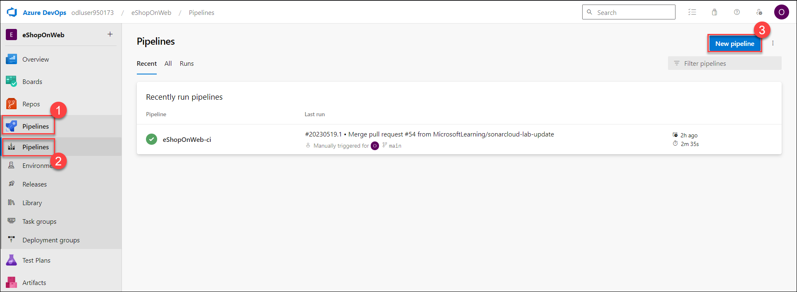

   2. Select **Azure Repos Git (Yaml)**

      

   3. Select the **eShopOnWeb** repository

      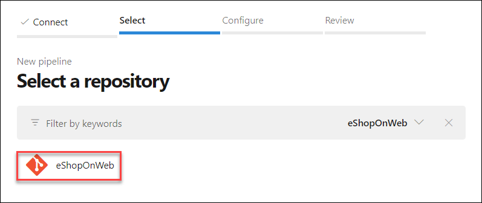

   4. Select **Existing Azure Pipelines YAML File**

      

   5. Select the **.ado/eshoponweb-cd-webapp-code.yml(1)** file then click on **Continue(2)**

      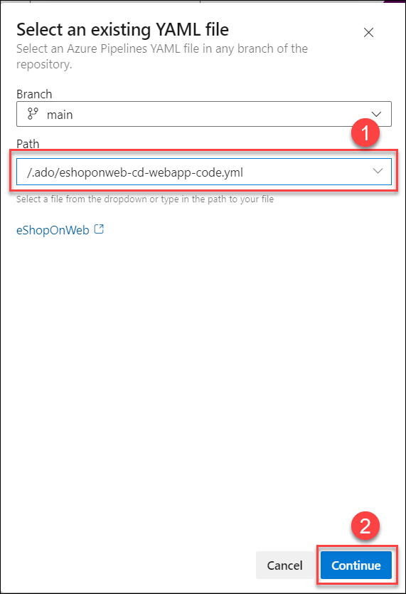
   
      In the YAML pipeline definition, customize:
      
      - **AZ400-EWebshop-NAME(1)** replace NAME with **<inject key="DeploymentID" enableCopy="false"/>**.
      - **YOUR-SUBSCRIPTION-ID(2)** with your Azure subscription id.
      - **az400-webapp-NAME(3)** replace NAME with **<inject key="DeploymentID" enableCopy="false"/>**.

      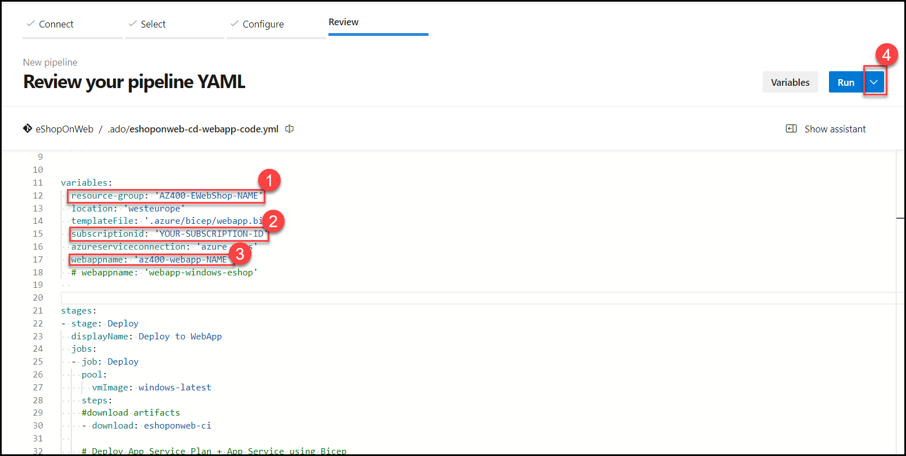
         
   6. Click on **Save and Run** and wait for the pipeline to execute successfully.

      > **Note**: The deployment may take a few minutes to complete.When the pipeline is running if you get a prompt  as **Permissions Needed** click on **view** and click on permit 

       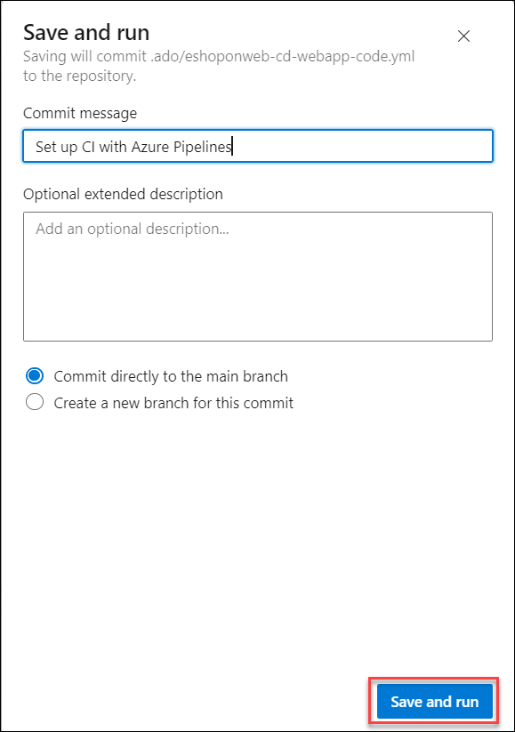
       
       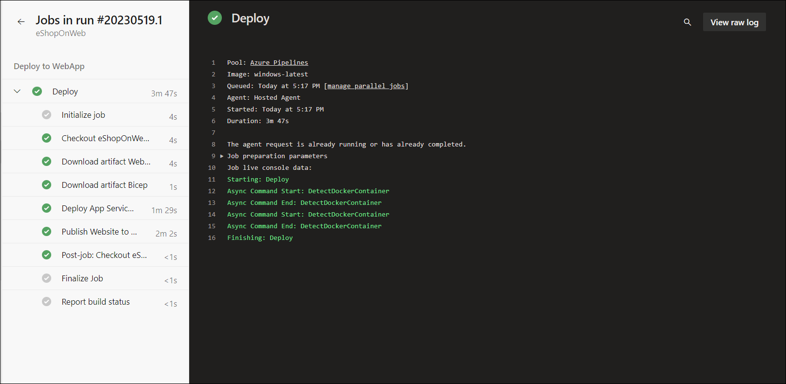

      The CD definition consists of the following tasks:
       - **Resources**: it is prepared to automatically trigger based on CI pipeline completion. It also downloads the repository for the bicep file.
       - **AzureResourceManagerTemplateDeployment**: Deploys the Azure Web App using bicep template.

  7. Your pipeline will take a name based on the project name. Let's **rename** it for identifying the pipeline better. Go to **Pipelines(1)>Pipelines(2)** and          click on the recently created pipeline. Click on the **ellipsis(3)** and **Rename/move(4)** option. Name it **eshoponweb-cd-webapp-code(5)** and click on          **Save(6)**.

        
     
      

# Exercise 2: Manage Azure App Configuration

In this exercise, you will create the App Configuration resource in Azure, enable the managed identity and then test the full solution.

>Note: This exercise doesn't require any coding skills. The website's code implements already Azure App Configuration functionalities.
If you want to know how to implement this in your application, please take a look at these tutorials: [Use dynamic configuration in an ASP.NET Core app](https://learn.microsoft.com/azure/azure-app-configuration/enable-dynamic-configuration-aspnet-core) and [Manage feature flags in Azure App Configuration](https://learn.microsoft.com/azure/azure-app-configuration/manage-feature-flags).

## Task 1: Create the App Configuration resource

1. In the Azure Portal, search for the **App Configuration** service

   
   
   
   
2. Click **Create app configuration** then select:
    - Your Azure Subscription(1)
    - The Resource Group **(2)** created previously (it should be named **AZ400-EWebShop1-<inject key="DeploymentID" enableCopy="false"/>**)
    - Retain the same region which is in the CD Pipeline previously **(3)**
    - Give a unique name **appcs-<inject key="DeploymentID" enableCopy="false"/>** **(4)**.
    - Select the **Free(5)** pricing tier

    
     
3. Click on **Review + create(6)** then **Create**

   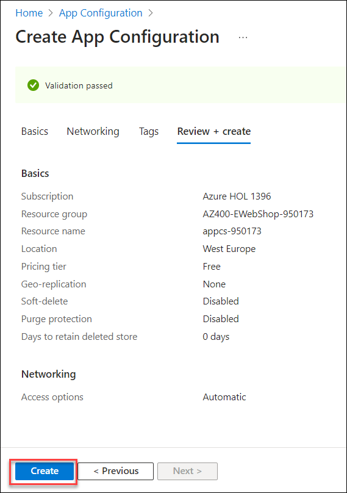
   
4. After creating the App Configuration service, go to **Overview(1)** and copy/save the value of the **Endpoint(2)**.

   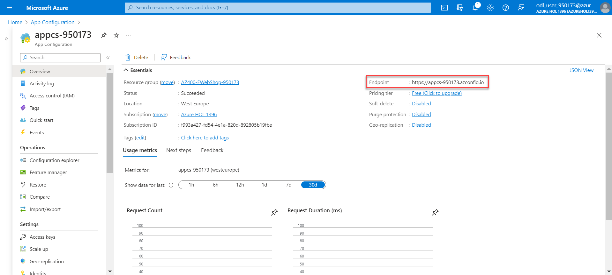

## Task 2: Enable Managed Identity

1. Go to the **Web App(1)** deployed using the pipeline (it should be named **az400-webapp-NAME**).

   
   
2. In the **Settings(2)** section, click on **Identity(3)** then switch status to **On(4)** in the **System Assigned** section, click **save(5)>yes(6)** and wait a few seconds for the operation to finish.

   
   
   
   
3. Go back to the **App Configuration(1)** service and click on **Access control(IAM)(2)** then **+Add(3)->Add role assignment(4)**.

   
   
4. In the **Role(1)** section, select **App Configuration Data Reader(2)** and click on **Next(3)**.

   
   
5. In the **Members(1)** section, check **Manage Identity(2)** then click on **+ Select members(3)**. In the select manage identities tab select **Managed Identity(4)** as **App Service** of your **Web App(5)** (they should have the same name) and then click on **Select(6)**.

   
   
6. Click on **Review and assign**

   

## Task 3: Configure the Web App

In order to make sure that your website is accessing App Configuration, you need to update its configuration.
1. Go back to your Web App.
2. In the **Settings(1)** section, click on **Configuration(2)** and select **+ New application setting(3)**.

   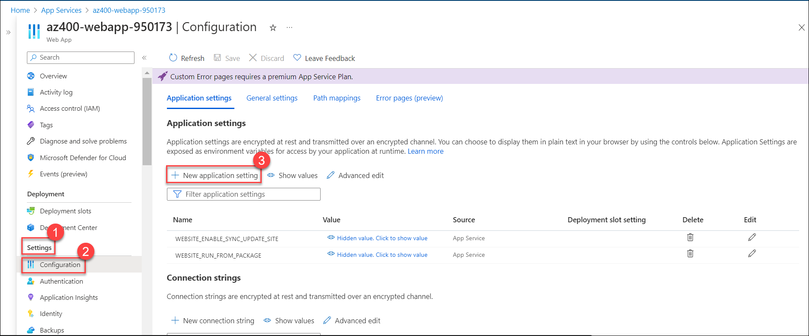

3. Add two new application settings:
    - First app setting
        - **Name:** UseAppConfig
        - **Value:** true

         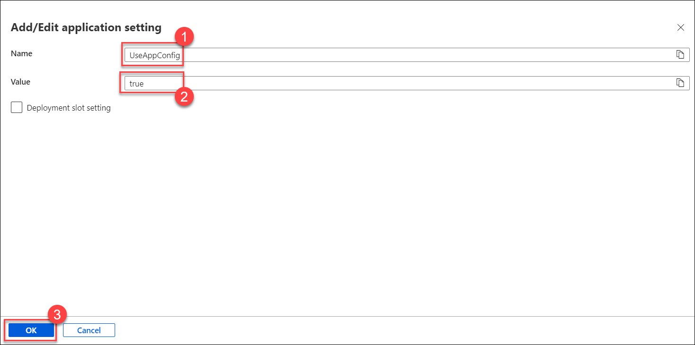
      
    - Second app setting
        - **Name:** AppConfigEndpoint
        - **Value:** *the value you saved/copied previously from App Configuration Endpoint. It should look like https://appcs-NAME-REGION.azconfig.io*
      
         
      
4. Click **Save** then **Continue** and wait for the settings to be updated.

   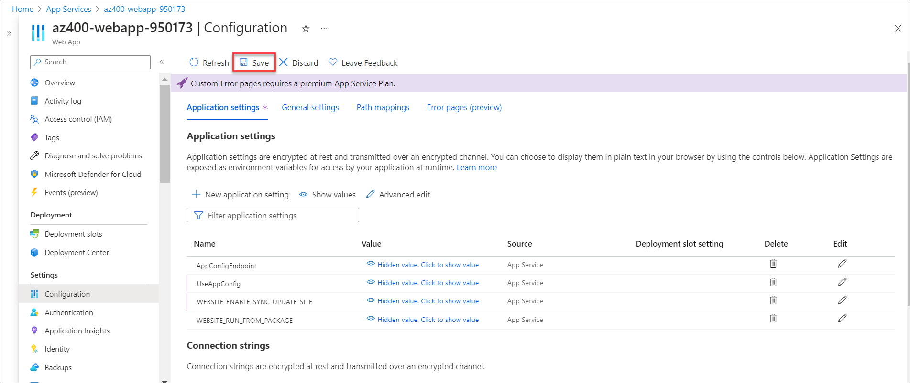
   
   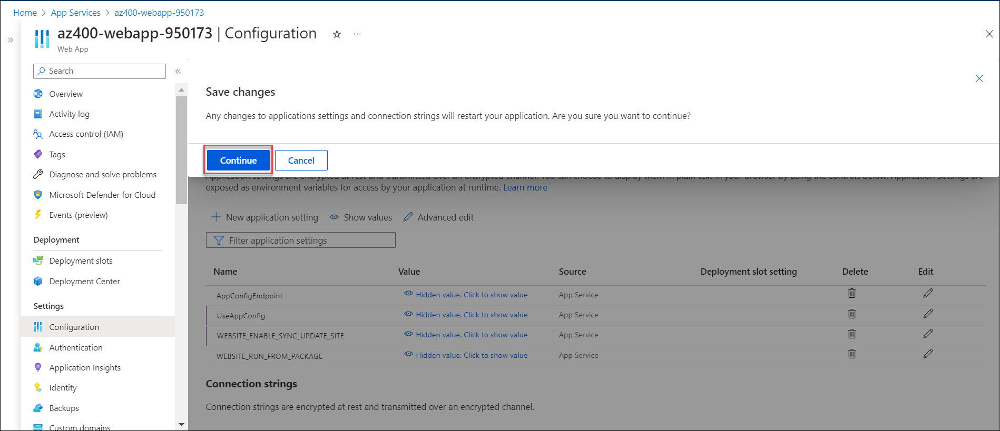
   
5. Go to **Overview(1)** and click on **Browse(2)**

   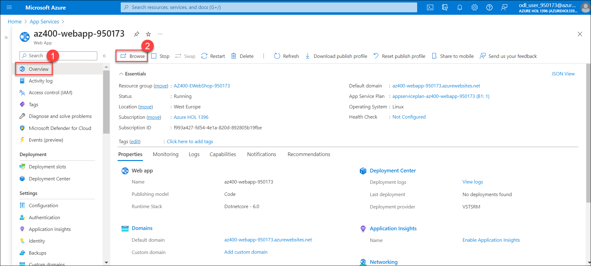
   
6. At this step, you will see no changes in the website since the App Configuration doesn't contain any data. This is what you will do in the next tasks.

## Task 4: Test the Configuration Management

1. In your website, select **Visual Studio(2)** in the **Brand(1)** drop-down list and click on the arrow button (**>(3)**).

   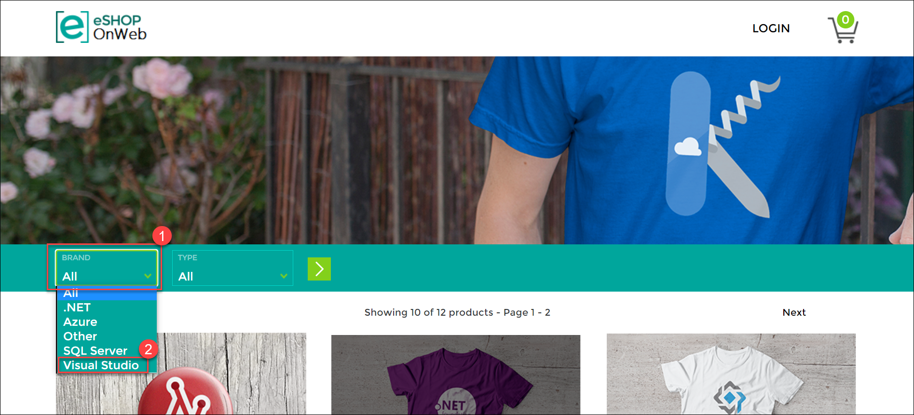
2. You will see a message saying **"THERE ARE NO RESULTS THAT MATCH YOUR SEARCH"(4)**.

   
   
The goal of this Lab is to be able to update that value without updating the website's code or redeploying it.

3. In order to try this, go back to **App Configuration(1)**. In the **Operations(2)** section, select **Configuration Explorer(3)** and Click on **+ Create(4) > Key-value(5)** then add:
    - **Key(6):** eShopWeb:Settings:NoResultsMessage
    - **Value(7):** *type your custom message*
   Click **Apply(8)** then go back to your website and refresh the webapp browser page.
   
   
   
   
   
4. You should see your new message instead of the old default value.

   
   
Congratulations! In this task, you tested the **Configuration explorer** in Azure App Configuration.

## Task 5: Test the Feature Flag

Let's continue to test the Feature manager.
1. In order to try this, go back to **App Configuration(1)**. In the **Operations(2)** section, select **Feature manager(3)**.

   
   
2. Click on **+ Create(4)** then add:
    - **Enable feature flag(1):** Checked
    - **Feature flag name(2):** SalesWeekend
   and click **Apply(3)** then go back to your website and refresh the page.
   
   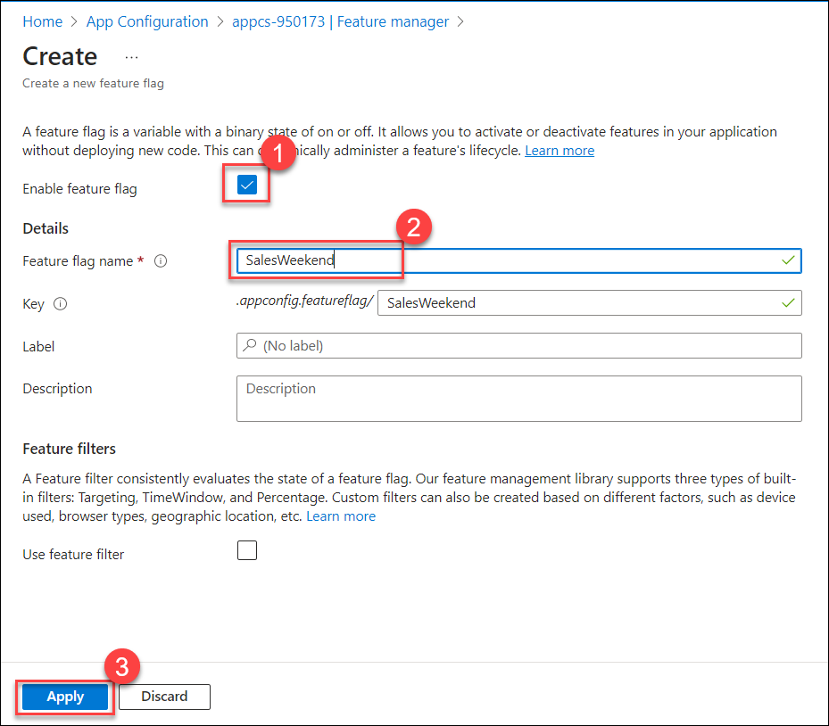
    
3. You should see an image with text "ALL T-SHIRTS ON SALE THIS WEEKEND".

   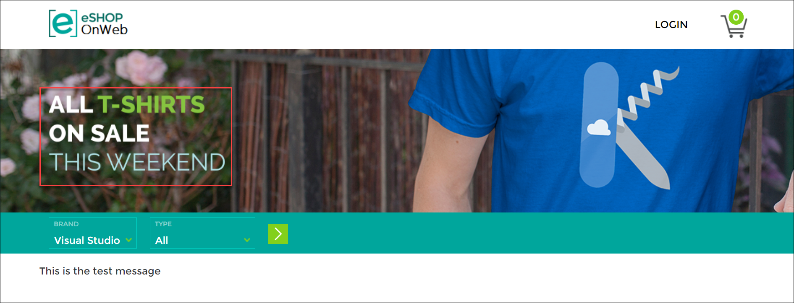
   
4. You can disable this feature in App Configuration and then you would see that the image disappears.

   
   
   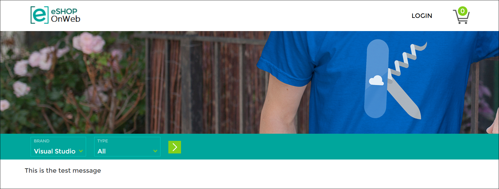

   **Congratulations!!** In this task, you tested the **Feature manager** in Azure App Configuration.

## Review

In this lab, you learned how to dynamically enable configuration and manage feature flags.
