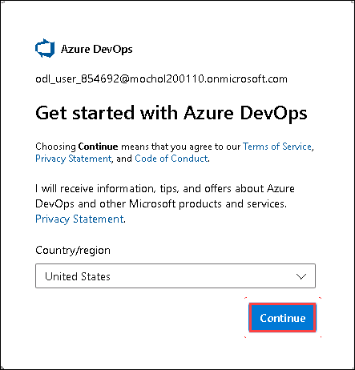
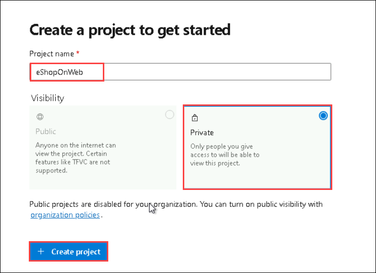
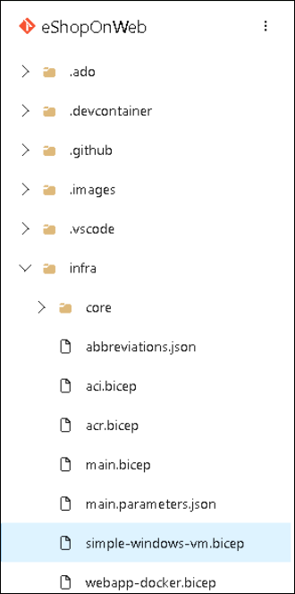
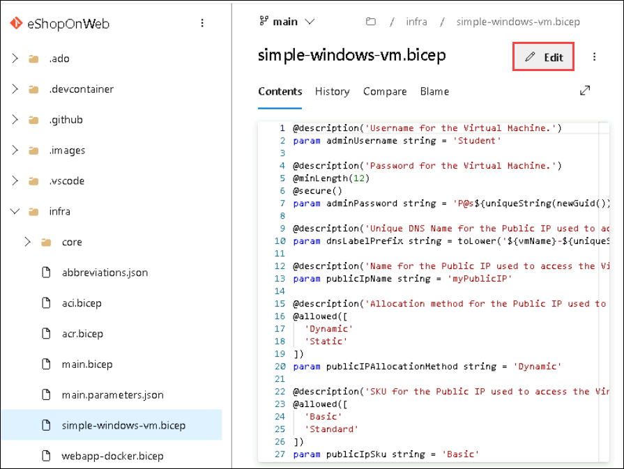
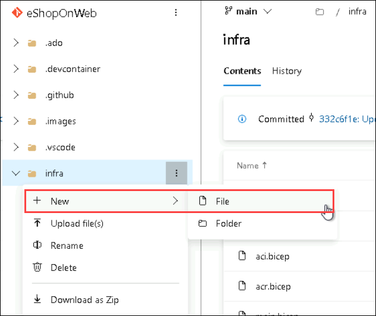
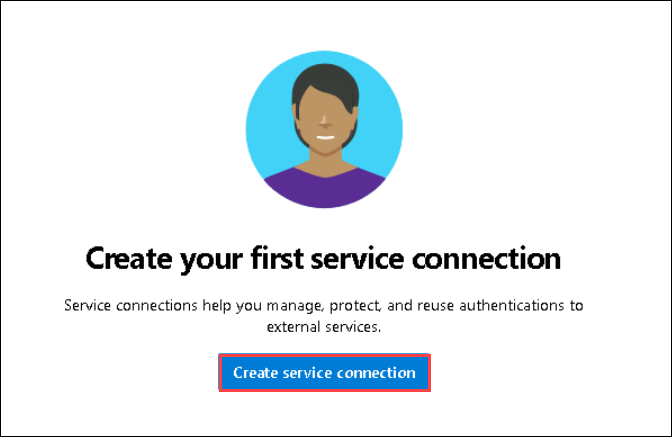
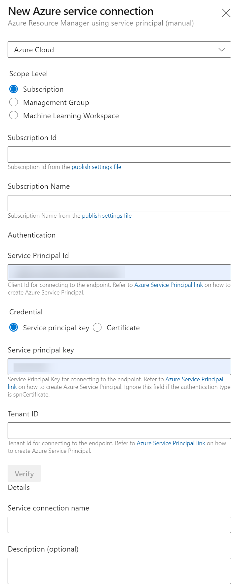
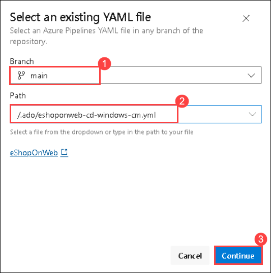
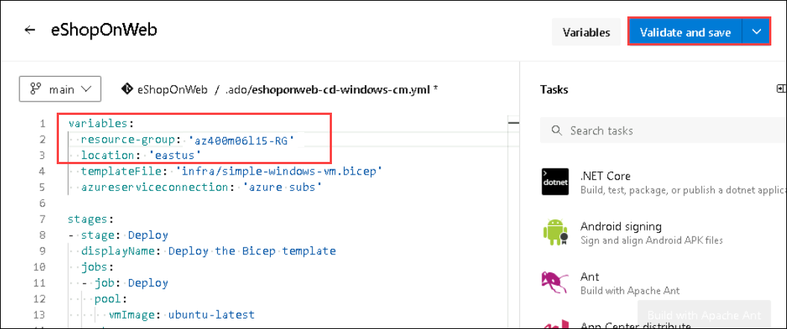
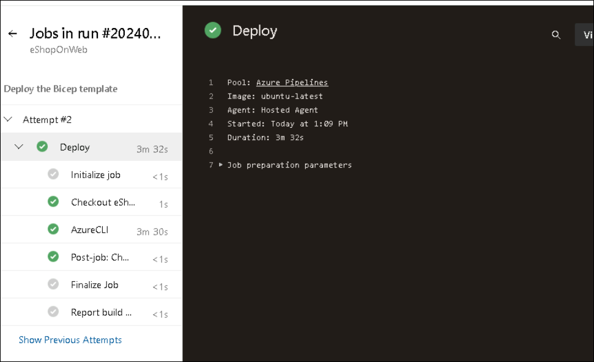

# Lab 1: Manage infrastructure as code using Azure and DSC

# Deployments using Azure Bicep templates

## Lab requirements

- This lab requires **Microsoft Edge** or an [Azure DevOps supported browser.](https://docs.microsoft.com/azure/devops/server/compatibility)

- **Set up an Azure DevOps organization:** If you don't already have an Azure DevOps organization that you can use for this lab, create one by following the instructions available at [Create an organization or project collection](https://docs.microsoft.com/azure/devops/organizations/accounts/create-organization).

- Identify an existing Azure subscription or create a new one.

- Verify that you have a Microsoft account or a Microsoft Entra account with the Owner role in the Azure subscription and the Global Administrator role in the Microsoft Entra tenant associated with the Azure subscription. For details, refer to [List Azure role assignments using the Azure portal](https://docs.microsoft.com/azure/role-based-access-control/role-assignments-list-portal) and [View and assign administrator roles in Azure Active Directory](https://docs.microsoft.com/azure/active-directory/roles/manage-roles-portal).

## Lab overview

In this lab, you'll create an Azure Bicep template and modularize it using the Azure Bicep Modules concept. You'll then modify the main deployment template to use the module and finally deploy all the resources to Azure.

## Objectives

After you complete this lab, you will be able to:

- Understand an Azure Bicep template's structure.
- Create a reusable Bicep module.
- Modify the main template to use the module
- Deploy all the resources to Azure using Azure YAML pipelines.

## Estimated timing: 45 minutes

## Instructions

## Set up an Azure DevOps organization. 

1. On your lab VM open **Edge Browser** on desktop and navigate to https://go.microsoft.com/fwlink/?LinkId=307137. 

2. In the pop-up for *Help us protect your account*, select **Skip for now (14 days until this is required)**.

3. On the next page accept defaults and click on continue.

    

4. On the **Almost Done...** page fill the captcha and click on continue. 

    

5. On the Azure Devops page click on **Azure DevOps** located at top left corner and then click on **Organization Setting** at the left down corner

    

6. In the **Organization Setting** window on the left menu,select **Billing** and click on **Set up billing**.

    
    
7. On the **Setup Billing** click on save.

        

8. On the **MS Hosted CI/CD** section under **Paid parallel jobs** enter value **1** and at the end of the page click on **Save**.

        

9. In the **Organization Setting** window on the left menu click on **Policies** and enable **Third-party application access via OAuth**.

        

# Exercise 0: Configure the lab prerequisites

In this exercise, you will set up the prerequisites for the lab, which consist of a new Azure DevOps project with a repository based on the [eShopOnWeb](https://dev.azure.com/unhueteb/_git/eshopweb-az400).

### Task 1: Create and configure the team project

In this task, you will create an **eShopOnWeb** Azure DevOps project to be used by several labs.

1. On your lab computer, in a browser window open your Azure DevOps organization.

   

1. Give your project the name **eShopOnWeb** and leave the other fields with defaults. Click on **+ Create Project**.

   

### Task 2: Import eShopOnWeb Git Repository

In this task you will import the eShopOnWeb Git repository that will be used by several labs.

1. On your lab computer, in a browser window open your Azure DevOps organization and the previously created **eShopOnWeb** project. Click on **Repos (1) >Files (2)** , **Import a Repository**. Select **Import (3)**. On the **Import a Git Repository** window, paste the following URL <https://github.com/MicrosoftLearning/eShopOnWeb.git> **(4)** and click **Import (5)**:


    

1. The repository is organized the following way:
    - **.ado** folder contains Azure DevOps YAML pipelines.
    - **.devcontainer** folder container setup to develop using containers (either locally in VS Code or GitHub Codespaces).
    - **infra** folder contains Bicep&ARM infrastructure as code templates used in some lab scenarios.
    - **.github** folder container YAML GitHub workflow definitions.
    - **src** folder contains the .NET 8 website used on the lab scenarios.


### Task 3: Set main branch as default branch
  
1. Go to **Repos>Branches (1)**.
1. Hover on the **main** branch then click the ellipsis on the right of the column **(2)**.
1. Click on **Set as default branch (3)**.
   
    

## Exercise 1: Understand an Azure Bicep template and simplify it using a reusable module

In this lab, you will review an Azure Bicep template and simplify it using a reusable module.

### Task 1: Create Azure Bicep template

In this task, you will use Visual Studio Code to create an Azure Bicep template

1. In the browser tab you have your Azure DevOps project open, navigate to **Repos** and **Files**. Open the `infra` folder and find the `simple-windows-vm.bicep` file.

   

1. Review the template to get a better understanding of its structure. There are some parameters with types, default values and validation, some variables, and quite a few resources with these types:

   - Microsoft.Storage/storageAccounts
   - Microsoft.Network/publicIPAddresses
   - Microsoft.Network/virtualNetworks
   - Microsoft.Network/networkInterfaces
   - Microsoft.Compute/virtualMachines

1. Pay attention to how simple the resource definitions are and the ability to implicitly reference symbolic names instead of explicit `dependsOn` throughout the template.

### Task 2: Create a bicep module for storage resources

In this task, you will create a storage template module **storage.bicep** which will create a storage account only and will be imported by the main template. The storage template module needs to pass a value back to the main template, **main.bicep**, and this value will be defined in the outputs element of the storage template module.

1. First we need to remove the storage resource from our main template. From the top right corner of your browser window click the **Edit** button:

   

1. Now delete the storage resource:

   ```bicep
   resource storageAccount 'Microsoft.Storage/storageAccounts@2022-05-01' = {
     name: storageAccountName
     location: location
     sku: {
       name: 'Standard_LRS'
     }
     kind: 'Storage'
   }
   ```

1. Click on Commit twice to commit the changes, however, we're not done with it yet.

1. Next, hover your mouse over the bicep folder and click the ellipsis icon, then select **New**, and **File**. Enter **storage.bicep** for the name and click **Create**.

   

1. Now copy the following code snippet into the file and commit your changes:

   ```bicep
   @description('Location for all resources.')
   param location string = resourceGroup().location

   @description('Name for the storage account.')
   param storageAccountName string

   resource storageAccount 'Microsoft.Storage/storageAccounts@2022-05-01' = {
     name: storageAccountName
     location: location
     sku: {
       name: 'Standard_LRS'
     }
     kind: 'Storage'
   }

   output storageURI string = storageAccount.properties.primaryEndpoints.blob
   ```

### Task 3: Modify the main template to use the template module

In this task, you will modify the main template to reference the template module you created in the previous task.

1. Navigate back to the `simple-windows-vm.bicep` file and click on the **Edit** button once again.

1. Next, add the following code after the variables:

   ```bicep
   module storageModule './storage.bicep' = {
     name: 'linkedTemplate'
     params: {
       location: location
       storageAccountName: storageAccountName
     }
   }
   ```

1. We also need to modify the reference to the storage account blob URI in our virtual machine resource to use the output of the module instead. Find the virtual machine resource and replace the diagnosticsProfile section with the following:

   ```bicep
   diagnosticsProfile: {
     bootDiagnostics: {
       enabled: true
       storageUri: storageModule.outputs.storageURI
     }
   }
   ```

1. Review the following details in the main template:

   - A module in the main template is used to link to another template.
   - The module has a symbolic name called `storageModule`. This name is used for configuring any dependencies.
   - You can only use **Incremental** deployment mode when using template modules.
   - A relative path is used for your template module.
   - Use parameters to pass values from the main template to the template modules.

1. Commit the template.

## Exercise 2: Deploying the templates to Azure using YAML pipelines

In this lab, you will create a service connection and use it in an Azure DevOps YAML pipeline to deploy your template to your Azure environment.

### Task 1: Create a Service Connection for deployment

In this task, you will create a Service Principal by using the Azure CLI, which will allow Azure DevOps to:

- Deploy resources on your Azure subscription.
- Have read access on the later created Key Vault secrets.

> **Note**: If you do already have a Service Principal, you can proceed directly to the next task.

You will need a Service Principal to deploy  Azure resources from Azure Pipelines. Since we are going to retrieve secrets in a pipeline, we will need to grant permission to the service when we create the Azure Key Vault.

A Service Principal is automatically created by Azure Pipelines, when you connect to an Azure subscription from inside a pipeline definition or when you create a new Service Connection from the project settings page (automatic option). You can also manually create the Service Principal from the portal or using Azure CLI and re-use it across projects.

1. From the lab computer, start a web browser, navigate to the [**Azure Portal**](https://portal.azure.com), if prompted to sign in sign in using the following credentials:

    Username:  <inject key="AzureAdUserEmail"></inject>
    Password:  <inject key="AzureAdUserPassword"></inject>
      
1. In the Azure portal, click on the **Cloud Shell** icon, located directly to the right of the search textbox at the top of the page.

     
   
1. If prompted to select either **Bash** or **PowerShell**, select **Bash**.
   
1. On the **Getting started**, select **Mount storage account** and select your subscription under storage account subscription. Click on **Apply**.
   
     
   
1. On the **Mount storage account** tab, select **I want to create a storage account**. Click on **Next**.
   
     

1. Use the existing **Subscription (1)** and **Resource group** as **AZ400-JumpVM (2)** and **Region** as **westus(3)** and specify new names for **Storage account** as **az400storage<inject key="DeploymentID" enableCopy="false" /> (4)** and **File share** as **az400fileshare<inject key="DeploymentID" enableCopy="false" /> (5)**, as shown in the dialog below. Then select **Create**.
   
     

1. From the **Bash** prompt, in the **Cloud Shell** pane, run the following commands to retrieve the values of the Azure subscription ID and subscription name attributes:

    ```bash
    az account show --query id --output tsv
    az account show --query name --output tsv
    ```

    > **Note**: Copy both values to a text file. You will need them later in this lab.

1. From the **Bash** prompt, in the **Cloud Shell** pane, run the following command to create a Service Principal (replace the **myServicePrincipalName** with any unique string of characters consisting of letters and digits) and **mySubscriptionID** with your Azure subscriptionId :

    ```bash
    az ad sp create-for-rbac --name myServicePrincipalName \
                         --role contributor \
                         --scopes /subscriptions/mySubscriptionID
    ```

    > **Note**: The command will generate a JSON output. Copy the output to text file. You will need it later in this lab.

    

1. Next, from the lab computer, start a web browser, navigate to the Azure DevOps **eShopOnWeb** project. Click on **Project Settings>Service Connections (under Pipelines)** and **Create Service Connection**.

   

   

1. On the **New service connection** blade, select **Azure Resource Manager** and **Next** (may need to scroll down).

1. The choose **Service Principal (manual)** and click on **Next**.

1. Fill in the empty fields using the information gathered during previous steps:
    - Subscription Id and Name.
    - Service Principal Id (appId), Service principal key (password) and Tenant ID (tenant).
    - In **Service connection name** type **azure subs**. This name will be referenced in YAML pipelines when needing an Azure DevOps Service Connection to communicate with your Azure subscription.

      

1. Click on **Verify and Save**.

### Task 2: Deploy resources to Azure by YAML pipelines

1. Navigate back to the **Pipelines** pane in of the **Pipelines** hub.
1. In the **Create your first Pipeline** window, click **Create pipeline**.

    > **Note**: We will use the wizard to create a new YAML Pipeline definition based on our project.

1. On the **Where is your code?** pane, click **Azure Repos Git (YAML)** option.

1. On the **Select a repository** pane, click **eShopOnWeb**.

1. On the **Configure your pipeline** pane, scroll down and select **Existing Azure Pipelines YAML File**.

1. In the **Selecting an existing YAML File** blade, specify the following parameters:
   - Branch: **main**
   - Path: **.ado/eshoponweb-cd-windows-cm.yml**
   
1. Click **Continue** to save these settings.

   

1. In the variables section, replace name with **az400m06l15-RG** resource group, set the desired **location** to **<inject key="Region" enableCopy="false"/>** replace the value of the service connection with one of your existing service connections you created earlier.

1. Click the **Verify and save** button from the top right corner and in the commit dialog, click **Save and run** again.

   

1. Wait for the pipeline to kick off.

1. **Ignore** any Warnings showing up during the Build Stage. Wait until it completes the Build Stage successfully. (You can select the actual Build stage to see more details from the logs.)

1. Once the Deploy Stage wants to start, you are prompted with **Permissions Needed**, as well as an orange bar saying:

    ```text
    This pipeline needs permission to access a resource before this run can continue to Deploy to an Azure Web App
    ```
1. Click on **View**.

1. From the **Waiting for Review** pane, click **Permit**.

1. Validate the message in the **Permit popup** window, and confirm by clicking **Permit**.

1. This sets off the Deploy Stage. Wait for this to complete successfully.

1. Wait for the deployment to finish and review the results.

   

   > **Congratulations** on completing the task! Now, it's time to validate it. Here are the steps:
   - If you receive a success message, you can proceed to the next task.
   - If not, carefully read the error message and retry the step, following the instructions in the lab guide.
   - If you need any assistance, please contact us at cloudlabs-support@spektrasystems.com. We are available 24/7 to help you out.
 
   <validation step="9cd20f12-9e2f-4fb2-b764-6790b73ade56" />

## Review

In this lab, you learned how to create an Azure Bicep template, modularize it by using a template module, modify the main deployment template to use the module and updated dependencies, and finally deploy the templates to Azure using YAML pipelines.

### You have successfully completed the lab.
