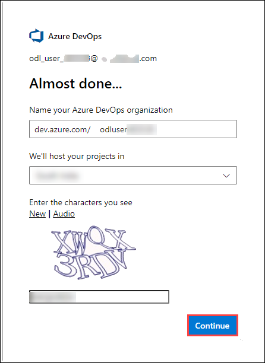
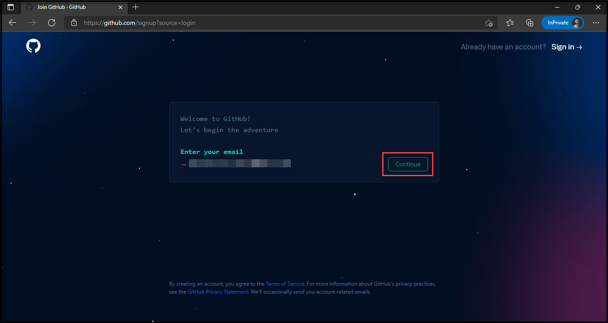
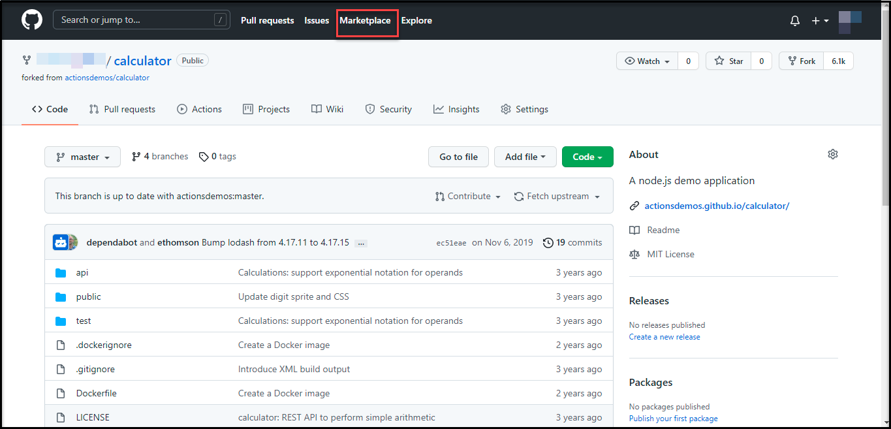
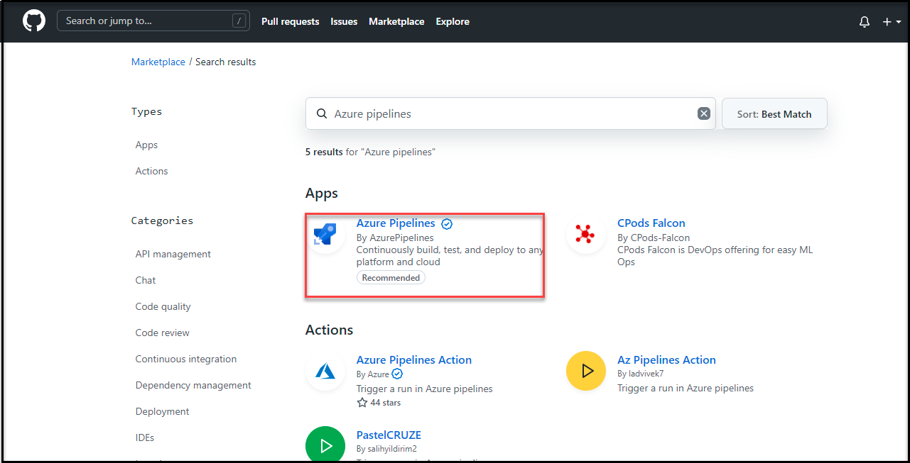
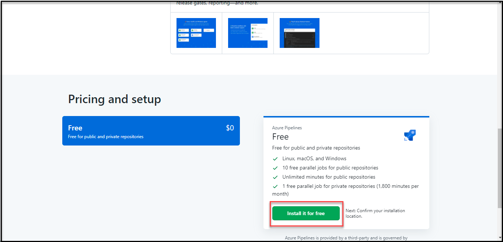
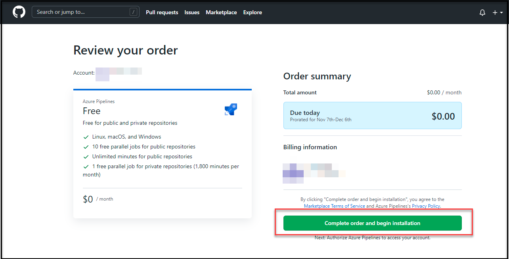
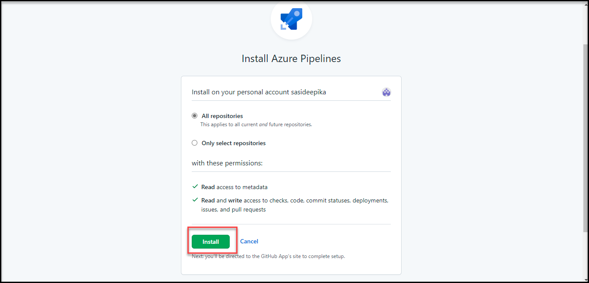
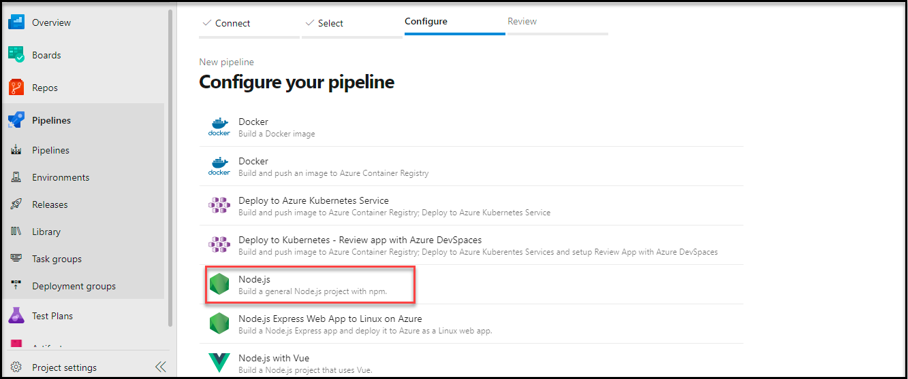
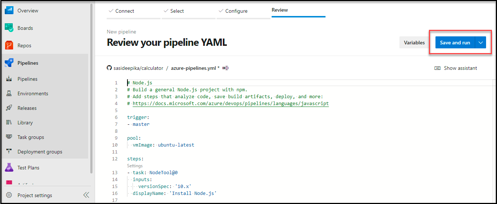

# Lab 06b: Integrating External Source Control with Azure Pipelines
# Student lab manual

## Lab overview

With the introduction of Azure DevOps, Microsoft is offering developers a new continuous integration/continuous delivery (CI/CD) service called Azure Pipelines that enables you to continuously build, test, and deploy to any platform or cloud. It has cloud-hosted agents for Linux, macOS, and Windows; powerful workflows with native container support; and flexible deployments to Kubernetes, VMs, and serverless environments.

Azure Pipelines provides unlimited CI/CD minutes and 10 parallel jobs to every GitHub open source project for free. All open source projects run on the same infrastructure that our paying customers use. That means you’ll have the same fast performance and high quality of service. Many of the top open source projects are already using Azure Pipelines for CI/CD, such as Atom, CPython, Pipenv, Tox, Visual Studio Code, and TypeScript-and the list is growing every day.

In this lab, you’ll see how easy it is to set up Azure Pipelines with your GitHub projects and how you can start seeing benefits immediately.

## Objectives

After you complete this lab, you will be able to:

-   Install Azure Pipelines from the GitHub Marketplace.
-   Integrate a GitHub project with an Azure DevOps pipeline.
-   Track pull requests through the pipeline.

## Lab duration

-   Estimated time: **60 minutes**

## Instructions

#### Set up an Azure DevOps organization

If you don't already have an Azure DevOps organization that you can use for this lab, create one by following the instructions available at [Create an organization or project collection](https://docs.microsoft.com/en-us/azure/devops/organizations/accounts/create-organization?view=azure-devops).

1. On your lab VM open **Edge Browser** on desktop and navigate to https://dev.azure.com. Then click on **Sign into Azure DevOps** and login with the credentials provided in environment details tab.

    

2. On the next page accept defaults and click on continue.

    

3. On the **Get started with Azure DevOps** page click on **Continue**.

4. On the **Almost Done...** page fill the captcha and click on continue. 

    


#### Set up a GitHub account

1. If you already have a GitHub account that you can use for this lab, else follow the instructions available at [Signing up for a new GitHub account](https://docs.github.com/en/free-pro-team@latest/github/getting-started-with-github/signing-up-for-a-new-github-account).

1. If you are not having Github account, follow the instructions to create an account.

1. Navigate to the [Github account](https://github.com/) Click on create an account.

   
   
1. Provide the email address and click on continue.

 
 
1. Provide the password and enter the valid username and click on continue.

  

1. Provide the confirmation and verify your account and click on create account. This would take 2 minutes to create.

 

### Exercise 1: Getting started with Azure Pipelines

In this exercise, you will integrate a GitHub project with Azure DevOps by using the new Azure Pipelines integration from the Marketplace.

#### Task 1: Forking a GitHub repo and installing Azure Pipelines

In this task, you will fork a GitHub repo and install Azure Pipelines in your GitHub account.

1.  On your lab computer, start a web browser, navigate to the [GitHub actionsdemos/calculator site](https://github.com/actionsdemos/calculator) and, if you're not already signed in to GitHub, sign in now.

    > **Note**: This is the baseline project we will fork and use for this lab.

1.  On the **actionsdemos/calculator site** page, click **Fork**, to fork the repository to your own GitHub account. If prompted, select the account to fork the repository into.
    
    

1.  On the page displaying the forked repo, at the top menu, click **Marketplace**.

   
   
   > **Note**: The **GitHub Marketplace** provides a variety of tools from Microsoft and 3rd parties that help you extend your project workflows. 
1.  In the **Search for apps and actions**, type **Azure Pipelines**, press the **Enter** key, and, in the list of results, click **Azure Pipelines**.

  

1.  On the **Azure Pipelines** page, click **Read more** and read through the benefits of Azure Pipelines.

    > **Note**: The Azure Pipelines offering is free for anyone to use for public repositories, and free for a single build queue if you're using a private repository. 

1.  On the **Azure Pipelines** page, click **Install it for free**. If you have multiple **GitHub** accounts, select the one you forked the calculator to from the **Switch billing account** dropdown.

  
1.  On the **Review your order** page, click **Complete order and begin installation**.

   
1.  On the **Install Azure Pipelines** page, use the default option **All repositories** and click **Install**.

   

   > **Note**: You have the option to specify repositories to include, but for the purposes of this lab, just include all of them. Note that Azure DevOps requires the listed set of permissions to fulfill its services. 

1.  If prompted, authenticate with your GitHub password to continue.
1.  When prompted, on the **Setup your Azure Pipelines project** page, in the **Select your Azure DevOps organization** dropdown list, select your Azure DevOps account and click **Create a new project**.
1.  When prompted, on the **Setup your Azure Pipelines project** page, in the **Project name** textbox, type **Integrating External Source Control with Azure Pipelines**, leave the **Project visibility** set to **Private**, and click **Continue**.
1. On the **Azure Pipelines by Microsoft would like permission to** page, click **Authorize Azure Pipelines**.

### Task 2: Configuring your Azure Pipelines project

In this task, you will configure the Azure Pipelines project based on the fork of the GitHub repo you created in the previous task.

> **Note**: You are now on the Azure DevOps site and need to set up your Azure Pipelines project.

1. In the Azure DevOps portal, click on **Pipelines** in the navigation panel on the left.

1. Click on the **New pipeline** button at top right.

1.  On the **Select a repository** pane of the **Pipelines** view in the Azure DevOps portal, select the fork of the GitHub calculator repository you created in the previous task.

   > **Note**: Azure Pipelines will analyze your project in an attempt to determine if any existing templates would be a good fit. In this case, the recommended template is for **Node.js**, which is perfect for our needs. Some alternative templates are also suggested, although the recommended one is the best for this lab. 
1.  On the **Configure your pipeline**, select **Node.js**.

  

   > **Note**: The build pipeline is defined as **YAML**, a markup syntax well-suited to defining processes like this because it allows you to manage the configuration of the pipeline like any other file in the repo. It's a pretty simple template that identifies the pool to pull a VM from for building, the process to install Node.js for building, and the actual build itself. 

1.  On the **Review your pipeline YAML**, click **Save and run** to save the pipeline and queue a new build.
1.  On the **Save and run** pane, accept the default settings and click **Save and run**.

  

   > **Note**: For the purposes of this lab, you can commit this new file directly to the master branch. 

   > **Note**: It will take a moment for the pipeline to complete. During this time it will configure the build agent, pull in the source from GitHub, and build it according to the pipeline definition.

1.  On the **Summary** tab of the build job's pane, verify that the build completed successfully.

### Task 3: Modifying a YAML build pipeline definition

In this task, you will modify the YAML build definition in the forked GitHub repository and track the build process triggered by your modification.

> **Note**: While the default pipeline is a great start, it doesn't do everything we would like to have automated. For example, it would be great if it also ran our tests to confirm that the changes don't create bugs. Let's return to GitHub where we can edit the YAML by hand. 

1.  On the **Summary** tab of the build job's pane, next to the **Repository and version** label, right-click the entry representing the GitHub project repo hosting the fork you created earlier in this lab and select **Open link in new tab**. This will open a new browser tab, displaying the GitHub page with the content of the fork.

    > **Note**: Since this lab will involve stepping back and forth between GitHub and Azure DevOps, it'll be easier to keep a browser tab open to each.

1.  On the GitHub page displaying the content of the fork, locate and click the entry representing the file **azure-pipelines.yml**. This will automatically open the file and display its content. 
1.  On the **master/calculator/azure-pipelines.yml** page, in the upper right corner of the pane displaying the file content, click the **Edit this file** icon in the shape of a pencil. 

    > **Note**: Our project already contains tests written using Mocha so we just need to execute them in our pipeline. 

1.  To add the test run, add the `npm test` command directly below the `npm run build` command, with the same indentation. In addition, update the `displayName` entry to `'npm install, build, and test'` to clearly indicate what each task of the build is doing: 

    ```
      npm test
    displayName: 'npm install, build, and test'
    ```

1.  Scroll to the bottom of the page, replace the default commit message with **Adding npm test**, and click **Commit changes**. 

    > **Note**: Again, it's acceptable to commit this change directly to the master branch considering that this is a lab environment.

1.  Switch back to the browser tab displaying the **Azure DevOps** portal and use the breadcrumb navigation to navigate to the **Pipelines** pane of the **Pipelines** view.
1.  Verify that the new build triggered by the update already appears on the **Recent** tab in the **Recently run pipelines** list. Click the entry corresponding to the pipeline, on the **Runs** tab, select the most recent run, and, in the **Jobs** section, click the **Job** entry.
1.  On the pane displaying job details, click on individual tasks of the job and follow it through to completion.

### Task 4: Proposing a change via GitHub pull request

In this task, you will propose an invalid change and review the results of a build triggered by a pull request.

> **Note**: One of the great benefits of this pipeline setup is that we now have a quality gate that's automatically run every time someone commits a change. This makes it much easier to manage a project that could have any number of contributions coming in at various levels of quality. 

1.  Switch back to the browser tab displaying the GitHub page displaying the content of the **azure-pipelines.yml** file, navigate back to the page listing content of the forked repo and click **Go to file**.
1.  At the **calculator/** prompt, type **arithmeticController.js** and, in the list of results click **api/controllers/arithmeticController.js**. This will automatically redirect the browser session to the **master/calculator/api/controllers/arithmeticController.js** page, displaying the content of that file.

    > **Note**: This controller contains the core functionality of the app. However, the code for the **add** operation isn't completely clear. Put yourself in the position of someone with good intentions, but a lack of experience with JavaScript. They might identify this as an opportunity to help out by cleaning up the code to make it better.

1.  On the **master/calculator/api/controllers/arithmeticController.js** page, in the upper right corner of the pane displaying the file content, click the **Edit this file** icon in the shape of a pencil. 
1.  Change the line `    'add':      function(a,b) { return +a + +b },` to `    'add':      function(a,b) { return a + b },`.

    > **Note**: This is an incorrect change that would result in invalid outcome.

1.  Scroll to the bottom of the page, replace the default commit message with **Modifying the add function**, select **Create a new branch**, set its name to **addition-cleanup**, and click **Propose file change**.
1.  On the **Open a pull request** page, click **Create pull request** to initiate the process of getting your untested changes into production code. 

    > **Note**: Azure DevOps will detect the change and start the build pipeline. This will result in failed checks, triggering an update the GitHub UI. 

    > **Note**: Return to your original mindset of "project owner".

1.  On the **Modifying the add function #1** pull request page, in the **All checks have failed** section, click **Details** to learn more.
1.  Review the **ANNOTATIONS** section and click the link **View more details on Azure Pipelines** directly below it. This will open a new browser tab displaying the failed run of the job in the Azure DevOps portal.
1.  On the failed job pane in the Azure portal, click the **Job** entry to display its details. 
1.  In the list of job tasks, click the **npm install, build, and test** task to view its output.
1.  Locate the section that lists out failing tests. 

    > **Note**: It might not be immediately clear why the tests failed, but all of the history we've accrued in the pipeline makes it easy to identify that something from this new pull request is the cause. The next step will be to figure out why "21 + 21" produced "2121" instead of the expected "42".

1.  Close the tab displaying the failed run of the job in the Azure DevOps portal.

### Task 5: Using the broken pull request to improve the project

In this task, you will correct the invalid changes introduced in the pull request created in the previous task.

> **Note**: Return to your original mindset of "project owner".

1.  Return to the browser tab displaying the **Modifying the add function #1** GitHub page and return to the main page listing the content of the forked repo. 
1.  At the top of the pane containing the listing of the repo files, **Pull requests** and then click the entry representing the most recent pull request.
1.  On the **Modifying the add function #1** GitHub page, click the **File changed** tab and review its content.

    > **Note**: It appears that the changes were made by someone who didn't realize that the plus signs before each variable were necessary to coerce those variables to their number representations. By removing them, JavaScript interpreted the middle plus sign as the string concatenation operator, which explains why 21 + 21 = 2121 in the failed test. 

1.  On the **Modifying the add function #1** GitHub page, click the ellipsis symbol directly under the **Review changes** button and, in the drop-down menu, click **Edit file**. 
1.  Revert the original changes by adding the plus signs in front of the **a** and **b** variables, resulting in 'add':      function(a,b) { return +a + +b },`. In addition, include a comment on the preceding line stating `// Using + operator to type cast variables as integers in order to prevent string concatenation`.
1.  Scroll to the bottom of the page, replace the default commit message with **Fixing the add function**, ensure that the option to **Commit directly to the addition-cleanup branch** is selected, and click **Commit changes**.
1.  On the **Modifying the add function #1** GitHub page, select the **Conversation** tab.

    > **Note**: Azure DevOps will again detect the change and start the build pipeline. Wait for all checks to pass. 

1.  Once all checks have passed, click **Merge pull request** and then click **Confirm merge**.

### Task 6: Adding a build status badge

In this task, you will add a build status badge to your GitHub repo.

> **Note**: An important sign for a quality project is its build status badge. When someone finds a project that has a badge indicating that the project is currently in a successful build state, it's a sign that the project is maintained effectively. 

1.  Switch back to the browser tab displaying the **Azure DevOps** portal and use the breadcrumb navigation to navigate to the **Recent** tab of the **Pipelines** pane of the **Pipelines** view.
1.  On the **Recent** tab in the **Recently run pipelines** list, click the entry corresponding to the pipeline you used in this lab. 
1.  On the pipeline pane, click the ellipsis symbol in the upper right corner and, in the dropdown list, select **Status badge**. 

    > **Note**: The **Status badge** UI provides a quick and easy way to reference the build status. Often, you'll want to use the provided URLs in your own dashboards, or you can use the Markdown snippet to add the status badge to locations such as Wiki pages. 

1.  On the **Status badge** pane, click the **Copy to clipboard** button for **Sample Markdown**.
1.  Switch back to the browser tab displaying the GitHub page displaying the content of the forked repo and, if needed, click the **<> Code** tab.
1.  In the list of repo files, click **README<nolink>.md** and, on the **master/calculator/README.md** page, in the upper right corner of the pane displaying the file content, click the **Edit this file** icon in the shape of a pencil. 
1.  Add an extra line above line 6 and paste into it the content of Clipboard.
1.  Scroll to the bottom of the page, replace the default commit message with **Add an Azure Pipelines status badge**, and click **Commit changes**. 

    > **Note**: You now have a dynamic build status badge on your project's front page that allows everyone to know that you're effectively managing your project.

#### Review

In this lab, you integrated a GitHub project with Azure DevOps by using the new Azure Pipelines integration from the Marketplace.
