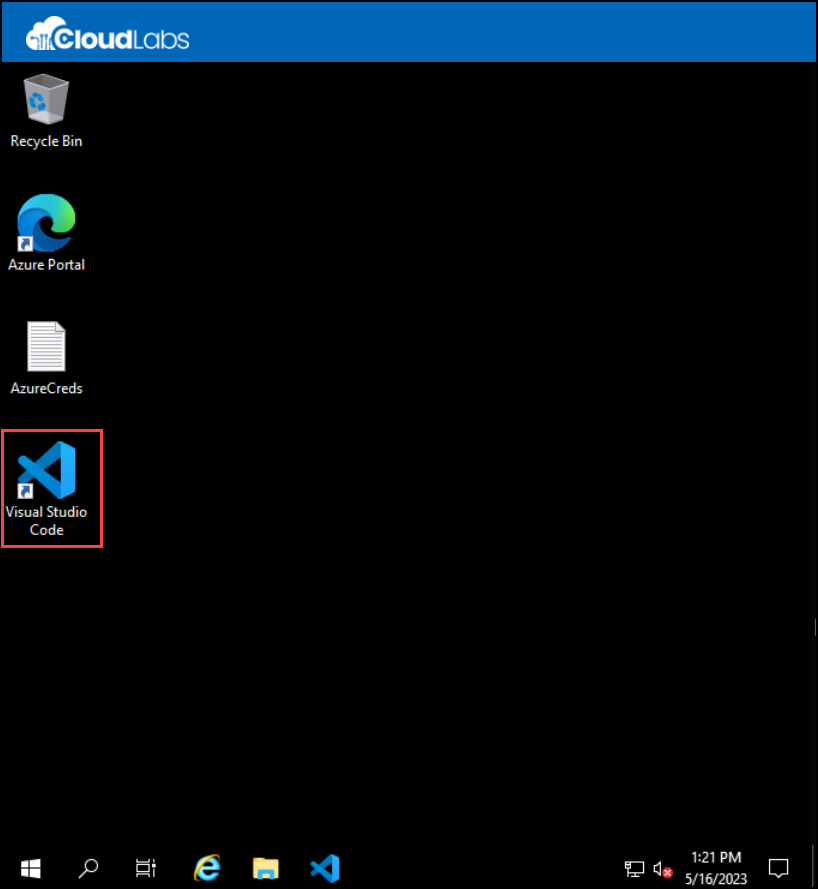
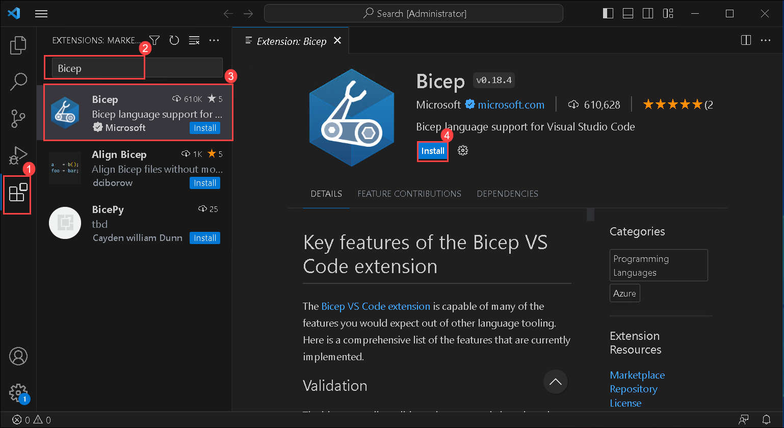
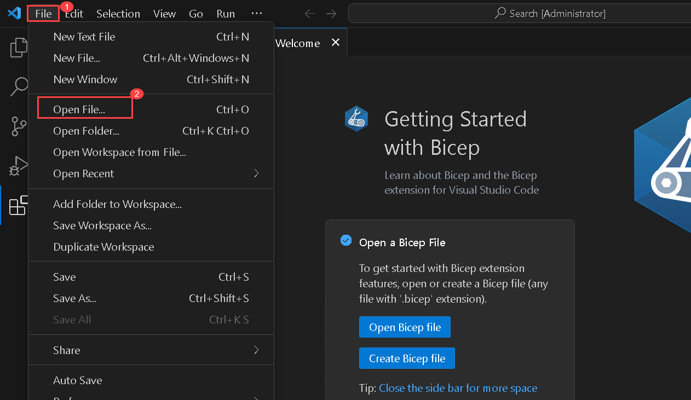
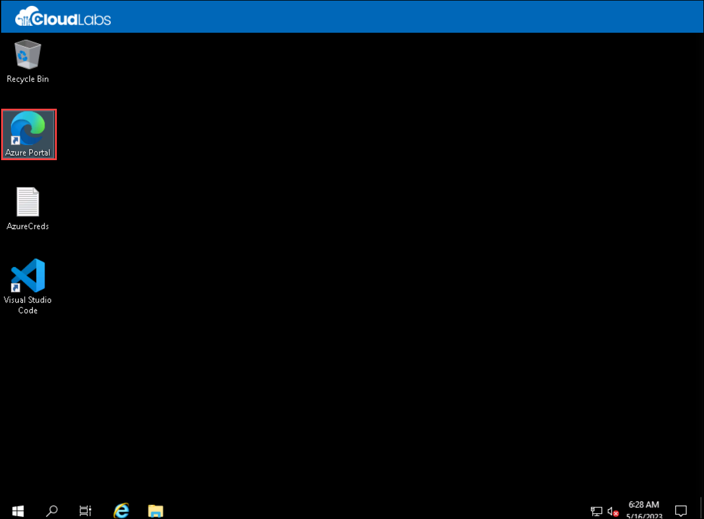
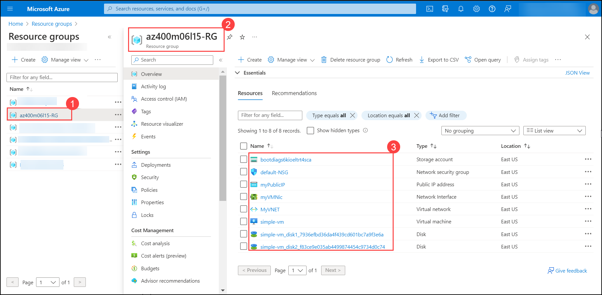

# Lab 12: Azure Deployments using Azure Bicep templates

## Lab overview

In this lab, you'll create an Azure Bicep template and modularize it using the Azure Bicep Modules concept. You'll then modify the main deployment template to use the module and finally deploy the all the resources to Azure.

## Objectives

After you complete this lab, you will be able to:

- Understand and create a Azure Bicep Templates.
- Create a reusable Bicep module for storage resources.
- Upload Linked Template to Azure Blob Storage and generate SAS token.
- Modify the main template to use the module.
- Modify the main template to update dependencies.
- Deploy all the resources to Azure using Azure Bicep Templates.
- Deploy resources to Azure using linked templates

## Architecture Diagram

  

# Exercise 1: Configure the lab prerequisites

In this exercise, you will set up the prerequisites for the lab, which include Visual Studio Code.

## Task 1: Install and configure Git and Visual Studio Code

In this task, you will install Visual Studio Code. If you have already implemented this prerequisite, you can proceed directly to the next task.

1. If you don't have Visual Studio Code installed yet, from your lab computer, start a web browser, navigate to the [Visual Studio Code download page](https://code.visualstudio.com/), download it, and install it.

# Exercise 2: Author and deploy Bicep templates

In this lab, you will create an Azure Bicep template and a template module. You will then modify the main deployment template to use the template module and update the dependencies, and finally deploy the templates to Azure.

## Task 1: Create Azure Bicep template

In this task, you will use Visual Studio Code to create a Azure Bicep template

1. From the Jump VM, start Visual Studio Code.

     
   
1. Select **Extensions(1)**, in the **Search Extensions** textbox, type **Bicep(2)**, select **Bicep(3)** the one published by Microsoft, and click **Install(4)** to install the Azure Bicep language support.
     
     
  
1. In Visual Studio Code, Click on **Files(1)>Open file(2)** to open a file.

     
     
 1. Now in the Open File dialog box, navigate to **C:\\templates(1)**,  Select **main.bicep(2)** file, Make sure that in the file name box **main.bicep(3)** will be selected then click on **Open(4)**.

   
     
    
1. Review the template to get a better understanding of its structure. There are five resource types included in the template:

   - Microsoft.Storage/storageAccounts
   - Microsoft.Network/publicIPAddresses
   - Microsoft.Network/virtualNetworks
   - Microsoft.Network/networkInterfaces
   - Microsoft.Compute/virtualMachines

   > **Note**: We now have two identical JSON files: **C:\\templates\\main.bicep** and **C:\\templates\\storage.bicep**.

## Task 2: Create a template module for storage resources.

In this task, you will modify the templates you saved in the previous task such that the storage template module **storage.bicep** will create a storage account only, it will be imported by the first template. The storage template module needs to pass a value back to the main template, **main.bicep**, and this value will be defined in the outputs element of the storage template module.

1. In Visual Studio Code, click the **File** top level menu, in the dropdown menu, select **Open File**, in the Open File dialog box, navigate to **C:\\templates(1)**, Select **storage.bicep(2)** file, Make sure that in the file name box **storage.bicep(3)** will be selected then click on **Open(4)**.
   
   

1. In the **storage.bicep** file displayed in the Visual Studio Code window, under the **resources section**, remove all the resource elements except the **storageAccounts** resource. It should result in a resource section looking as follows:

   ```bicep
   resource storageAccount 'Microsoft.Storage/storageAccounts@2022-05-01' = {
     name: storageAccountName
     location: location
     sku: {
       name: 'Standard_LRS'
     }
     kind: 'Storage'
   }
   ```

1. Next, remove all the variables definitions:

   ```bicep
   var storageAccountName = 'bootdiags${uniqueString(resourceGroup().id)}'
   var nicName = 'myVMNic'
   var addressPrefix = '10.0.0.0/16'
   var subnetName = 'Subnet'
   var subnetPrefix = '10.0.0.0/24'
   var virtualNetworkName = 'MyVNET'
   var networkSecurityGroupName = 'default-NSG'
   var securityProfileJson = {
     uefiSettings: {
       secureBootEnabled: true
       vTpmEnabled: true
     }
     securityType: securityType
   }
   var extensionName = 'GuestAttestation'
   var extensionPublisher = 'Microsoft.Azure.Security.WindowsAttestation'
   var extensionVersion = '1.0'
   var maaTenantName = 'GuestAttestation'
   var maaEndpoint = substring('emptyString', 0, 0)
   ```

1. Next, remove all parameter values except location. 

   ```bicep
   @description('Location for all resources.')
   param location string = resourceGroup().location
    ```
   
1. Add the following parameter code, below the location parameter resulting in the following outcome:

   ```bicep
   @description('Name for the storage account.')
   param storageAccountName string
     ```

1. Next, at the end of the file, remove the current output and add a new one called storageURI output value. Modify the output so it looks like the below.

   ```bicep
   output storageURI string = storageAccount.properties.primaryEndpoints.blob
   ```

1. Save the storage.bicep template module. The storage template should now look as follows:

   ```bicep
   @description('Location for all resources.')
   param location string = resourceGroup().location

   @description('Name for the storage account.')
   param storageAccountName string

   resource storageAccount 'Microsoft.Storage/storageAccounts@2022-05-01' = {
     name: storageAccountName
     location: location
     sku: {
       name: 'Standard_LRS'
     }
     kind: 'Storage'
   }

   output storageURI string = storageAccount.properties.primaryEndpoints.blob
   ```

## Task 3: Modify the main template to use the template module

In this task, you will modify the main template to reference the template module you created in the previous task.

1. In Visual Studio Code, click the **File** top level menu, in the dropdown menu, select **Open File**, in the Open File dialog box, navigate to **C:\\templates(1)**,  Select **main.bicep(2)** file, Make sure that in the file name box **main.bicep(3)** will be selected then click on **Open(4)**

      
      
3. In the **main.bicep** file, in the resource section remove the storage resource element

   ```bicep
   resource storageAccount 'Microsoft.Storage/storageAccounts@2022-05-01' = {
     name: storageAccountName
     location: location
     sku: {
       name: 'Standard_LRS'
     }
     kind: 'Storage'
   }
   ```

1. Next, add the following code directly in the same location where the newly deleted storage resource element was:

   ```bicep
   module storageModule './storage.bicep' = {
     name: 'linkedTemplate'
     params: {
       location: location
       storageAccountName: storageAccountName
     }
   }
   ```

1. We also need to modify the reference to the storage account blob URI in our virtual machine resource to use the output of the module instead. Find the virtual machine resource and replace the diagnosticsProfile section with the following:

   ```bicep
   diagnosticsProfile: {
     bootDiagnostics: {
       enabled: true
       storageUri: storageModule.outputs.storageURI
     }
   }
   ```

1. Review the following details in the main template:

   - A module in the main template is used to link to another template.
   - The module has a symbolic name called storageModule. This name is used for configuring any dependencies.
   - You can only use Incremental deployment mode when using template modules.
   - A relative path is used for your template module.
   - Use parameters to pass values from the main template to the template modules.

    > **Note**: With Azure ARM Templates, you would have used a storage account to upload the linked template to make it easier for others to use them. With Azure Bicep modules, you have the option to upload them to Azure Bicep Module registry which has both public and private registry options. More information can be found on the [Azure Bicep documentation](https://learn.microsoft.com/en-us/azure/azure-resource-manager/bicep/modules#file-in-registry).

1. Save the template.

## Task 4: Deploy resources to Azure by using template modules

 > **Note**: You can deploy templates in several ways, such as using Azure CLI installed locally or from the Azure Cloud Shell or from a CI/CD pipeline. In this lab, you will use Azure CLI from the Azure Cloud Shell.

 > **Note**: In contrast to ARM templates you cannot use Azure portal to directly deploy Bicep templates.

 > **Note**: To use Azure Cloud Shell, you will upload the both the main.bicep and storage.bicep files into your Cloud Shell's home directory.

 > **Note**: Currently, Azure CLI does not support deploying remote Bicep files. You can build the bicep files to get the ARM Template JSON and then upload them to an storage account, then deploy them remotely.
 
1. In the JumpVM, click on the Azure portal shortcut of the Microsoft Edge browser which is created on the desktop.

   
   
1. If not Sign-in, then on the **Sign into Microsoft Azure** tab you will see the login screen, in that enter following **Email/Username** and then click on **Next**. 
   * Email/Username: <inject key="AzureAdUserEmail"></inject>
   
1. Now enter the following **Password** and click on **Sign in**.
   * Password: <inject key="AzureAdUserPassword"></inject>
   
1. If you see the pop-up **Stay Signed in?**, click No.

1. If you see the pop-up **You have free Azure Advisor recommendations!**, close the window to continue the lab.

1. If **Welcome to Microsoft Azure** popup window appears, click **Maybe Later** to skip the tour.

1. In the Azure portal, click the **Cloud Shell** icon, located directly to the right of the search textbox at the top of the page.

      
  
1. If prompted to select either **Bash** or **PowerShell**, select **Bash**.

     

   > **Note**: If this is the first time you are starting Cloud Shell and you are presented with the You have no storage mounted message, select the subscription you are using in this lab, and select Create storage.
   
     
   
1. In the Cloud Shell pane, click the **Upload/download files** icon and, in the dropdown menu, click **Upload**.
   
     
   
1. In the **Open** dialog box, navigate to and select **C:\\templates\\main.bicep** and click **Open**.
1. Follow the same steps to upload the **C:\\templates\\storage.bicep** file too.
  
1. From a **Bash** session in the Cloud Shell pane, run the following to perform a deployment by using a newly uploaded template:

   ```bash
   LOCATION='eastus'
   ```
    > **Note**: replace the name of the region with a region close to your location example : **"eastus"**. If you do not know what locations are available, run the `az account list-locations -o table` command.
  
   ```bash
   az group create --name az400m06l15-RG --location $LOCATION
   ```

   ```bash   
   az deployment group create --name az400m06l15[Deployment-ID] --resource-group az400m06l15-RG --template-file main.bicep
   ```
    > **Note**: Replace the [Deployment-ID] with <inject key="DeploymentID"></inject> 

1. When prompted to provide the value for 'adminUsername', type **Student** and press the **Enter** key.
1. When prompted to provide the value for 'adminPassword', type **Pa55w.rd1234** and press the **Enter** key. (Password typing will not be shown)
   > **Note**: It will take around 5 minutes to get output.
   
1. In the Azure portal, use the **Search resources, services, and docs** text box at the top of the page to search for **resource group** and, in the list of results, select **Resouce groups**.
      
1. Click on **az400m06l15-RG(1)** resource group, on the **az400m06l15-RG blade(2)** you can see the **resources(3)** which we deployed in the previous steps using azure cloudshell.
       
      
       
3. If you receive errors when running the above command to deploy the template, try the following:

   - If you have multiple Azure subscriptions ensure you have set the subscription context to the correct one where the resource group is deployed.
   - Ensure that the linked template is accessible via the URI you specified.

   > **Note**: As a next step, you could now modularize the remaining resource definitions in the main deployment template, such as the network and virtual machine resource definitions.


   > **Congratulations** on completing the task! Now, it's time to validate it. Here are the steps:
   > - Select the **Lab Validation** tab located at the upper right corner of the lab guide section.
   > - Hit the Validate button for the corresponding task. If you receive a success message, you can proceed to the next task. 
   > - If not, carefully read the error message and retry the step, following the instructions in the lab guide.
   > - If you need any assistance, please contact us at labs-support@spektrasystems.com. We are available 24/7 to help you out.


## Review

In this lab, you learned how to create an Azure Resource manager template, modularize it by using a linked template, modify the main deployment template to call the linked template and updated dependencies, and finally deploy the templates to Azure.
