# Lab 1: Package Management with Azure Artifacts

## Lab overview

Azure Artifacts facilitate discovery, installation, and publishing NuGet, npm, and Maven packages in Azure DevOps. It's deeply integrated with other Azure DevOps features such as Build, making package management a seamless part of your existing workflows.

## Objectives

After you complete this lab, you will be able to:

-  Create and connect to a feed.
-  Create and publish a NuGet package.
-  Import a NuGet package.
-  Update a NuGet package.

## Estimated timing: 40 minutes

## Architecture Diagram

  

## Set up an Azure DevOps organization
1. On your lab VM open **Edge Browser** on desktop and navigate to [Azure DevOps](https://go.microsoft.com/fwlink/?LinkId=307137), and if prompted sign in with the credentials.

    * Email/Username: <inject key="AzureAdUserEmail"></inject>

    * Password: <inject key="AzureAdUserPassword"></inject>

2. In the pop-up for *Help us protect your account*, select **Skip for now (14 days until this is required)**.

3. On the next page accept defaults and click on continue.

   
    
4. On the **Almost Done...** page fill the captcha and click on continue. 

    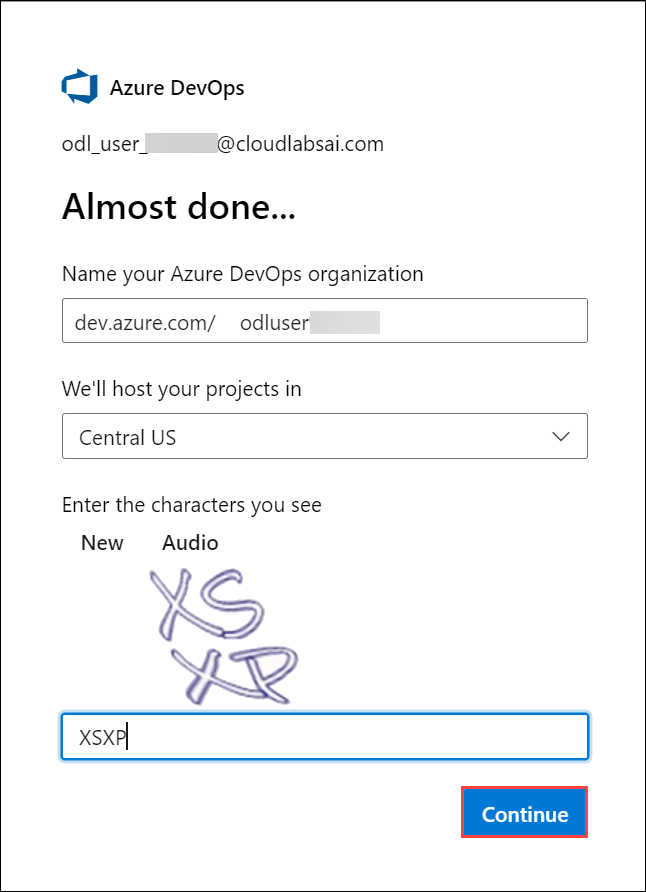

# Exercise 1: Configure the lab prerequisites

In this exercise, you will set up the prerequisites for the lab, which include the pre-configured EShopOnWeb team project based on an Azure DevOps Organization and a Visual Studio configuration.

## Task 1: Configure the EShopOnWeb project

In this task, you will create a new project named **EShopOnWeb** in Azure DevOps Organization.

1.  Click **Sign in** and sign in with the following credentials.
    
    > **Email/Username**: <inject key="AzureAdUserEmail"></inject>
    
    > **Password**: <inject key="AzureAdUserPassword"></inject>

1.  On the **Create New Project** page, in the **Project Name** textbox, type **EShopOnWeb (1)**, select visibility as **Private (2)**, and then click **+ Create Project(3)**

    

## Task 2: Configuring the EShopOnWeb solution in Visual Studio

In this task, you will configure Visual Studio to prepare for the lab.

1.  Ensure that you are viewing the **EShopOnWeb** team project on the Azure DevOps portal. 

    > **Note**: You can access the project page directly by navigating to the [https://dev.azure.com/<inject key="DeploymentID" enableCopy="false"/>/EShopOnWeb]URL.

    .png)

2.  In the vertical menu on the left side of the **EShopOnWeb** pane, click **Repos**.

    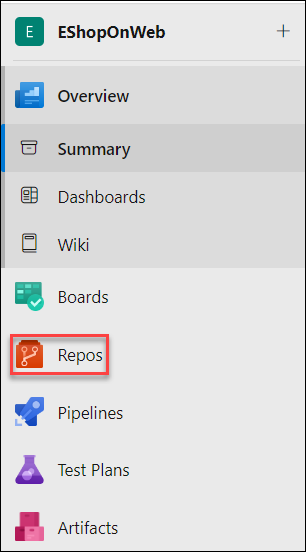

3. When we click on the **Files (2)** pane, we can see that **EShopOnWeb is empty. Add some code!**. So click **Initialize (3)** to initialize the repository for the first time.

    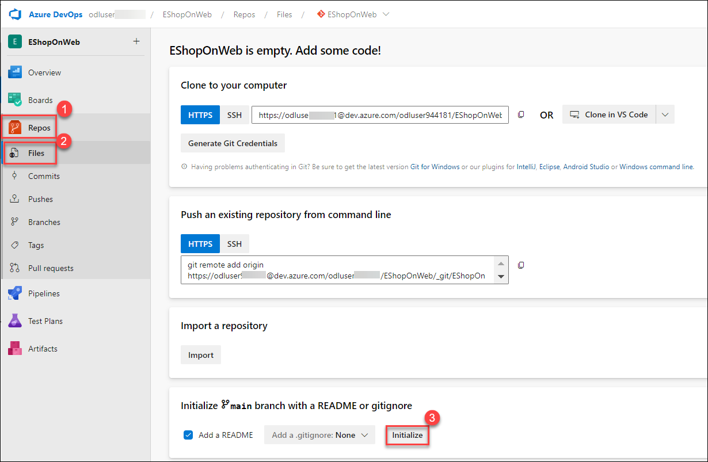

4. In the **EShopOnWeb** repo Click on **Clone**.

    .png)

5. Select the drop-down arrow next to **Clone in VS Code (1)**, and, in the dropdown menu, select **Visual Studio (2)**.

    .png)

6. If **This site is trying to open Microsoft visua---ndler Selector** prompted , click on **Open**.

    .png)

7. On **Sign in to Visual Studio** page click **Sign in**.

    
    
8. If prompted, sign in with following Username and password.
  
    > **Email/Username**: <inject key="AzureAdUserEmail"></inject>
    
    > **Password**: <inject key="AzureAdUserPassword"></inject>
    
9. On **Personalize your Visual Studio experience** page click **Start Visual Studio**.

    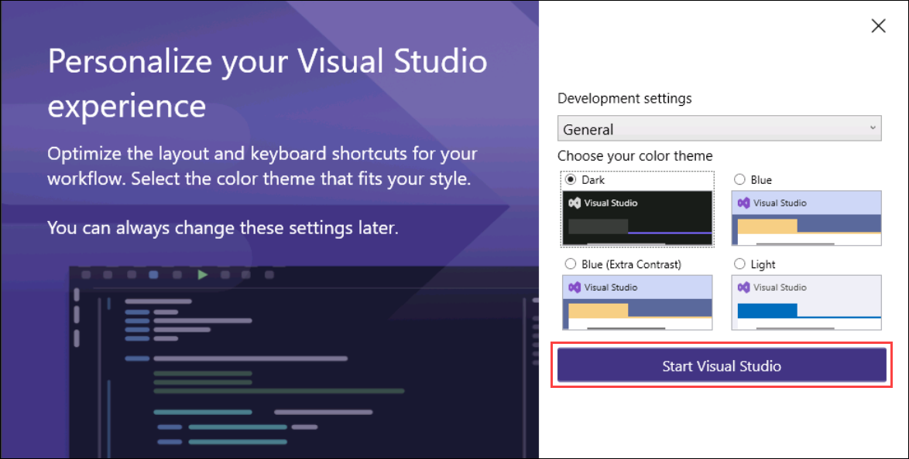            
     
10. Within the Visual Studio interface, in the **Azure DevOps** pop-up window, accept the default local path and click **Clone**. This will automatically import the project into Visual Studio. Make a note of local path you will need it in further tasks.

     .png)

      - if prompted to sign-in  with the following credentials.
    
           > **Email/Username**: <inject key="AzureAdUserEmail"></inject>
    
           > **Password**: <inject key="AzureAdUserPassword"></inject>
    
     >**Note**: If **Visual Studio** takes more than 5 minutes to get launched follow the below steps:
   
     - Close the **Visual Studio** by navigating to **Task Manager** and on task manager select **Microsoft Visual studio 2022**, click **End Task** and reopen **Visual Studio**  from start menu.

       .png)
       
     - If prompted click **Continue without code** on **Visual studio 2022** page
    
     - Within the Visual Studio interface click **Git** tool and select **Clone Repository**
          
       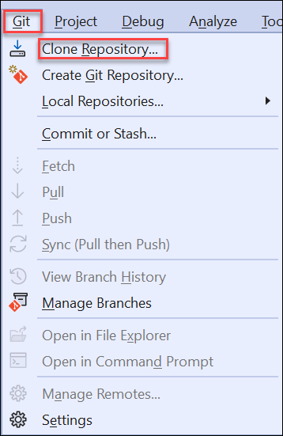
             
     - On **Clone Repository** page under Browse a Repository select **Azure DevOps** and Connect to a Project select **EShopOnWeb** repo and **Clone**.
           
        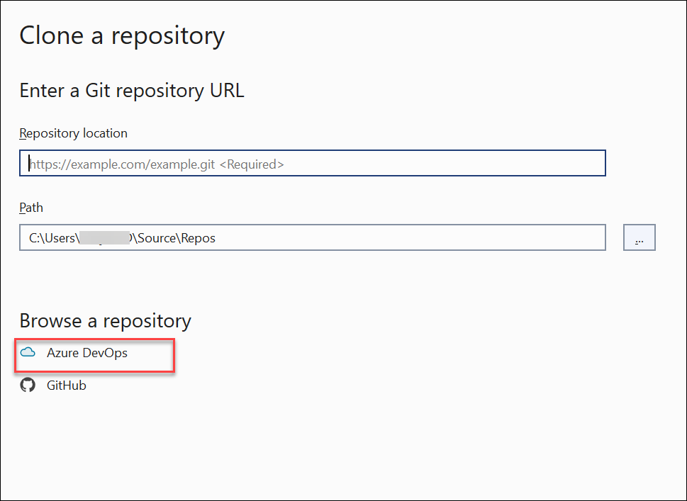
        
        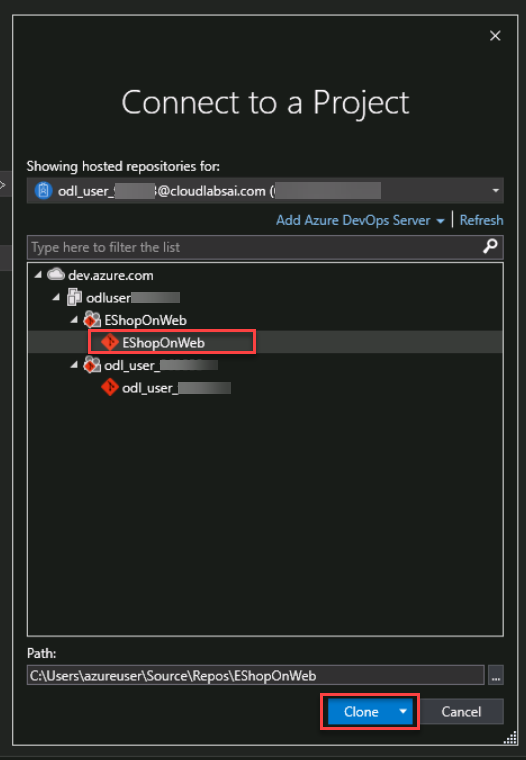
         
     - If prompted, sign in with the following Username and password.

          > **Email/Username**: <inject key="AzureAdUserEmail"></inject>
    
          > **Password**: <inject key="AzureAdUserPassword"></inject>

# Exercise 2: Working with Azure Artifacts

In this exercise, you will learn how to work with Azure Artifacts by using the following steps:

- create and connect to a feed.
- create and publish a NuGet package.
- import a NuGet package.
- update a NuGet package.

## Task 1: Create and connect to a feed

In this task, you will create and connect to a feed.

1.  In the web browser window displaying your project settings in the Azure DevOps portal, in the vertical navigational pane, select **Artifacts**.
    
    

2.  With the **Artifacts** hub displayed, select organization **odluser-<inject key="DeploymentID" enableCopy="false"/>** **(1)** and click **+ Create feed (2)** at the top of the pane. 

    > **Note**: This feed will be a collection of NuGet packages available to users within the organization and will sit alongside the public NuGet feed as a peer. The scenario in this lab will focus on the workflow for using Azure Artifacts, so the actual architectural and development decisions are purely illustrative.  This feed will include common functionality that can be shared across projects in this organization. 
    
    

3.  On the **Create new feed** pane, in the **Name** textbox, type **EShopOnWebShared (1)**, in the **Scope** section, select the **Organization (2)** option, leave other settings with their default values, and click **Create (3)**. 

    > **Note**: Any user who wants to connect to this NuGet feed must configure their environment. 
    
    .png)
    
4.  Back on the **Artifacts** hub, select **EShopOnWebShared** **(1)** Organization, click **Connect to feed (2)**.

      
           
5.  On the **Connect to feed** pane, in the **NuGet** section, select **Visual Studio (1)** and, on the **Visual Studio** pane, copy the **Source (2)** url.
    
    .png)

6.  Switch back to the **Visual Studio** window and wait for the installation to be get completed. 

7.  In the Visual Studio window, click **Tools (1)** menu header, in the dropdown menu, select **NuGet Package Manager (2)** and, in the cascading menu, select **Package Manager Settings (3)**.
    
    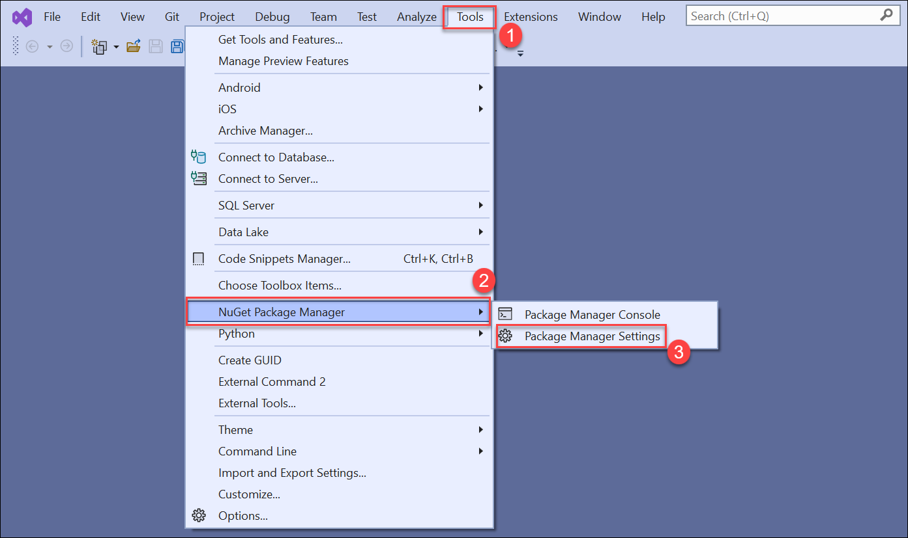
    
8.  In the **Options** dialog box, click **Package Sources** and click the plus sign to add a new package source.

9.  At the bottom of the dialog box, in the **Name** textbox, replace **Package Sources (1)** with **EShopOnWebShared (2)** and, in the **Source** textbox, paste the **Source URL (3)** you copied in the Azure DevOps portal and click **Update (4)** and then click **OK (5)** to finalize the addition. 
    
     (1).png)
     
     > **Note**: Visual Studio is now connected to the new feed.

11.  Close and reopen the other Visual Studio instance you used for cloning the EShopOnWeb repository, to account for the artifact source update and open the **EShopOnWebShared** solution. You will need it in the third task of this exercise.

      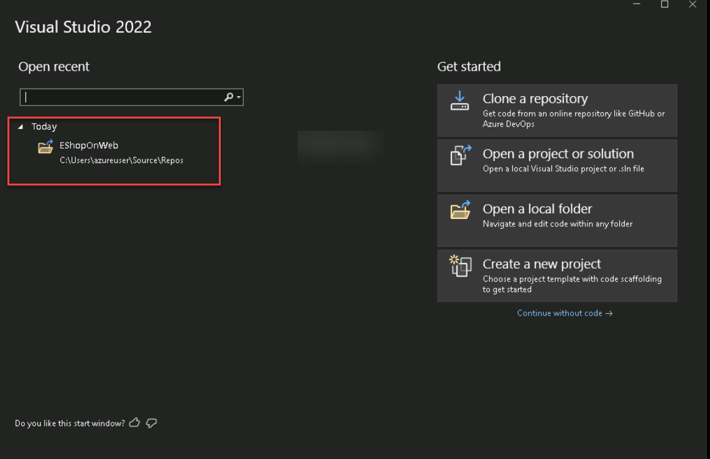

     >**Note**: If your not able to see **EShopOnWebShared** solution, click on **Open a local folder** and select **EShopOnWebShared** > **Select folder**. 

## Task 2: Create and publish a NuGet package

In this task, you will create and publish a NuGet package.

1.  In the Visual Studio window you used to configure the new package source, in the main menu, click **File (1)**, in the dropdown menu, click **New (2)** and then, in the cascading menu, click **Project (3)**. 

    > **Note**: We will now create a shared assembly that will be published as a NuGet package so that other teams can integrate it and stay up to date without having to work directly with the project source.
    
    

2.  On the **Recent project templates** page of the **Create a new project** pane, use the search textbox to locate the **Class Library (1)** template, select the template for **C# (2)**, and click **Next (3)**. 
    
    

3.  On the **Class Library** page of the **Configure your new project** pane, specify the following settings and click **Next (5)**:

    | Setting | Value |
    | --- | --- |
    | Project name | **EShopOnWeb.Shared (1)** |
    | Location | accept the default value (2) |
    | Solution | **Create new solution (3)** |
    | Solution name | **EShopOnWeb.Shared (4)** |
    
    > **Note**: Make sure not to select **.NET Standard**.

    
    
4.  Click Next. Accept **.NET 8.0 (Long Term Support) (1)** as Framework option and click **Create (2)**.
    
5.  Within the Visual Studio interface, in the **Solution Explorer** pane, right-click **Class1.cs (1)**, in the right-click menu, select **Delete (2)**, and, when prompted for confirmation, click **OK**.
    
    .png)

7.  Press **Ctrl+Shift+B** or **Right-click** on the **EShopOnWeb.Shared Project (1)** and select **Build (2)** to build the project.. 

    > **Note**: In the next task we'll use **NuGet.exe** to generate a NuGet package directly from the built project, but it requires the project to be built first.

    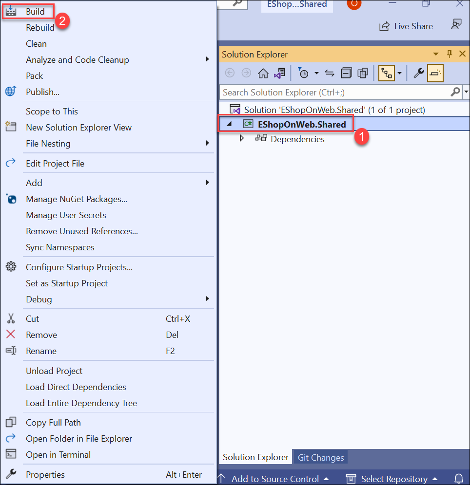
    
    
   
1. From your lab workstation, open the Start menu, and search for **Windows PowerShell**. Next, in the cascading menu, click **Open Windows PowerShell as administrator**.

1. In the **Administrator: Windows PowerShell** window, navigate to the eShopOnWeb.Shared folder, by executing the following command:

    ```text
    cd C:\Users\azureuser\source\repos\EShopOnWeb.Shared\EShopOnWeb.Shared
    ```

     > **Note**: The **eShopOnWeb.Shared** folder is the location of the **eShopOnWeb.Shared.csproj** file. If you chose a different location, navigate to that location instead.

1. Run the following to create a **.nupkg** file from the project.

    ```powershell
    dotnet pack .\eShopOnWeb.Shared.csproj
    ```

1. Run the following to publish the package to the EShopOnWebShared feed:

     ```
     dotnet nuget push --source "eShopOnWebShared" --api-key az eShopOnWeb.Shared.1.0.0.nupkg
     ```  

1. Wait for the confirmation of the successful package push operation.

1. Switch to the web browser window displaying the Azure DevOps portal and, in the vertical navigational pane, select **Artifacts**.
 
    > **Note**: The **eShopOnWebShared** feed should include the newly published NuGet package.

1. Click the NuGet package to display its details.

## Task 3: Import an Open-Source NuGet package to the Azure DevOps Package Feed

Besides developing your own packages, why not using the Open Source NuGet (<https://www.nuget.org>) DotNet Package library? With a few million packages available, there will always be something useful for your application.

In this task, we will use a generic "Newtonsoft.Json" sample package, but you can use the same approach for other packages in the library.

1. From the same PowerShell window, navigate to the **EShopOnWeb.Shared** folder, run the following **dotnet** command to install the sample package:

    ```powershell
    dotnet add package Newtonsoft.Json
    ```

1. Check the output of the install process. It shows the different Feeds it will try to download the package:

    ```powershell
    Feeds used:
      https://api.nuget.org/v3/registration5-gz-semver2/newtonsoft.json/index.json
      https://pkgs.dev.azure.com/<AZURE_DEVOPS_ORGANIZATION>/eShopOnWeb/_packaging/eShopOnWebShared/nuget/v3/index.json
    ```

1. Next, it will show additional output regarding the actual installation process itself.

    ```powershell
    Determining projects to restore...
    Writing C:\Users\AppData\Local\Temp\tmpxnq5ql.tmp
    info : X.509 certificate chain validation will use the default trust store selected by .NET for code signing.
    info : X.509 certificate chain validation will use the default trust store selected by .NET for timestamping.
    info : Adding PackageReference for package 'Newtonsoft.Json' into project 'c:\EShopOnWeb\eShopOnWeb.Shared\EShopOnWeb.Shared.csproj'.
    info :   GET https://api.nuget.org/v3/registration5-gz-semver2/newtonsoft.json/index.json
    info :   OK https://api.nuget.org/v3/registration5-gz-semver2/newtonsoft.json/index.json 124ms
    info : Restoring packages for c:\eShopOnWeb\eShopOnWeb.Shared\eShopOnWeb.Shared.csproj...
    info :   GET https://api.nuget.org/v3/vulnerabilities/index.json
    info :   OK https://api.nuget.org/v3/vulnerabilities/index.json 84ms
    info :   GET https://api.nuget.org/v3-vulnerabilities/2024.02.15.23.23.24/vulnerability.base.json
    info :   GET https://api.nuget.org/v3-vulnerabilities/2024.02.15.23.23.24/2024.02.17.11.23.35/vulnerability.update.json
    info :   OK https://api.nuget.org/v3-vulnerabilities/2024.02.15.23.23.24/vulnerability.base.json 14ms
    info :   OK https://api.nuget.org/v3-vulnerabilities/2024.02.15.23.23.24/2024.02.17.11.23.35/vulnerability.update.json 30ms
    info : Package 'Newtonsoft.Json' is compatible with all the specified frameworks in project 'c:\EShopOnWeb\EShopOnWeb.Shared\eShopOnWeb.Shared.csproj'.
    info : PackageReference for package 'Newtonsoft.Json' version '13.0.3' added to file 'c:\EShopOnWeb\EShopOnWeb.Shared\EShopOnWeb.Shared.csproj'.
    info : Writing assets file to disk. Path: c:\eShopOnWeb\eShopOnWeb.Shared\obj\project.assets.json
    log  : Restored c:\eShopOnWeb\eShopOnWeb.Shared\eShopOnWeb.Shared.csproj (in 294 ms).
    ```

1. The Newtonsoft.Json package got installed in the Packages as **Newtonsoft.Json**. From the Visual Studio **Solution Explorer**, navigate to the **EShopOnWeb.Shared** Project, expand Dependencies, and notice the **Newtonsoft.Json** under the Packages. Click on the little arrow to the left of the Packages, to open the folder and file list.

   

## Task 4: Upload the Open-Source NuGet package to Azure Artifacts

Let's consider this package an "approved" package for our DevOps team to reuse, by uploading it to the Azure Artifacts Package feed created earlier.

1. From the Visual Studio, right-click the new **Newtonsoft.Json** package, and select **Open Folder in File Explorer** from the context menu. You will see the new **Newtonsoft.Json** package with the extension **.nupkg**.
2. Copy the full path from the address bar of the File Explorer window and paste it in notepad. 
   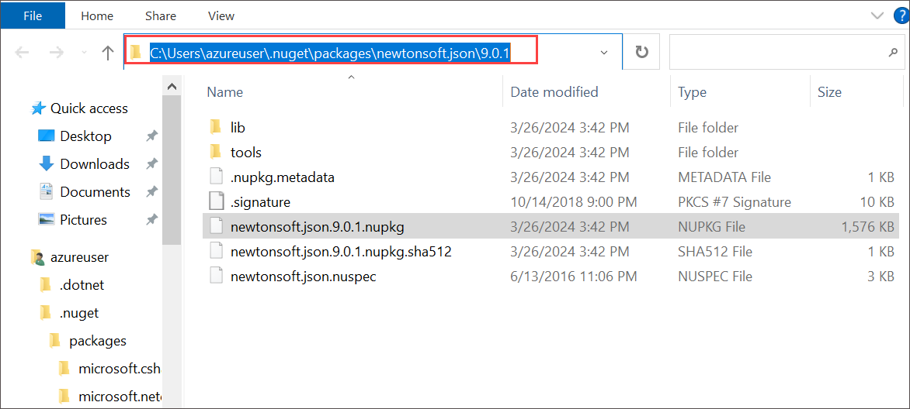

3. Right click on **newtonsoft.json.X.X.X.nupkg**  and select **Properties** then copy the  **newtonsoft.json.X.X.X.nupkg** file name within the Properties window.
     .png)
   
     .png)
   
5. Navigate back to notepad where you recorded the path and add one backslash \ after version X.X.X and paste the **newtonsoft.json.X.X.X.nupkg** file name at the end.

7. From the PowerShell window, execute the following command replacing the **[path]** with the one which you recored and modified in notepad:

    ```powershell
    dotnet nuget push --source "EShopOnWebShared" --api-key az [path]
    ```

   

   > **Note**: This should now result in a successful upload.

    ```text
    Pushing newtonsoft.json.13.0.3.nupkg to 'https://pkgs.dev.azure.com/<AZURE_DEVOPS_ORGANIZATION>/_packaging/5faffb6c-018b-4452-a4d6-72c6bffe79db/nuget/v2/'...
    PUT https://pkgs.dev.azure.com/<AZURE_DEVOPS_ORGANIZATION>/_packaging/5faffb6c-018b-4452-a4d6-72c6bffe79db/nuget/v2/
    Accepted https://pkgs.dev.azure.com/<AZURE_DEVOPS_ORGANIZATION>/_packaging/5faffb6c-018b-4452-a4d6-72c6bffe79db/nuget/v2/ 3160ms
    Your package was pushed.
    ```
1. From the Azure DevOps Portal, **refresh** the Artifacts Package Feed page. The list of packages shows both the **EShopOnWeb.Shared** custom-developed package, as well as the **Newtonsoft.Json** public sourced package.

   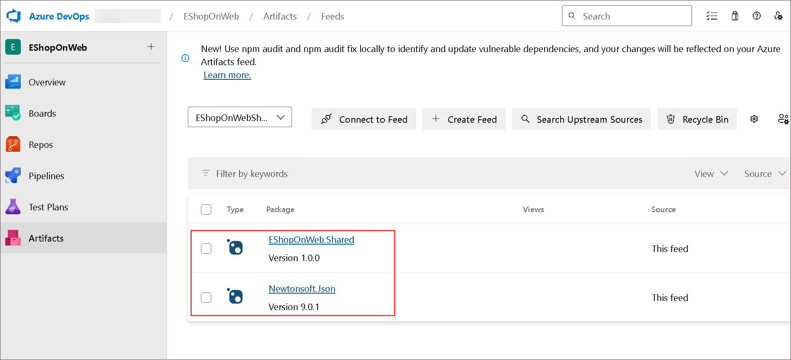
   
1. From the Visual Studio **EShopOnWeb.Shared** Solution, right-click the **EShopOnWeb.Shared** Project, and select **Manage NuGet Packages** from the context menu.

1. From the NuGet Package Manager window, validate the **Package Source** is set to **EShopOnWebShared**.

     

1. Click **Browse**, and wait for the list of NuGet Packages to load.

1. This list will also show both the **EShopOnWeb.Shared** custom-developed package, as well as the **Newtonsoft.Json** public sourced package.

    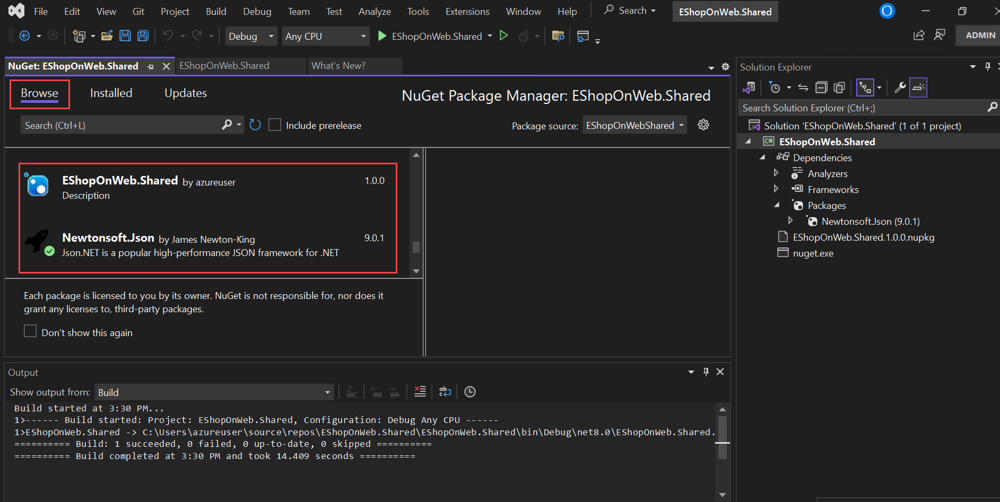

    > **Congratulations** on completing the lab! Now, it's time to validate it. Here are the steps:
    > - Hit the Validate button for the corresponding task. If you receive a success message, you have successfully validated the lab. 
    > - If not, carefully read the error message and retry the step, following the instructions in the lab guide.
    > - If you need any assistance, please contact us at labs-support@spektrasystems.com.
    
    <validation step="24e21234-c893-4493-9184-a1cfa01e826c" />
## Review

In this lab, you learned how to work with Azure Artifacts by using the following steps:

- created and connect to a feed.
- created and publish a NuGet package.
- imported a NuGet package.
- updated a NuGet package.

### You have successfully completed the lab.
