# Lab 16: Monitoring Application Performance with Application Insights


## Lab overview

Application Insights is an extensible Application Performance Management (APM) service for web developers on multiple platforms. You can use it to monitor your live web applications. It automatically detects performance anomalies, includes powerful analytics tools to help you diagnose issues, and helps you continuously improve performance and usability. It works for apps on a wide variety of platforms including .NET, Node.js and Java EE, hosted on-premises, hybrid, or any public cloud. It integrates with your DevOps process with connection points available in a variety of development tools. It also allows you to monitor and analyze telemetry from mobile apps through integration with Visual Studio App Center.

In this lab, you'll learn about how you can add Application Insights to an existing web application, as well as how to monitor the application via the Azure portal.

## Objectives

After you complete this lab, you will be able to:

- Deploy Azure App Service web apps
- Generate and monitor Azure web app application traffic by using Application Insights
- Investigate Azure web app performance by using Application Insights
- Track Azure web app usage by using Application Insights
- Create Azure web app alerts by using Application Insights

## Estimated timing: 60 minutes

## Architecture Diagram

   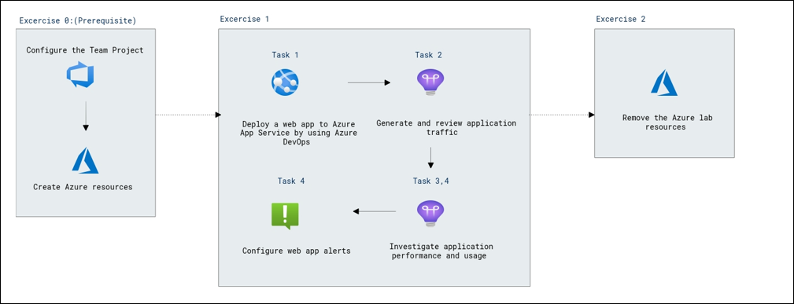

## Set up an Azure DevOps organization. 

1. On your lab VM open **Edge Browser** on desktop and navigate to [Azure DevOps](https://go.microsoft.com/fwlink/?LinkId=307137), and if prompted sign with the credentials.

    * Email/Username: <inject key="AzureAdUserEmail"></inject>

    * Password: <inject key="AzureAdUserPassword"></inject>

2. In the pop-up for *Help us protect your account*, select **Skip for now (14 days until this is required)**.

3. On the next page accept defaults and click on continue.

    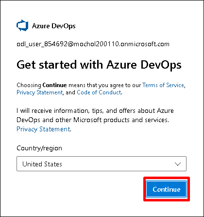

4. On the **Almost Done...** page fill the captcha and click on continue. 

    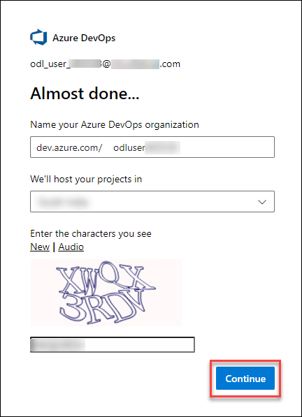

5. On the Azure Devops page click on **Azure DevOps** located at top left corner and then click on **Organization Settings** at the left down corner

    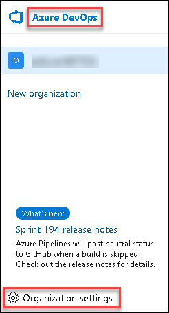

6. In the **Organization Settings** window on the left menu click on **Billing** and select **Setup Billing** then click on save.

    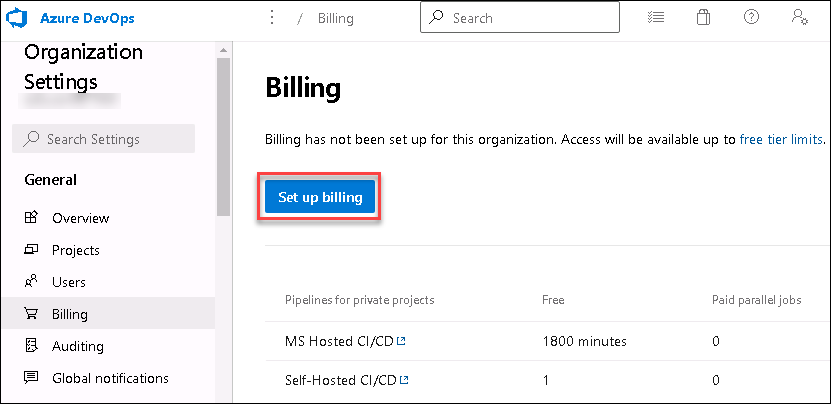
    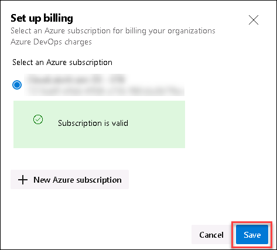    

7. On the **MS Hosted CI/CD** section under **Paid parallel jobs** enter value **1** and at the end of the page click on **Save**.

    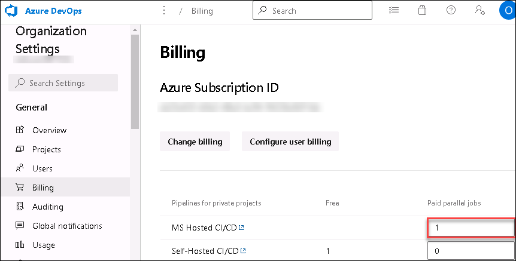

# Exercise 0: Configure the lab prerequisites

In this exercise, you will set up the prerequisites for the lab, which consist of the preconfigured Parts Unlimited team project based on an Azure DevOps Demo Generator template and Azure resources, including an Azure web app and an Azure SQL database. 

## Task 1: Configure the team project

In this task, you will use Azure DevOps Demo Generator to generate a new project based on the **Parts Unlimited** template.

1.  On your lab computer, start a web browser and navigate to [Azure DevOps Demo Generator](https://azuredevopsdemogenerator.azurewebsites.net). This utility site will automate the process of creating a new Azure DevOps project within your account that is prepopulated with content (work items, repos, etc.) required for the lab. 

    > **Note**: For more information on the site, see https://docs.microsoft.com/en-us/azure/devops/demo-gen.

2.  Click **Sign in** and sign in using the Microsoft account associated with your Azure DevOps subscription.

    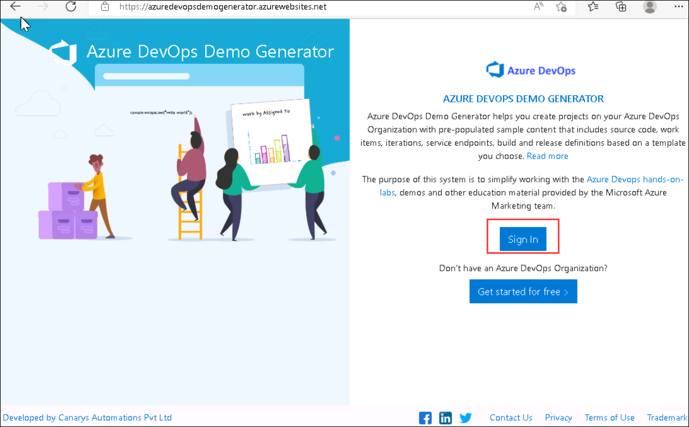
    
3.  If required, on the **Azure DevOps Demo Generator** page, click **Accept** to accept the permission requests for accessing your Azure DevOps subscription.

    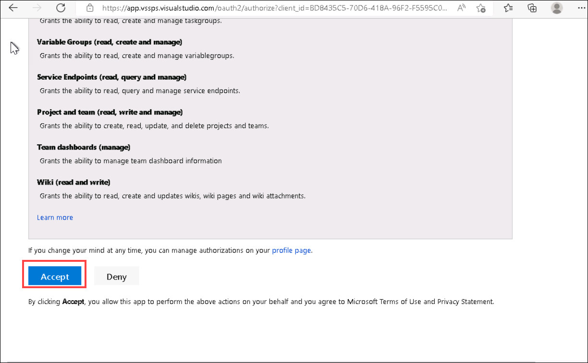
    
4.  On the **Create New Project** page, in the **New Project Name** textbox, type **Monitoring Application Performance**, in the **Select organization** dropdown list, select your Azure DevOps organization, and then click **Choose template**.
5.  In the list of templates, select the **PartsUnlimited** template and click **Select Template**.
6.  Back on the **Create New Project** page, click **Create Project**

    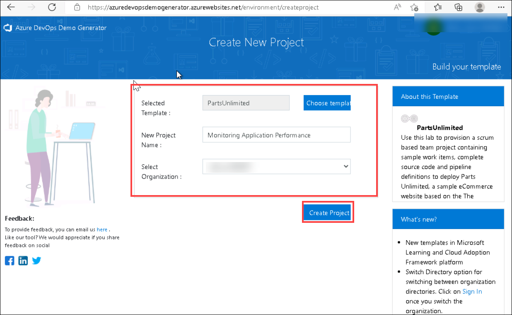

    > **Note**: Wait for the process to complete. This should take about 2 minutes. In case the process fails, navigate to your DevOps organization, delete the project, and try again.

7.  On the **Create New Project** page, click **Navigate to project**.

    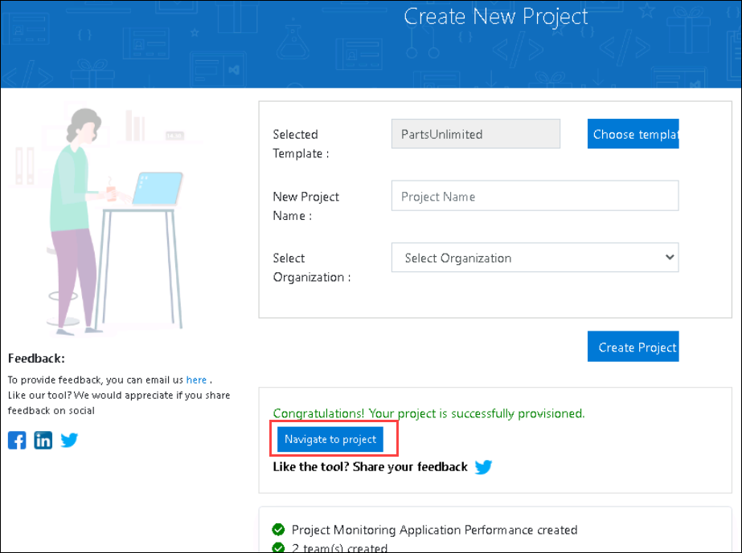

## Task 2: Create Azure resources

In this task, you will create an Azure web app and an Azure SQL database by using the cloud shell in Azure portal.

> **Note**: This lab involves a deployment of the Parts Unlimited site to an Azure app service. To accommodate this requirement, you will need to spin up the necessary infrastructure. 

1.  From the lab computer, start a web browser, navigate to the [**Azure Portal**](https://portal.azure.com), and sign in with the user account that has the Owner role in the Azure subscription you will be using in this lab and has the role of the Global Administrator in the Azure AD tenant associated with this subscription.
2. In the Azure portal, in the toolbar, click the **Cloud Shell** icon located directly to the right of the search text box.

   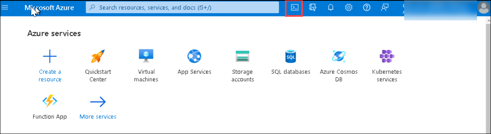

3. If prompted to select either **Bash** or **PowerShell**, select **Bash**.

   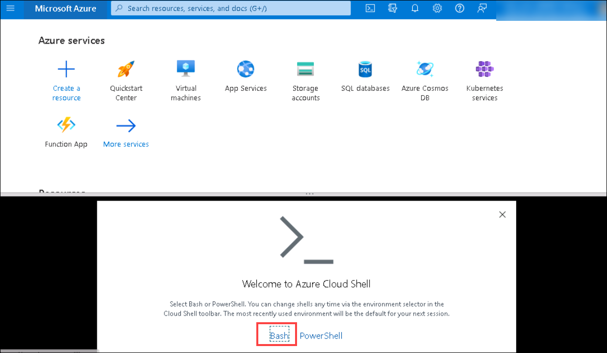

    >**Note**: If this is the first time you are starting **Cloud Shell** and you are presented with the **You have no storage mounted** message, select the subscription you are using in this lab, and select **Create storage**.

   

4.  From the **Bash** prompt, in the **Cloud Shell** pane, run the following command to create a resource group (replace the `<region>` placeholder with the name of the Azure region closest to you such as 'eastus').

    ```bash
    RESOURCEGROUPNAME='az400m17l01a-RG'
    LOCATION='<region>'
    az group create --name $RESOURCEGROUPNAME --location $LOCATION
    ```

5.  To create a Windows App service plan by running the following command:

    ```bash
    SERVICEPLANNAME='az400l17-sp'
    az appservice plan create --resource-group $RESOURCEGROUPNAME \
        --name $SERVICEPLANNAME --sku B3 
    ```

 6.  Run the following command before running the step 7 creation of webapp.
 
     ```
     az extension remove -n appservice-kube
     az extension add -n appservice-kube
     ```    

7.  Create a web app with a unique name.

    ```bash
    WEBAPPNAME=partsunlimited$RANDOM$RANDOM
    az webapp create --resource-group $RESOURCEGROUPNAME --plan $SERVICEPLANNAME --name $WEBAPPNAME 
    ```

    > **Note**: Record the name of the web app by navigating to **App Services**. You will need it later in this lab.

8. Now is the time to create an Application Insights instance.

    ```bash
    az monitor app-insights component create --app $WEBAPPNAME \
        --location $LOCATION \
        --kind web --application-type web \
        --resource-group $RESOURCEGROUPNAME
    ```

    > **Note**: If you got prompted with 'The command requires the extension application-insights. Do you want to install it now?', type Y and press enter.

9. Let us connect the Application Insights to our web application.

    ```bash
    az monitor app-insights component connect-webapp --app $WEBAPPNAME --resource-group $RESOURCEGROUPNAME --web-app $WEBAPPNAME
    ```

10. Next, create an Azure SQL Server.
     ```
     USERNAME="Student"
     SQLSERVERPASSWORD="Pa55w.rd1234"
     SERVERNAME="partsunlimitedserver$RANDOM"
    
     az sql server create --name $SERVERNAME --resource-group $RESOURCEGROUPNAME \
     --location $LOCATION --admin-user $USERNAME --admin-password $SQLSERVERPASSWORD
     ```
 
11. The web app needs to be able to access the SQL server, so we need to allow access to Azure resources in the SQL Server firewall rules.
     ```
     STARTIP="0.0.0.0"
     ENDIP="0.0.0.0"
     az sql server firewall-rule create --server $SERVERNAME --resource-group $RESOURCEGROUPNAME \
     --name AllowAzureResources --start-ip-address $STARTIP --end-ip-address $ENDIP
     ```

11. Now create a database within that server.
     ```
     az sql db create --server $SERVERNAME --resource-group $RESOURCEGROUPNAME --name PartsUnlimited \
     --service-objective S0
     ```

12. The web app you created needs the database connection string in its configuration, so run the following commands to prepare and add it to the app settings of the web app.
     ```
     CONNSTRING=$(az sql db show-connection-string --name PartsUnlimited --server $SERVERNAME \
     --client ado.net --output tsv)
     CONNSTRING=${CONNSTRING//<username>/$USERNAME}
     CONNSTRING=${CONNSTRING//<password>/$SQLSERVERPASSWORD}
     az webapp config connection-string set --name $WEBAPPNAME --resource-group $RESOURCEGROUPNAME \
     -t SQLAzure --settings "DefaultConnectionString=$CONNSTRING" 
    ```

# Exercise 1: Monitor an Azure App Service web app by using Azure Application Insights

In this exercise, you will deploy a web app to Azure App Service by using Azure DevOps pipelines, generate traffic targeting the web app, and use Application Insights to review the web traffic, investigate application performance, track application usage, and configure alerting.

## Task 1: Deploy a web app to Azure App Service by using Azure DevOps

In this task, you will deploying a web app to Azure by using Azure DevOps pipelines.

> **Note**: The sample project we are using in this lab includes a continuous integration build, which we will use without modifications. There is also a continuous delivery release pipeline that will require minor changes before it is ready for deployment to the Azure resources you implemented in the previous task. 

1. Switch to the web browser window displaying the **Monitoring Application Performance** project in the Azure DevOps portal, in the vertical navigational pane, select the **Pipelines**, and, in the **Pipelines** section, select **Releases**.

    >**Note:** If you are not able to see the **Releases** option, then follow these instructions:
    
    a. Select **Azure DevOps**, select **Organization settings** from the left navigation menu. 

    b. From the left navigation menu, under **Pipelines**, select **Settings**.

    c. Now, enable the **Disable creation of classic release pipelines**.

    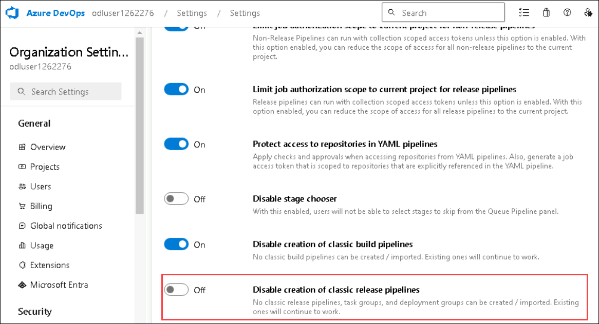
    
1. Confirm to run this pipeline by clicking **Run** from the appearing pane and confirm by clicking **Run** once more.
1. Notice the 2 different Stages, **Build .Net Core Solution** and **Deploy to Azure Web App** appearing.
1. Wait for the pipeline to kick off.

1. **Ignore** any Warnings showing up during the Build Stage. Wait until it completes the Build Stage successfully. (You can select the actual Build stage to see more details from the logs.)

1. Once the Deploy Stage wants to start, you are prompted with **Permissions Needed**, as well as an orange bar saying:

    ```text
    This pipeline needs permission to access a resource before this run can continue to Deploy to an Azure Web App
    ```

1. Click on **View**
1. From the **Waiting for Review** pane, click **Permit**.
1. Validate the message in the **Permit popup** window, and confirm by clicking **Permit**.
1. This sets off the Deploy Stage. Wait for this to complete successfully.

#### Task 2: Review the deployed site

1. Switch back to web browser window displaying the Azure portal and navigate to the blade displaying the properties of the Azure web app.
1. On the Azure web app blade, click **Overview** and, on the overview blade, click **Browse** to open your site in a new web browser tab.
1. Verify that the deployed site loads as expected in the new browser tab, showing the eShopOnWeb E-commerce website.

### Exercise 2: Deploy and Setup Azure Load Testing

In this exercise, you will deploy an Azure Load Testing Resource in Azure, and configure different Load Testing scenarios for your live-running Azure App Service.

#### Task 1: Deploy Azure Load Testing

In this task, you will deploy an Azure Load Testing Resource into your Azure subscription.

1. From the Azure Portal (<https://portal.azure.com>), navigate to **Create Azure Resource**.
1. In the 'Search Services and marketplace' search field, enter **Azure Load Testing**.
1. Select **Azure Load Testing** (published by Microsoft), from the search results.
1. From the Azure Load Testing Page, click **Create** to start the deployment process.
1. From the 'Create a Load Testing Resource' page, provide the necessary details for the resource deployment:
   - **Subscription**: select your Azure Subscription
   - **Resource Group**: select the Resource Group you used for deploying the Web App Service in the earlier exercise
   - **Name**: eShopOnWebLoadTesting<inject key="DeploymentID"></inject>
   - **Region**: Select a region that is close to your region

    > **Note**: Azure Load Testing service is not available in all Azure Regions.

1. Click **Review and Create**, to have your settings validated.
1. Click **Create** to confirm, and get the Azure Load Testing resource deployed.
1. You are switched to the 'Deployment is in progress' page. Wait for a few minutes, until the deployment completes successfully.
1. Click **Go to Resource** from the deployment progress page, to navigate to the **eShopOnWebLoadTesting<inject key="DeploymentID"></inject>** Azure Load Testing resource.

    > **Note**: If you closed the blade or closed the Azure Portal during the deployment of the Azure Load Testing Resource, you can find it again from the Azure Portal Search field, or from the Resources / Recent list of resources.

#### Task 2: Create Azure Load Testing tests

In this task, you will create different Azure Load Testing tests, using different load configuration settings.

1. From within the **eShopOnWebLoadTesting** Azure Load Testing Resource blade, navigate to **Tests**. Click the **+Create** menu option, and select **Create a URL-based test**.
1. Complete the following parameters and settings to create a load test:
   - **Test URL**: Enter the URL from the Azure App Service you deployed in the previous exercise (az400eshoponweb...azurewebsites.net), **including https://**
   - **Specify Load**: Virtual Users
   - **Number of Virtual Users**: 50
   - **Test Duration (minutes)**: 5
   - **Ramp-up time (minutes)**:  1

1. Confirm the configuration of the test, by clicking **Review and Create**,  (Don't make any changes in the other tabs). Click **Create** once more.
1. This kicks off the Load Testing tests, which will run The test will run for 5 minutes.
1. With the test running, navigate back to the **eShopOnWebLoadTesting<inject key="DeploymentID"></inject>** Azure Load Testing Resource page, and navigate to **Tests**, select **Tests** and see a test **Get_eshoponweb...**
1. From the top menu, click **Create**, **Create a URL-based test**, to create a 2nd Load test.
1. Complete the following parameters and settings to create another load test:
   - **Test URL**: Enter the URL from the Azure App Service you deployed in the previous exercise (eShopOnWeb...azurewebsites.net), **including https://**
   - **Specify Load**: Requests per Second (RPS)
   - **Requests per second (RPS)**: 100
   - **Response time (milliseconds)**: 500
   - **Test Duration (minutes)**: 5
   - **Ramp-up time (minutes)**:  1

1. Confirm the configuration of the test, by clicking **Review + create**, and **Create** once more.
1. The test will run for about 5 minutes.

#### Task 3: Validate Azure Load Testing results

In this task, you will validate the outcome of an Azure Load Testing TestRun.

With both quick tests complete, let's make a few changes to them, and validate the results.

1. From **Azure Load Testing**, navigate to **Tests**. Select either of the test definitions, to open a more detailed view, by **clicking** on one of the tests. This redirects you to the more detailed test page. From here, you can validate the details of the actual runs, by selecting the **TestRun_mm/dd/yy-hh:hh** from the resulting list.
1. From the detailed **TestRun** page, identify the actual outcome of the Azure Load Testing simulation. Some of the values are:
   - Load / Total Requests
   - Duration
   - Response Time (shows the outcome in seconds, reflecting the 90th percentile response time - this means that, for 90% of the requests, the response time will be within the given results)
   - Throughput in requests per second

1. More below, several of these values are represented using dashboard graph line and chart views.
1. Take a few minutes to **compare the results** of both simulated tests with each other, and **identify the impact** of more users on the App Service performance.

### Exercise 2: Automate a Load Test with CI/CD in Azure Pipelines

Get started with automating load tests in Azure Load Testing by adding it to a CI/CD pipeline. After running a load test in the Azure portal, you export the configuration files, and configure a CI/CD pipeline in Azure Pipelines (similar capability exists for GitHub Actions).

After you complete this exercise, you have a CI/CD workflow that is configured to run a load test with Azure Load Testing.

#### Task 1: Identify ADO Service Connection Details

In this task, you will grant the required permissions to the Azure DevOps Service Connection's Service Principal.

1. From the **Azure DevOps Portal**(<https://dev.azure.com>), navigate to the **eShopOnWeb** Project.
1. From the down left corner, select **Project Settings**.
1. Under the **Pipelines** section, select **Service Connections**.
1. Notice the Service Connection, having the name of your Azure Subscription you used to deploy Azure Resources at the start of the lab exercise.
1. **Select the Service Connection**. From the **Overview** tab, navigate to **Details** and select **Manage Service Principal**.
1. This redirects you to the Azure Portal, from where it opens the **Service Principal** details for the identity object.
1. Copy the **Display Name** value (formatted like Name_of_ADO_Organization_eShopOnWeb_-b86d9ae1-7552-4b75-a1e0-27fb2ea7f9f4) aside, as you will need this in the next steps.

#### Task 2: Grant Service Principal Permissions

Azure Load Testing uses Azure RBAC to grant permissions for performing specific activities on your load testing resource. To run a load test from your CI/CD pipeline, you grant the **Load Test Contributor** role to the service principal.

1. In the **Azure portal**, go to your **Azure Load Testing** resource.
1. Select **Access control (IAM)** > Add > Add role assignment.
1. In the **Role tab**, select **Load Test Contributor** in the list of job function roles.
1. In the **Members tab**, select **Select members**, and then use the **display name** you copied previously to search the service principal.
1. Select the **service principal**, and then select **Select**.
1. In the **Review + assign tab**, select **Review + assign** to add the role assignment.

You can now use the service connection in your Azure Pipelines workflow definition to access your Azure load testing resource.

#### Task 3: Export load test input files and Import to Azure Repos

To run a load test with Azure Load Testing in a CI/CD workflow, you need to add the load test configuration settings and any input files in your source control repository. If you have an existing load test, you can download the configuration settings and all input files from the Azure portal.

Perform the following steps to download the input files for an existing load testing in the Azure portal:

1. In the **Azure portal**, go to your **Azure Load Testing** resource.
1. On the left pane, select **Tests** to view the list of load tests, and then select **your test**.
1. Selecting the **ellipsis (...)** next to the test run you're working with, and then select **Download input file**.
1. The browser downloads a zipped folder that contains the load test input files.
1. Use any zip tool to extract the input files. The folder contains the following files:

   - *config.yaml*: the load test YAML configuration file. You reference this file in the CI/CD workflow definition.
   - *quick_test.jmx*: the JMeter test script

1. Commit all extracted input files to your source control repository. To do this, navigate to the **Azure DevOps Portal**(<https://dev.azure.com>), and navigate to the **eShopOnWeb** DevOps Project.
1. Select **Repos**. In the source code folder structure, notice the **tests** subfolder. Notice the ellipsis (...), and select **New > Folder**.
1. specify **jmeter** as folder name, and **placeholder.txt** for the file name (Note: a Folder cannot be created as empty)
1. Click on **Create** and click on **Commit** to confirm the creation of the placeholder file and jmeter folder.
1. From the **Folder structure**, navigate to the new created **jmeter** subfolder. Click the **ellipsis(...)** and select **Upload File(s)**.
1. Using the **Browse** option, navigate to the location of the extracted zip-file, and select both **config.yaml** and **quick_test.jmx**.
1. Click **Commit** to confirm the file upload into source control.

#### Task 4: Update the CI/CD workflow YAML definition file

In this task, you will import the Azure Load Testing - Azure DevOps Marketplace extension, as well as updating the existing CI/CD pipeline with the AzureLoadTest task.

1. To create and run a load test, the Azure Pipelines workflow definition uses the **Azure Load Testing task extension** from the Azure DevOps Marketplace. Open the [Azure Load Testing task extension](https://marketplace.visualstudio.com/items?itemName=AzloadTest.AzloadTesting) in the Azure DevOps Marketplace, and select **Get it free**.
1. Select your Azure DevOps organization, and then select **Install** to install the extension.
1. From within the Azure DevOps Portal and Project, navigate to **Pipelines** and select the pipeline created at the start of this exercise. Click **Edit**.
1. In the YAML script, navigate to **line 56** and press ENTER/RETURN, to add a new empty line. (this is right before the Deploy Stage of the YAML file).
1. At line 57, select the Tasks Assistant to the right-hand side, and search for **Azure Load Testing**.
1. Complete the graphical pane with the correct settings of your scenario:
   - Azure Subscription: Select the subscription which runs your Azure Resources
   - Load Test File: '$(Build.SourcesDirectory)/tests/jmeter/config.yaml'
   - Load Test Resource Group: The Resource Group which holds your Azure Load Testing Resources
   - Load Test Resource Name: ESHopOnWebLoadTesting
   - Load Test Run Name: ado_run
   - Load Test Run Description: load testing from ADO

1. Confirm the injection of the parameters as a snippet of YAML by clicking **Add**
1. If the indentation of the YAML snippet is giving errors (red squiggly lines), fix them by adding 2 spaces or tab to position the snippet correctly.  
1. The below sample snippet shows what the YAML code should look like

    ```yml
         - task: AzureLoadTest@1
          inputs:
            azureSubscription: 'AZURE DEMO SUBSCRIPTION(b86d9ae1-1234-4b75-a8e7-27fb2ea7f9f4)'
            loadTestConfigFile: '$(Build.SourcesDirectory)/tests/jmeter/config.yaml'
            resourceGroup: 'az400m05l11-RG'
            loadTestResource: 'eShopOnWebLoadTesting'
            loadTestRunName: 'ado_run'
            loadTestRunDescription: 'load testing from ADO'
    ```

1. below the inserted YAML snippet, add a new empty line by pressing ENTER/RETURN.
1. below this empty line, add a snippet for the Publish task, showing the results of the Azure Load testing task during the pipeline run:

    ```yml
        - publish: $(System.DefaultWorkingDirectory)/loadTest
          artifact: loadTestResults
    ```

1. If the indentation of the YAML snippet is giving errors (red squiggly lines), fix them by adding 2 spaces or tab to position the snippet correctly.  
1. With both snippets added to the CI/CD pipeline, click on **Validate and Save** to save the changes.
1. Once saved, click **Run** to trigger the pipeline.
1. Confirm the branch (main) and click the **Run** button to start the pipeline run.
1. From the pipeline status page, click the **Build** stage to open the verbose logging details of the different tasks in the pipeline.
1. Wait for the pipeline to kick off the Build Stage, and arrive at the **AzureLoadTest** task in the flow of the pipeline.

## Review

In this exercise, you deployed a web app to Azure App Service by using Azure DevOps pipelines, generated traffic targeting the web app, and used Application Insights to review the web traffic, investigate application performance, track application usage, and configure alerting.

### You have successfully completed the lab.
