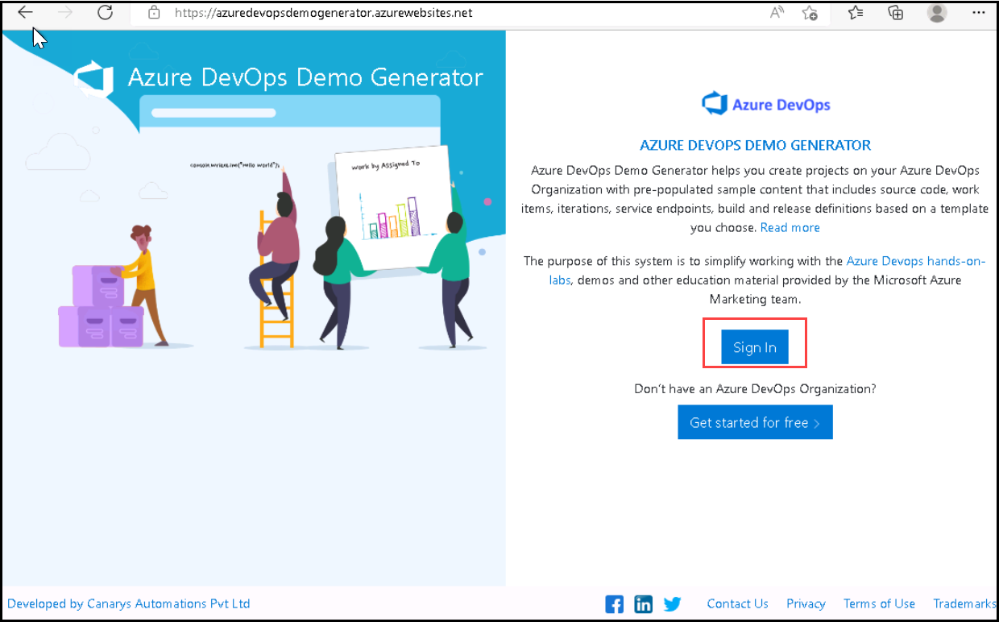
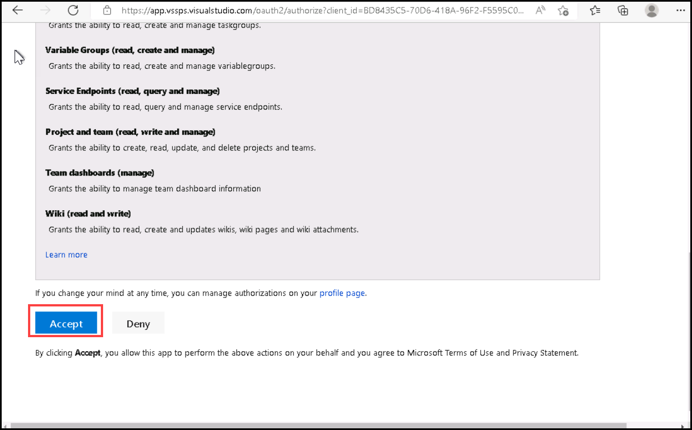
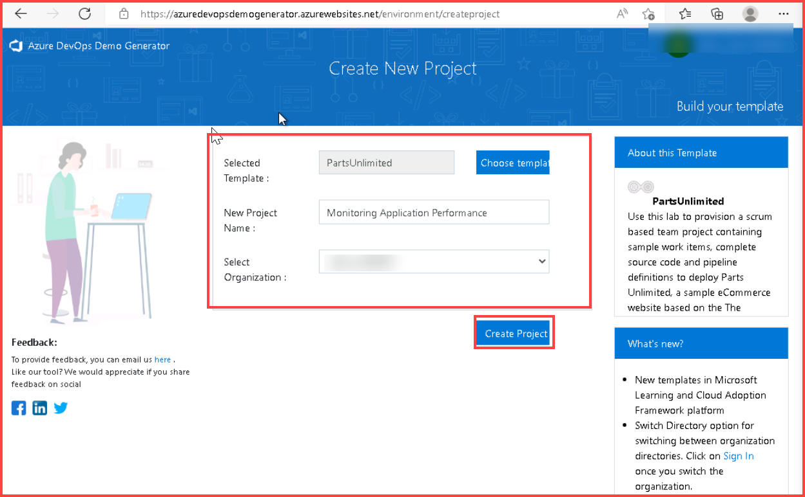
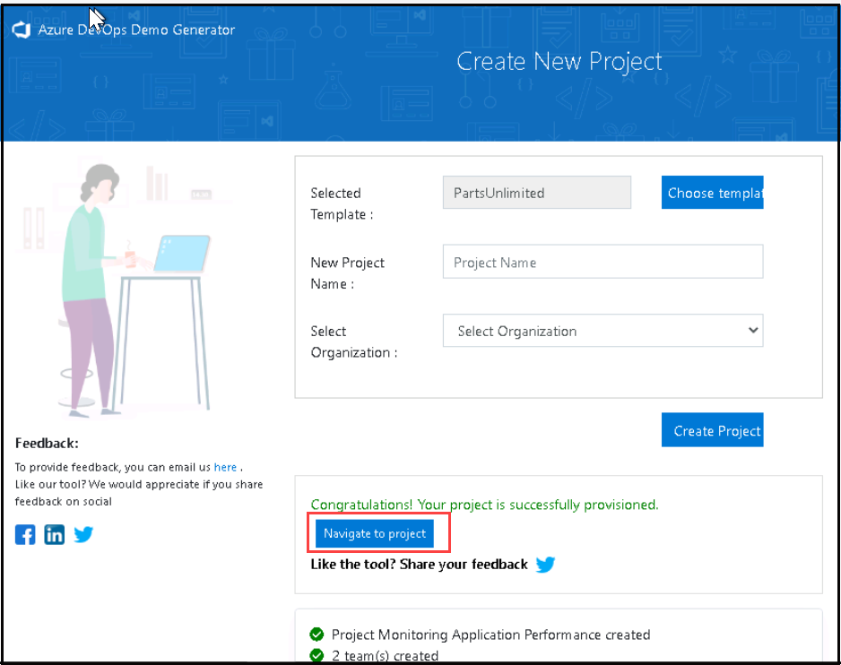
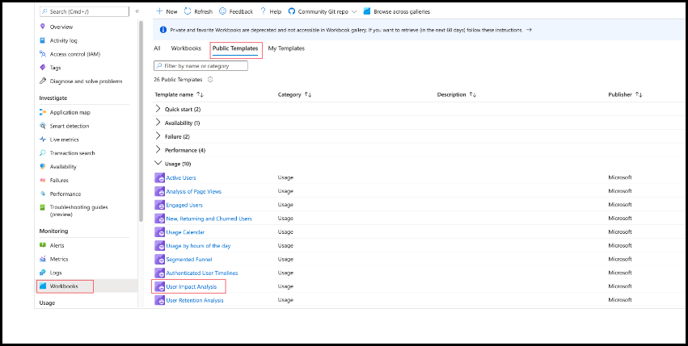

# Lab 17: Monitoring Application Performance with Application Insights
# Student lab manual

## Lab overview

Application Insights is an extensible Application Performance Management (APM) service for web developers on multiple platforms. You can use it to monitor your live web applications. It automatically detects performance anomalies, includes powerful analytics tools to help you diagnose issues, and helps you continuously improve performance and usability. It works for apps on a wide variety of platforms including .NET, Node.js and Java EE, hosted on-premises, hybrid, or any public cloud. It integrates with your DevOps process with connection points available in a variety of development tools. It also allows you to monitor and analyze telemetry from mobile apps through integration with Visual Studio App Center.

In this lab, you'll learn about how you can add Application Insights to an existing web application, as well as how to monitor the application via the Azure portal.

## Objectives

After you complete this lab, you will be able to:

- Deploy Azure App Service web apps
- Generate and monitor Azure web app application traffic by using Application Insights
- Investigate Azure web app performance by using Application Insights
- Track Azure web app usage by using Application Insights
- Create Azure web app alerts by using Application Insights

## Lab duration

-   Estimated time: **60 minutes**

## Instructions

#### Set up an Azure DevOps organization. 

1. On your lab VM open **Edge Browser** on desktop and navigate to https://dev.azure.com. Then click on **Sign into Azure DevOps** and login with the credentials provided in environment details tab.

    

2. On the next page accept defaults and click on continue.

    

3. On the **Get started with Azure DevOps** page click on **Continue**.

4. On the **Almost Done...** page fill the captcha and click on continue. 

    

5. On the Azure Devops page click on **Azure DevOps** located at top left corner and then click on **Organization Setting** at the left down corner

    

6. In the **Organization Setting** window on the left menu click on **Billing** and select **Setup Billing** then click on save.

    
        

7. On the **MS Hosted CI/CD** section under **Paid parallel jobs** enter value **1** and at the end of the page click on **Save**.

    

### Exercise 0: Configure the lab prerequisites

In this exercise, you will set up the prerequisites for the lab, which consist of the preconfigured Parts Unlimited team project based on an Azure DevOps Demo Generator template and Azure resources, including an Azure web app and an Azure SQL database. 

#### Task 1: Configure the team project

In this task, you will use Azure DevOps Demo Generator to generate a new project based on the **Parts Unlimited** template.

1.  On your lab computer, start a web browser and navigate to [Azure DevOps Demo Generator](https://azuredevopsdemogenerator.azurewebsites.net). This utility site will automate the process of creating a new Azure DevOps project within your account that is prepopulated with content (work items, repos, etc.) required for the lab. 

    > **Note**: For more information on the site, see https://docs.microsoft.com/en-us/azure/devops/demo-gen.

2.  Click **Sign in** and sign in using the Microsoft account associated with your Azure DevOps subscription.

    
    
3.  If required, on the **Azure DevOps Demo Generator** page, click **Accept** to accept the permission requests for accessing your Azure DevOps subscription.

    
    
4.  On the **Create New Project** page, in the **New Project Name** textbox, type **Monitoring Application Performance**, in the **Select organization** dropdown list, select your Azure DevOps organization, and then click **Choose template**.
5.  In the list of templates, select the **PartsUnlimited** template and click **Select Template**.
6.  Back on the **Create New Project** page, click **Create Project**

    

    > **Note**: Wait for the process to complete. This should take about 2 minutes. In case the process fails, navigate to your DevOps organization, delete the project, and try again.

7.  On the **Create New Project** page, click **Navigate to project**.

    

#### Task 2: Create Azure resources

In this task, you will create an Azure web app and an Azure SQL database by using the cloud shell in Azure portal.

> **Note**: This lab involves a deployment of the Parts Unlimited site to an Azure app service. To accommodate this requirement, you will need to spin up the necessary infrastructure. 

1.  From the lab computer, start a web browser, navigate to the [**Azure Portal**](https://portal.azure.com), and sign in with the user account that has the Owner role in the Azure subscription you will be using in this lab and has the role of the Global Administrator in the Azure AD tenant associated with this subscription.
2. In the Azure portal, in the toolbar, click the **Cloud Shell** icon located directly to the right of the search text box.

   

3. If prompted to select either **Bash** or **PowerShell**, select **Bash**.

   

    >**Note**: If this is the first time you are starting **Cloud Shell** and you are presented with the **You have no storage mounted** message, select the subscription you are using in this lab, and select **Create storage**.

   

4.  From the **Bash** prompt, in the **Cloud Shell** pane, run the following command to create a resource group (replace the `<region>` placeholder with the name of the Azure region closest to you such as 'eastus').

    ```bash
    RESOURCEGROUPNAME='az400m17l01a-RG'
    LOCATION='<region>'
    az group create --name $RESOURCEGROUPNAME --location $LOCATION
    ```

5.  To create a Windows App service plan by running the following command:

    ```bash
    SERVICEPLANNAME='az400l17-sp'
    az appservice plan create --resource-group $RESOURCEGROUPNAME \
        --name $SERVICEPLANNAME --sku B3 
    ```
    > **Note**: If the `az appservice plan create` command fails with an error message starting with `ModuleNotFoundError: No module named 'vsts_cd_manager'`, then run the following commands and then re-run the failed command.

    ```bash
    az extension remove --name appservice-kube
    az extension add --yes --source "https://aka.ms/appsvc/appservice_kube-latest-py2.py3-none-any.whl"
    ```
6.  Create a web app with a unique name.

    ```bash
    WEBAPPNAME=partsunlimited$RANDOM$RANDOM
    az webapp create --resource-group $RESOURCEGROUPNAME --plan $SERVICEPLANNAME --name $WEBAPPNAME 
    ```

    > **Note**: Record the name of the web app by navigating to **App Services**. You will need it later in this lab.

7. Now is the time to create an Application Insights instance.

    ```bash
    az monitor app-insights component create --app $WEBAPPNAME \
        --location $LOCATION \
        --kind web --application-type web \
        --resource-group $RESOURCEGROUPNAME
    ```

    > **Note**: If you got prompted with 'The command requires the extension application-insights. Do you want to install it now?', type Y and press enter.

8. Let us connect the Application Insights to our web application.

    ```bash
    az monitor app-insights component connect-webapp --app $WEBAPPNAME \
        --resource-group $RESOURCEGROUPNAME --web-app $WEBAPPNAME
    ```

9.  Next, create an Azure SQL Server.

    ```bash
    USERNAME="Student"
    SQLSERVERPASSWORD="Pa55w.rd1234"
    SERVERNAME="partsunlimitedserver$RANDOM"
    
    az sql server create --name $SERVERNAME --resource-group $RESOURCEGROUPNAME \
    --location $LOCATION --admin-user $USERNAME --admin-password $SQLSERVERPASSWORD
    ```

10.  The web app needs to be able to access the SQL server, so we need to allow access to Azure resources in the SQL Server firewall rules.

    ```bash
    STARTIP="0.0.0.0"
    ENDIP="0.0.0.0"
    az sql server firewall-rule create --server $SERVERNAME --resource-group $RESOURCEGROUPNAME \
    --name AllowAzureResources --start-ip-address $STARTIP --end-ip-address $ENDIP
    ```

11.  Now create a database within that server.

    ```bash
    az sql db create --server $SERVERNAME --resource-group $RESOURCEGROUPNAME --name PartsUnlimited \
    --service-objective S0
    ```

12.  The web app you created needs the database connection string in its configuration, so run the following commands to prepare and add it to the app settings of the web app.

    ```bash
    CONNSTRING=$(az sql db show-connection-string --name PartsUnlimited --server $SERVERNAME \
    --client ado.net --output tsv)
    CONNSTRING=${CONNSTRING//<username>/$USERNAME}
    CONNSTRING=${CONNSTRING//<password>/$SQLSERVERPASSWORD}
    az webapp config connection-string set --name $WEBAPPNAME --resource-group $RESOURCEGROUPNAME \
    -t SQLAzure --settings "DefaultConnectionString=$CONNSTRING" 
    ```

### Exercise 1: Monitor an Azure App Service web app by using Azure Application Insights

In this exercise, you will deploy a web app to Azure App Service by using Azure DevOps pipelines, generate traffic targeting the web app, and use Application Insights to review the web traffic, investigate application performance, track application usage, and configure alerting.

#### Task 1: Deploy a web app to Azure App Service by using Azure DevOps

In this task, you will deploying a web app to Azure by using Azure DevOps pipelines.

> **Note**: The sample project we are using in this lab includes a continuous integration build, which we will use without modifications. There is also a continuous delivery release pipeline that will require minor changes before it is ready for deployment to the Azure resources you implemented in the previous task. 

1.  Switch to the web browser window displaying the **Monitoring Application Performance** project in the Azure DevOps portal, in the vertical navigational pane, select the **Pipelines**, and, in the **Pipelines** section, select **Releases**.
2.  In the list of release pipelines, on the **PartsUnlimitedE2E** pane, click **Edit**. 
3.  On the **All pipelines > PartsUnlimitedE2E** pane, click the rectangle representing the **Dev** stage, on the **Dev** pane, click **Delete**, and, in the **Delete stage** dialog box, click **Confirm**.
4.  Back on the **All pipelines > PartsUnlimitedE2E** pane, click the rectangle representing the **QA** stage, on the **QA** pane, click **Delete**, and, in the **Delete stage** dialog box, click **Confirm**.
6.  Back on the **All pipelines > PartsUnlimitedE2E** pane, in the rectangle representing the **Production** stage, click the **1 job, 1 task** link.
7.  On the pane displaying the list of tasks of the **Production*** stage, click the entry representing the **Azure App Service Deploy** task.
8.  On the **Azure App Service deploy** pane, in the **Azure subscription** dropdown list, select the entry representing the Azure subscription you are using in this lab, and click **Authorize** to create the corresponding service connection. When prompted, sign in using the account with the Owner role in the Azure subscription and the Global Administrator role in the Azure AD tenant associated with the Azure subscription.
9.  With the **Tasks** tab of the **All pipelines > PartsUnlimitedE2E** pane active, click the **Pipeline** tab header to return to the diagram of the pipeline. 
10.  In the diagram, click the **Pre-deployment condition** oval symbol on the left side of the rectangle representing the **Production** stage.
11.  On the **Pre-deployment condition** pane, in the **Select trigger** section, select **After release**.

    > **Note**: This will invoke the release pipeline after the project's build pipeline succeeds.

12.  With the **Pipeline** tab of the **All pipelines > PartsUnlimitedE2E** pane active, click the **Variables** tab header.
13.  In the list of variables, set the value of the **WebsiteName** variable to match the name of the Azure App Service web app you created earlier in this lab.
14.  In the upper right corner of the pane, click **Save**, and, when prompted, in the **Save** dialog box, click **OK** again.

    > **Note**: Now that the release pipeline is in place, we can expect that any commits to the master branch will trigger the build and release pipelines.

15.  In the web browser window displaying the Azure DevOps portal, in the vertical navigational pane, click **Repos**. 
16.  On the **Files** pane, navigate to and select the **PartsUnlimited-aspnet45/src/PartsUnlimitedWebsite/Web.config** file.

    > **Note**: This application already has configuration settings for the Application Insights key and for a SQL connection. 

17. On the **Web.config** pane, review the lines referencing the Application Insights key and for a SQL connection:

    ```xml
    <add key="Keys:ApplicationInsights:InstrumentationKey" value="0839cc6f-b99b-44b1-9d74-4e408b7aee29" />
    ```

    ```xml
    <connectionStrings>
       <add name="DefaultConnectionString" connectionString="Server=(localdb)\mssqllocaldb;Database=PartsUnlimitedWebsite;Integrated Security=True;" providerName="System.Data.SqlClient" />
    </connectionStrings>
    ```

    > **Note**: You will modify values of these settings in the Azure portal following the deployment to represent the Azure Application Insights and the Azure SQL Database you deployed earlier in the lab.

    > **Note**: Now trigger the build and release processes without modifying any relevant code, by simply adding an empty line to the end of the file

18. On the **Web.config** pane, click **Edit**, add an empty line to the end of the file, click **Commit** and, on the **Commit** pane, click **Commit** again.

    > **Note**: A new build will begin and ultimately result in a deployment to Azure. Do not wait for its completion, but instead proceed to the next step.

19.  Switch to the web browser displaying the Azure portal and navigate to the App Service web app you provisioned earlier in the lab. 
20.  On the App Service web app blade, click in the vertical menu on the left side, in the **Settings** section, click **Configuration** tab.
21.  In the list of **Application settings**, click the **APPINSIGHTS_INSTRUMENTATIONKEY** entry. 
22.  On the **Add/Edit application setting** blade, copy the text in the **Value** textbox and click **Cancel**.

    > **Note**: This is the default setting added during the App Service web app deployment, which already contains the Application Insights ID. We need to add a new setting expected by our app, with a different name but the matching value. This is a specific requirement for our sample.

23.  In the **Application settings** section, click **+ New application setting**.
24.  On the **Add/Edit application setting** blade, in the **Name** textbox, type **Keys:ApplicationInsights:InstrumentationKey**, in the **Value** textbox, type the string of characters you copied into Clipboard and click **OK**.

    > **Note**: Changes to the application settings and connection strings trigger restart of the web app.

25.  Switch back to the web browser window displaying the Azure DevOps portal, in the vertical navigational pane, select the **Pipelines**, and, in the **Pipelines** section, click the entry representing your most recently run build pipeline.
26.  If the build has not yet completed, track it through until it does, then, in the vertical navigational pane, in the **Pipelines** section, click **Releases**, on the **PartsUnlimiteE2E** pane, click **Release-1** and follow the release pipeline to its completion.
27.  Switch to the web browser window displaying the Azure portal and, on the **App Service web app** blade, in the vertical menu bar on the left side, click **Overview**. 
28.  On the right side, in the **Essentials** section, click the **URL** link. This will automatically open another web browser tab displaying the **Parts Unlimited** 
web site.
29.  Verify that the **Parts Unlimited** web site loads as expected. 

     


#### Task 2: Generate and review application traffic

In this task, you will generate traffic targeting the App Service web app you deployed in the previous task and review the data collected by Application Insights resource associated with the web app.

1.  In the web browser window displaying the **Parts Unlimited** web site, navigate through its pages to generate some traffic.
2.  On the **Parts Unlimited** web site, click the **Brakes** menu item.

    

4.  In the URL textbox at the top of the browser window, append **1** to the end of the URL string and press **Enter**, effectively setting the **CategoryId** parameter to **11**. 

    

    > **Note**: This will trigger a server error since that category does not exist. Refresh the page a few times to generate more errors.

4.  Return to the web browser tab displaying the Azure portal.
5.  In the web browser tab displaying the Azure portal, on the **App Service** web app blade, in the vertical menu bar on the left, in the **Settings** section, click the **Application Insights** entry to display the **Application Insights** configuration blade.

    > **Note**: This blade includes settings that allow you to integrate Application Insights with different types of apps. While the default experience produces a wealth of data for tracking and monitoring apps, the API provides support for more specialized scenarios and custom event tracking.

6.  On the **Application Insights** configuration blade, click the **View Application Insights data** link.
7.  Review the resulting **Application Insights** blade displaying charts presenting different characteristics of the collected data, including the traffic you generated and failed requests you triggered earlier in this task.

#### Task 3: Investigate application performance

In this task, you will use Application Insights to investigate performance of the App Service web app.

1.  On the **Application Insights** blade, in the vertical menu on the left side, in the **Investigate** section, click **Application map**.

    > **Note**: Application Map helps you spot performance bottlenecks or failure hotspots across all components of your distributed application. Each node on the map represents an application component or its dependencies, as well as health KPI and alerts status. You can click through from any component to more detailed diagnostics, such as Application Insights events. If your app uses Azure services, you can also click through to Azure diagnostics related to those services, such as SQL Database Advisor recommendations.

2.  On the **Application Insights** blade, in the vertical menu on the left side, in the **Investigate** section, click **Smart Detection**.

    > **Note**: Smart Detection automatically warns you of potential performance problems in your web application. It performs proactive analysis of the telemetry that your app sends to Application Insights. If there is a sudden rise in failure rates, or abnormal patterns in client or server performance, you get an alert. This feature needs no configuration. It operates if your application sends enough telemetry. However, there won't be any data in there yet since our app has just deployed.

3.  On the **Application Insights** blade, in the vertical menu on the left side, in the **Investigate** section, click **Live Metrics**.

    > **Note**: Live Metrics Stream enables you to probe the beating heart of your live, in-production web application. You can select and filter metrics and performance counters to watch in real time, without any impact to your service. You can also inspect stack traces from sample failed requests and exceptions.

4.  Return to the web browser displaying the **Parts Unlimited** web site, navigate through its pages to generate some traffic, including a few server errors. 
5.  Return to the web browser displaying the Azure portal to watch the live traffic as it arrives. 
6.  On the **Application Insights** blade, in the vertical menu on the left side, in the **Investigate** section, click **Transaction search**.

    > **Note**: Transaction search provides a flexible interface to locate the exact telemetry you need to answer questions. 

7.  On the **Transaction search** blade, click **See all data in the last 24 hours**.

    > **Note**: The results include all telemetry data, which can be filtered down by multiple properties.

8.  On the **Transaction search** blade, in the middle of the blade, right above the list of results, click **Grouped results**. 

    > **Note**: These results are grouped based common properties.

9.  On the **Transaction search** blade, in the middle of the blade, right above the list of results, click **Results** to return to the original view, listing all results.
10.  At the top of the **Transaction search** blade, click **Event types = All selected**, in the dropdown list, clear the **Select all** checkbox, and, in the list of event types, select the **Exception** checkbox.

    > **Note**: There should be some exceptions representing the errors you generated earlier. 

11.  In the list of results, click one of them. This will display the **End-to-end transaction details** blade, providing a full timeline view of the exception within the context of its request. 
12.  At the bottom of the **End-to-end transaction details** blade, click **View all telemetry**.

    > **Note**: The **Telemetry** view provides the same data but in a different format. On the right hand side of the **End-to-end transaction details** blade, you can also review the details of the exception itself, such as its properties and call stack.

13.  Close the **End-to-end transaction details** blade and back on the **Transaction search** blade, in the vertical menu on the left side, in the **Investigate** section, click **Availability**.

    > **Note**: After you've deployed your web app or web site to any server, you can set up tests to monitor its availability and responsiveness. Application Insights sends web requests to your application at regular intervals from points around the world. It alerts you if your application doesn't respond or responds slowly. 

14.  On the **Availability** blade, in the toolbar, click **+ Add Classic test**.
15.  On the **Create test** blade, in the **Test name** textbox, type **Home page**, set the **URL** to the root of your App Service web app, and click **Create**.

    > **Note**: The test will not run immediately, so there won't be any data. If you check back later, you should see the availability data updated to reflect the tests against your live site. Don't wait for this now.

16.  On the **Availability** blade, in the vertical menu on the left side, in the **Investigate** section, click **Failures**.

    > **Note**: The Failures view aggregates all exception reports into a single dashboard. From here, you can easily locate relevant data based on such filters as dependencies or exceptions. 

17.  On the **Failures** blade, in the upper right corner, in the **Top 3 response codes** list, click the link representing the number of **500** errors.

    > **Note**: This will present a list of exceptions matching this HTTP response code. Selecting the suggested exception will lead to the same exception view you reviewed earlier.

18.  On the **Failures** blade, in the vertical menu on the left side, in the **Investigate** section, click **Performance**.

    > **Note**: The Performance view provides a dashboard that simplifies the details of application performance based on the collected telemetry.

19.  On the **Performance** blade, in the vertical menu on the left side, in the **Monitoring** section, click **Metrics**.

    > **Note**: Metrics in Application Insights are measured values and counts of events that are sent in telemetry from your application. They help you detect performance issues and watch trends in how your application is being used. There's a wide range of standard metrics, and you can also create your own custom metrics and events. 

20.  On the **Metrics** blade, in the filter section, click **Select metric** and, in the dropdown list, select **Server requests**.

    > **Note**: You can also segment your data using splitting. 

21.  At the top of the newly displayed chart, click **Apply splitting** and, in the resulting filter, in the **Select values** dropdown list, select **Operation name**. 

    > **Note**: This will split the server requests based on pages they reference, represented by different colors in the chart.

#### Task 4: Track application usage

> **Note**: Application Insights provides a broad set of features to track application usage. 

1.  On the **Metrics** blade, in the vertical menu on the left side, in the **Usage** section, click **Users**.

    > **Note**: While there aren't many users of our application yet, some data will be available. 

2.  On the **Users** blade, below the main chart, click **View More Insights**. This will display additional data, extending the blade downwards.
3.  Scroll down to review details about the geographies, operating systems, and browsers.

    > **Note**: You can also drill into user-specific data to gain a better understanding of the user-specific usage patterns.

4.  On the **Users** blade, in the vertical menu on the left side, in the **Usage** section, click **Events**.
5.  On the **Events** blade, below the main chart, click **View More Insights**.

    > **Note**: The display will include a range of built-in events raised so far based on site usage. You can programmatically add custom events with custom data to meet your needs.

6.  On the **Events** blade, in the vertical menu on the left side, in the **Usage** section, click **Funnels**.

    > **Note**: Understanding the customer experience is of the utmost importance to your business. If the usage of your application involves multiple steps, you need to know if most customers are following the intended process. The progression through a series of steps in a web application is known as a funnel. You can use Azure Application Insights Funnels to gain insights into your users, and monitor step-by-step conversion rates.

7.  On the **Funnels** blade, in the vertical menu on the left side, in the **Usage** section, click **User Flows**.

    > **Note**: The User Flows tool starts from an initial page view, custom event, or exception that you specify. Given this initial event, User Flows shows the events that happened before and afterwards during the corresponding user sessions. Lines of varying thickness show how many times each path was followed by users. The **Session Started** nodes represent the beginning of a session. **Session Ended** nodes show how many users didn't generate page views or custom events after the preceding node, corresponding likely to users leaving your site.

8.  On the **User Flows** blade, click **Select an event**, on the **Edit** pane, in the **Initial Event** dropdown list, in the **Page Views** section, select **Home Page - Parts Unlimited** entry, and then click **Create Graph**.

9.  On the **Cohorts** blade, in the vertical menu on the left side, in the **Usage** section, click **More**.

    > **Note**: This blade includes a variety of reports and templates for review.

10.  On the **More \| Gallery** blade, in the **Usage** section, click **Analysis of Page Views** and review the content of the corresponding blade.

    > **Note**: This particular report offers insight regarding the page views. There are many other reports available by default, and you can customize and save new ones.

11.   On the **Workbooks** blade, in the vertical menu on the left side, in the **Monitoring** section, select **User Retention Analysis** under Usage.

   

    > **Note**: The retention feature in Application Insights helps you analyze how many users return to your app, and how often they perform particular tasks or achieve goals. For example, if you run a game site, you could compare the numbers of users who return to the site after losing a game with the number who return after winning. This knowledge can help you improve both your user experience and your business strategy.

    > **Note**: The User Retention Analysis experience was transitioned to Azure Workbooks

12.  Now click on **Retention Analysis Workbook**, review the **Overall Retention** chart, and close the blade.
13.  On the **Workbooks** blade, in the vertical menu on the left side, in the **Monitoring** section, select **User Impact Analysis** under Usage.

     

    > **Note**: Impact analyzes how web site properties, such as load times, influence conversion rates for various parts of your app. To put it more precisely, it discovers how any dimension of a page view, custom event, or request affects page views or custom events.

    > **Note**: The Impact Analysis experience was transitioned to Azure Workbooks

14.  Click on **Impact Analysis Workbook**, and in the **Selected event** dropdown list, in the **Page Views** section, select **Home Page - Parts Unlimited**, in the **Impacting event**, select **Browse Product - Parts Unlimited**, review the results, and close the blade.
15.  On the **Impact** blade, in the vertical menu on the left side, in the **Usage** section, click **Cohorts**.

    > **Note**: A cohort is a set of users, sessions, events, or operations that have something in common. In Application Insights, cohorts are defined by an analytics query. In cases where you have to analyze a specific set of users or events repeatedly, cohorts can give you more flexibility to express exactly the set you're interested in. Cohorts are used in ways similar to filters, but cohort definitions are built from custom analytics queries, so they're much more adaptable and complex. Unlike filters, you can save cohorts so other members of your team can reuse them.


#### Task 5: Configure web app alerts

1.  While on the **More \| Gallery** blade, in the vertical menu on the left side, in the **Monitoring** section, click **Alerts**. 

    > **Note**: Alerts enable you to set triggers that perform actions when Application Insights measurements reach specified conditions.

2.  On the **Alerts** blade, in the toolbar, click **+ New alert rule**.
3.  On the **Create alert rule** blade, note that, in the **Scope** section, the current Application Insights resource will be selected by default. 
4.  On the **Create alert rule** blade, in the **Condition** section, click **Select condition**.
5.  On the **Configure signal logic** blade, search for and select the **Failed requests** metric.
6.  On the **Configure signal logic** blade, scroll down to the **Alert logic** section, ensure that **Threshold** is set to **Static** and set the **Threshold value** to **1**. 

    > **Note**: This will trigger the alert once a second failed request is reported. By default, the conditions will be evaluated every minute and based on the aggregation of measurements over the past 5 minutes. 

7.  On the **Configure signal logic** blade, click **Done**.

    > **Note**: Now that the condition is created, we need to define an **Action Group** for it to execute. 

8.  Back on the **Create alert rule** blade, in the **Action** section, click **Select action group** and then, on the **Select an action group to attach to this alert rule, click **+ Create action group**.
9.  On the **Basics** tab of the **Create action group** blade, specify the following settings and click **Next: Notifications >**:

    | Setting | Value |
    | --- | --- |
    | Subscription | the name of the Azure subscription you are using in this lab |
    | Resource group | the name of a new resource group **az400m17l01b-RG** |
    | Action group name | **az400m17-action-group** |
    | Display name | **az400m17-ag** |

10.  On the **Notifications** tab of the **Create action group** blade, in the **Notification type** dropdown list, select **Email/SMS message/Push/Voice**. This will open the **Email/SMS message/Push/Voice** blade. 
11.  On the **Email/SMS message/Push/Voice** blade, select the **Email** checkbox, in the **Email** textbox, type your email address, and click **OK**.
12.  Back on the **Notifications** tab of the **Create action group** blade, in the **Name** textbox, type **email** and click **Next: Actions >**:
13.  On the **Actions** tab of the **Create action group** blade, select the **Action type** dropdown list, review the available options without making any changes, and click **Review + create**.
14.  On the **Review + create** tab of the **Create action group** blade, click **Create**
15.  Back on the **Create alert rule** blade, in the **Alert rule details** section, in the **Alert rule name** textbox, type **az400m17 lab alert rule**, review the remaining alert rule settings without modifying them, and click **Create alert rule**.
16.  Switch to the web browser window displaying the **Parts Unlimited** web site, on the **Parts Unlimited** web site, click the **Brakes** menu item.
17.  In the URL textbox at the top of the browser window, append **1** to the end of the URL string and press **Enter**, effectively setting the **CategoryId** parameter to **11**. 

    > **Note**: This will trigger a server error since that category does not exist. Refresh the page a few times to generate more errors.

18.  After about five minutes, check your email account to verify that you have received an email indicating that the alert you defined was triggered.

### Exercise 2: Remove the Azure lab resources

In this exercise, you will remove the Azure resources provisione in this lab to eliminate unexpected charges. 

>**Note**: Remember to remove any newly created Azure resources that you no longer use. Removing unused resources ensures you will not see unexpected charges.

#### Task 1: Remove the Azure lab resources

In this task, you will use Azure Cloud Shell to remove the Azure resources provisioned in this lab to eliminate unnecessary charges. 

1.  In the Azure portal, open the **Bash** shell session within the **Cloud Shell** pane.
2.  List all resource groups created throughout the labs of this module by running the following command:

    ```sh
    az group list --query "[?starts_with(name,'az400m17l01')].name" --output tsv
    ```

3.  Delete all resource groups you created throughout the labs of this module by running the following command:

    ```sh
    az group list --query "[?starts_with(name,'az400m17l01')].[name]" --output tsv | xargs -L1 bash -c 'az group delete --name $0 --no-wait --yes'
    ```

    >**Note**: The command executes asynchronously (as determined by the --nowait parameter), so while you will be able to run another Azure CLI command immediately afterwards within the same Bash session, it will take a few minutes before the resource groups are actually removed.

#### Task 2: Remove the Azure DevOps billing

In this task, you will remove pipeline billing to eliminate unnecessary charges.

1. On the lab computer, switch to the browser window displaying Azure DevOps organization homepage and select **Organization Settings** at bottom left corner.

2. Under **Organization Settings** select **Billing** and click on **Change billing** button to open Change billing pane.

3. In the **Change billing** pane, select **Remove billing** setting and click on Save.

## Review

In this exercise, you deployed a web app to Azure App Service by using Azure DevOps pipelines, generated traffic targeting the web app, and used Application Insights to review the web traffic, investigate application performance, track application usage, and configure alerting.
