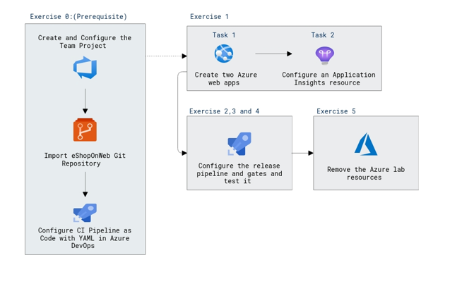

# Lab Scenario Preview: AZ-400: Design and implement a release strategy

## Lab 07: Controlling Deployments using Release Gates

### Lab overview

This lab covers the configuration of the deployment gates and details how to use them to control the execution of Azure Pipelines. To illustrate their implementation, you'll configure a release definition with two environments for an Azure Web App. You'll deploy to the Canary environment only when there are no blocking bugs for the app and mark the Canary environment complete only when there are no active alerts in Application Insights of Azure Monitor.

A release pipeline specifies the end-to-end release process for an application to be deployed across various environments. Deployments to each environment are fully automated by using jobs and tasks. Ideally, you don't want new updates to the applications to be simultaneously exposed to all the users. It's a best practice to expose updates in a phased manner, that is, expose them to a subset of users, monitor their usage, and expose them to other users based on the experience of the initial set of users.

Approvals and gates enable you to take control over the start and completion of the deployments in a release. You can wait for users to approve or reject deployments with approvals manually. Using release gates, you can specify application health criteria to be met before the release is promoted to the following environment. Before or after any environment deployment, all the specified gates are automatically evaluated until they pass or reach your defined timeout period and fail.

Gates can be added to an environment in the release definition from the pre-deployment conditions or the post-deployment conditions panel. Multiple gates can be added to the environment conditions to ensure all the inputs are successful for the release.

As an example:

- Pre-deployment gates ensure no active issues in the work item or problem management system before deploying a build to an environment.
- Post-deployment gates ensure no incidents from the app's monitoring or incident management system after being deployed before promoting the release to the following environment.

There are 4 types of gates included by default in every account.

- Invoke Azure Function: Trigger the execution of an Azure Function and ensures a successful completion.
- Query Azure Monitor alerts: Observe the configured Azure Monitor alert rules for active alerts.
- Invoke REST API: Make a call to a REST API and continues if it returns a successful response.
- Query work items: Ensure the number of matching work items returned from a query is within a threshold.

### Objectives

After you complete this lab, you will be able to:

- Configure release pipelines.
- Configure release gates.
- Test release gates.

### Architecture Diagram

   
